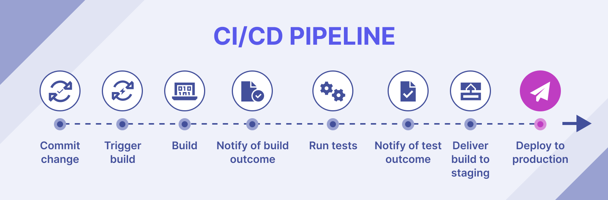

# CI/CD Pipelines là gì ?

**CI/CD Pipelines** (hay còn được gọi là Tích hợp liên tục/Phát hành liên tục **Pipelines**) là một tập hợp các công cụ và quy trình tự động hóa việc xây dựng, kiểm tra và triển khai mã. Các đường ống này thường được sử dụng trong phát triển phần mềm để đảm bảo rằng mã được xây dựng và triển khai một cách nhất quán và đáng tin cậy.

### Xây dựng CI/CD Pipelines theo các bước

Các **CI/CD Pipelines** thường được xây dựng theo một cách nhất quán, với các bước sau:

1. **Tích hợp**: Đây là bước mà mã từ các nhà phát triển khác nhau được tích hợp lại với nhau.

2. **Kiểm tra**: Đây là bước mà mã được kiểm tra để tìm lỗi.

3. **Tối ưu hóa**: Đây là bước mà mã được tối ưu hóa để cải thiện hiệu suất.

4. **Triển khai**: Đây là bước mà mã được triển khai lên môi trường sản xuất.

Các **CI/CD Pipelines** có thể giúp các nhóm phát triển phần mềm cải thiện chất lượng mã, tăng tốc độ phát triển và giảm thiểu rủi ro khi triển khai mã mới.

### Lợi ích khi sử dụng CI/CD Pipelines

Một số lợi ích của việc sử dụng các **CI/CD Pipelines**:

- **Tăng chất lượng code**: Các CI/CD Pipelines có thể giúp phát hiện và khắc phục lỗi sớm hơn, đồng thời giảm thiểu rủi ro khi triển khai code mới.

- **Tăng tốc độ phát triển**: Các CI/CD Pipelines có thể giúp các nhóm phát triển xây dựng và triển khai mã mới nhanh hơn.

- **Giảm thiểu rủi ro**: Các CI/CD Pipelines có thể giúp giảm thiểu rủi ro khi triển khai mã mới bằng cách tự động hóa các quy trình kiểm tra và triển khai.

- **Tăng khả năng mở rộng**: Các CI/CD Pipelines có thể giúp các nhóm phát triển dễ dàng mở rộng quy mô của các dự án của họ.

- **Tăng khả năng bảo mật**: Các CI/CD Pipelines có thể giúp các nhóm phát triển phát hiện và khắc phục các lỗ hổng bảo mật sớm hơn.

Các  **CI/CD Pipelines** là một tập hợp các công cụ và quy trình quan trọng giúp các nhóm phát triển phần mềm xây dựng, kiểm tra và triển khai mã của họ một cách nhanh chóng, hiệu quả và an toàn.

Nếu bạn đang tìm cách cải thiện tốc độ, chất lượng, khả năng mở rộng, khả năng bảo mật và độ tin cậy của quy trình phát triển phần mềm của mình, thì việc sử dụng **CI/CD Pipelines** là một cách tuyệt vời để bắt đầu.