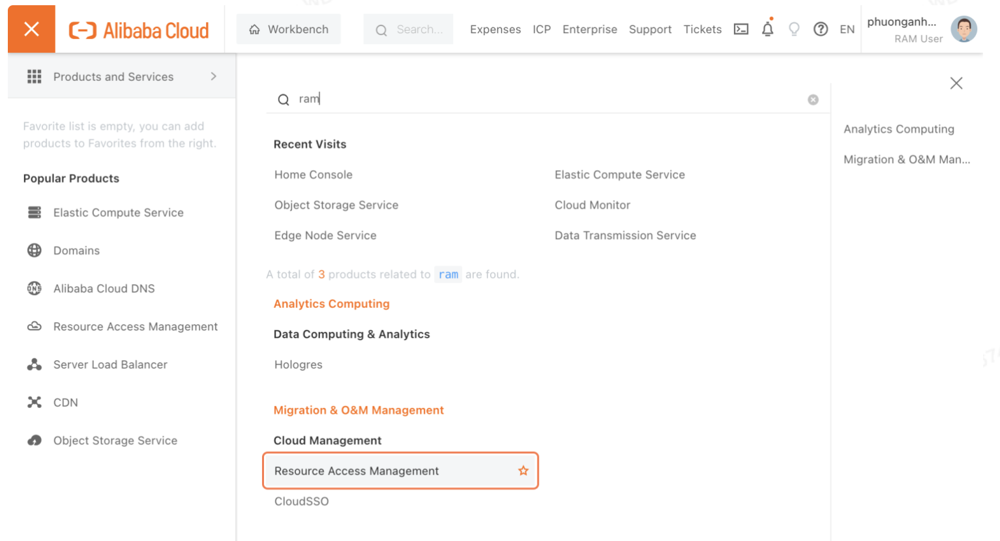
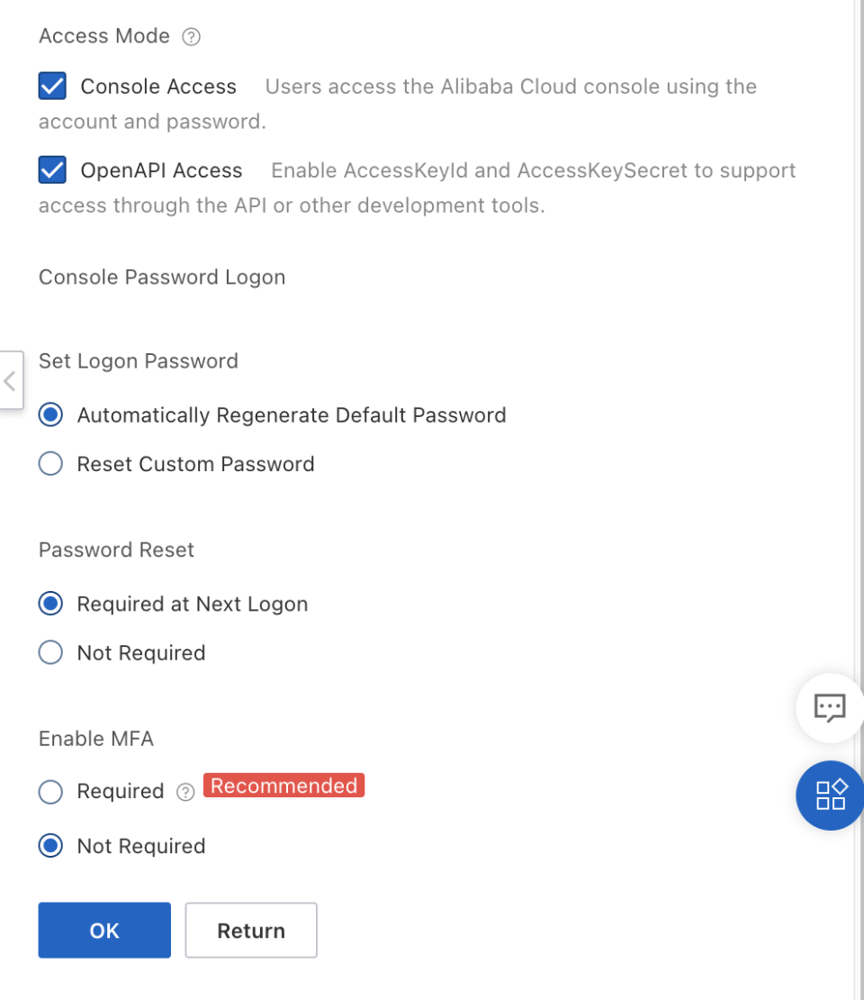
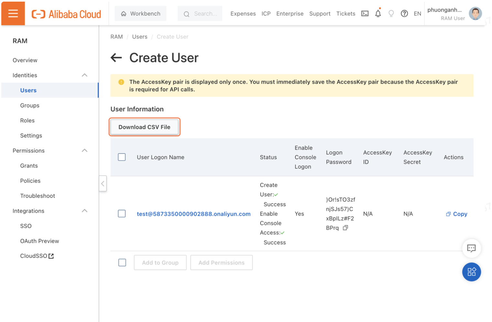
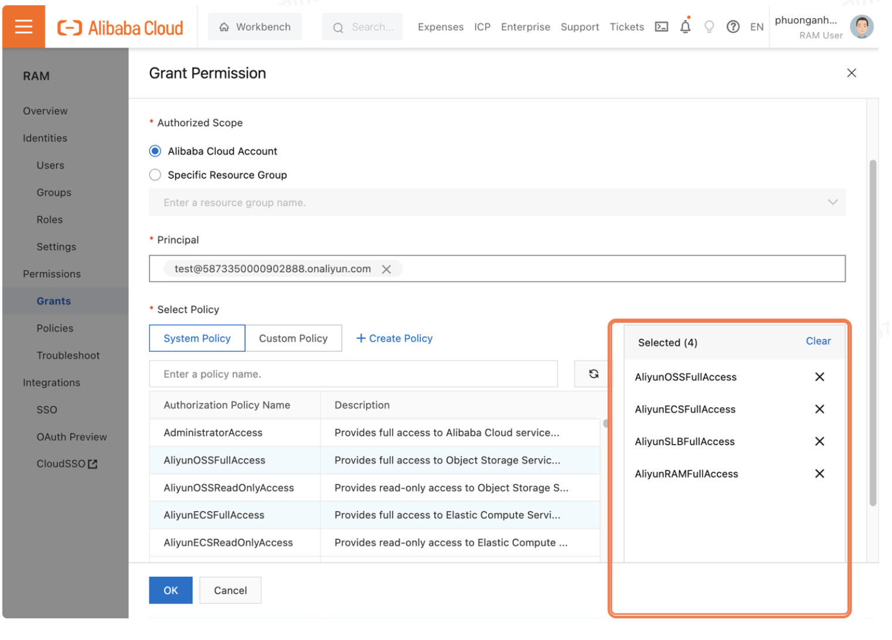

# Alibaba Cloud Resource Access Management (RAM) là gì ?

**Resource Access Management (RAM)** là một dịch vụ được cung cấp bởi **Alibaba Cloud** cho phép người dùng quản lý người dùng và quyền truy cập tài nguyên từ một tài khoản chính.

Giả sử bạn muốn thực hiện một dự án lên **Alibaba Cloud** và đã mua một số loại tài nguyên **Alibaba Cloud**, như **Elastic Compute Service (ECS)**, **ApsaraDB RDS**, **Server Load Balancer (SLB)**, các bucket OSS…. Từ đó các thành viên của dự án phải quản lý các tài nguyên khác nhau và yêu cầu các quyền khác nhau. Trong trường hợp này, **Alibaba Cloud RAM** có thể giúp phân quyền hiệu quả và đảm bảo các yếu tố sau:

- Các thành viên trong dự án không có thông tin của tài khoản chính (**AccessKeyID – Access Secret Key**).
- Tạo ra các người dùng RAM khác nhau cho từng thành viên và cấp các quyền khác nhau cho người dùng RAM. Các thành viên được cấp quyền chỉ cần các quyền được yêu cầu để hoàn thành nhiệm vụ của họ.
- Người dùng RAM chỉ có thể quản lý tài nguyên sau khi được cấp các quyền cần thiết. Tất cả các hoạt động được thực hiện bởi người dùng RAM đều có thể được kiểm tra.
- Chủ tài khoản có thể thu hồi các quyền được cấp cho người dùng RAM và xóa người dùng RAM bất cứ lúc nào.
- Các khoản phí tài nguyên của người dùng RAM được tính cho tài khoản chính.
Với những lợi ích đó, Alibaba Cloud RAM có thể hỗ trợ rất nhiều trong việc quản lý người dùng và các tài nguyên trên Alibaba Cloud. Để bắt đầu sử dụng Alibaba Cloud RAM, tỏng bài viết này chúng tôi sẽ hướng dẫn cách tạo một tài khoản RAM trên Alibaba Cloud.

### Cách tạo RAM Account và phân quyền trên console Alibaba Cloud

Để tiến hành tạo tài khoản **RAM Alibaba Cloud**, truy cập vào trang **console** của A**libaba Cloud** và chọn **All Products** > **Cloud Management** > **Resource Access Management**.

Tại **console RAM**, chọn **Users** > **Create User** để tạo một người dùng **RAM** mới.

Nhập **Logon Name** (tên người dùng) và **Display Name** (tên hiển thị) cho người dùng **RAM** cần tạo.

Ở mục **Access Mode**, bạn có thể chọn **Console Access** để cho phép người dùng đăng nhập vào từ **console**; hoặc **OpenAPI Access** để truy cập bằng cặp **Key Pair** từ **API**. Bạn có thể tham khảo các thông số dưới đây.

Sau khi hoàn tất, nhấn **OK** để tạo tài khoản.

Sau khi tạo thành công, chọn **Download CSV File** để lưu lại thông tin **AccessKeyID** và **Secret Key** (chỉ hiện thị một lần cho **account RAM**). Bạn cũng có thể vào **Users** để xem thông tin tài khoản vừa được tạo.

### Cấp quyền cho tài khoản RAM

Vậy là chúng ta đã hoàn tất tạo một tài khoản **RAM Account** trong **Alibaba Cloud**. Giờ đây bạn có thể thực hiện phân các quyền cụ thể vào tài khoản **RAM** đã được tạo.

Vào phần **Permission** > **Grants** > **Grant Permission** trong **RAM Console** để bắt đầu cấp quyền.

Chọn **Alibaba Cloud Account** cho mục **Authorized Scope** và chọn tài khoản cần cấp quyền cho mục **Principal**.

Kế đến, chọn các quyền bạn muốn cấp cho tài khoản. Bạn có thể chọn **Administrator Access** để cấp quyền truy cập vào toàn bộ dịch vụ hỗ trợ trên A**libaba Cloud** hoặc cấp quyền theo từng dịch vụ (**ECS, OSS**..). Trong bài hướng dẫn này chúng tôi sẽ cấp mẫu vài quyền **FullAccess** theo dịch vụ.

Nhấn **OK** để hoàn tất.

Sau khi cấp quyền các tài khoản **RAM** đã có thể hoạt động trên **Alibaba Cloud** dưới tài khoản chính của bạn.

### Tham khảo

- https://www.alibabacloud.com/blog/create-alibaba-cloud-ram-account_600153
- https://www.alibabacloud.com/product/ram
- https://www.alibabacloud.com/help/en/resource-access-management
- https://www.alibabacloud.com/help/en/cloudsso