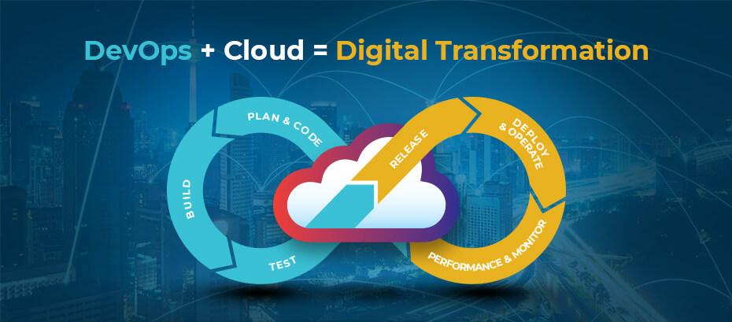

### Tổng quan DevOps và Cloud

    **DevOps** là một cách tiếp cận tổng thể cho việc phát triển và vận hành phần mềm, tập trung vào việc hợp nhất các nhóm phát triển và vận hành để tạo ra các ứng dụng và dịch vụ nhanh hơn, đáng tin cậy hơn và an toàn hơn.

    **The Cloud** là một mô hình cung cấp các dịch vụ điện toán, lưu trữ và phần mềm qua Internet. Các dịch vụ Cloud có thể được sử dụng để triển khai các ứng dụng DevOps, giúp các nhóm phát triển và vận hành hợp tác hiệu quả hơn và cung cấp các ứng dụng nhanh hơn, đáng tin cậy hơn và an toàn hơn.

Có một số lợi ích của việc sử dụng DevOps và Cloud cùng nhau, bao gồm:

- **Tăng tốc độ phát triển**: DevOps cho phép các nhóm phát triển và vận hành hợp tác chặt chẽ hơn, dẫn đến việc phát triển ứng dụng nhanh hơn.
- **Tăng cường khả năng đáp ứng**: Các ứng dụng được triển khai trên Cloud có thể được mở rộng và thu nhỏ nhanh chóng để đáp ứng nhu cầu thay đổi của người dùng.
- **Tăng cường tính bảo mật**: Các dịch vụ Cloud thường được tích hợp với các tính năng bảo mật, giúp các ứng dụng được triển khai trên Cloud được bảo vệ tốt hơn.
- **Giảm chi phí:** Các dịch vụ Cloud thường có chi phí thấp hơn so với việc tự triển khai và vận hành các ứng dụng.

Nếu bạn đang tìm cách phát triển và vận hành các ứng dụng nhanh hơn, đáng tin cậy hơn và an toàn hơn, thì việc sử dụng DevOps và Cloud là một giải pháp hiệu quả.

Dưới đây là một số ví dụ về cách DevOps và Cloud có thể được sử dụng cùng nhau:

- **Tự động hóa việc triển khai ứng dụng**: DevOps cho phép tự động hóa việc triển khai ứng dụng, giúp các ứng dụng được triển khai nhanh hơn và đáng tin cậy hơn.
- **Tự động hóa việc kiểm tra và phát hành ứng dụng**: DevOps cho phép tự động hóa việc kiểm tra và phát hành ứng dụng, giúp các ứng dụng được phát hành nhanh hơn và an toàn hơn.
- **Quản lý thay đổi**: DevOps cho phép quản lý thay đổi tập trung, giúp các thay đổi đối với ứng dụng được quản lý hiệu quả hơn.
- **Theo dõi và giám sát**: DevOps cho phép theo dõi và giám sát ứng dụng tập trung, giúp các vấn đề về ứng dụng được phát hiện và khắc phục nhanh hơn.

DevOps và Cloud là hai xu hướng công nghệ quan trọng hiện nay. Việc sử dụng DevOps và Cloud cùng nhau có thể mang lại nhiều lợi ích cho các doanh nghiệp và tổ chức.