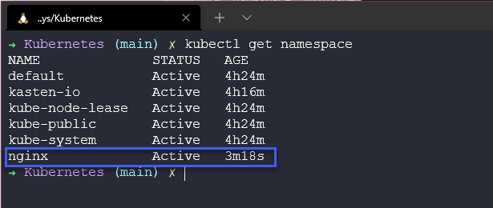
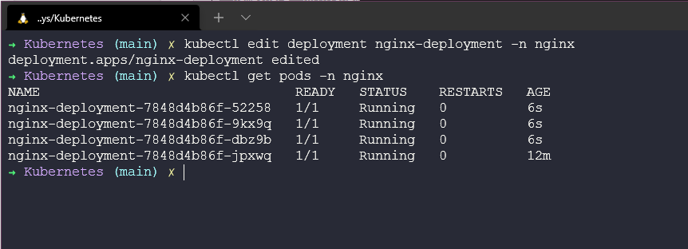
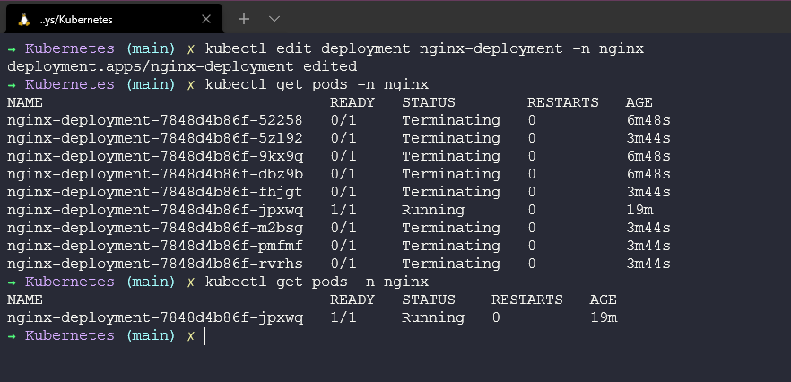
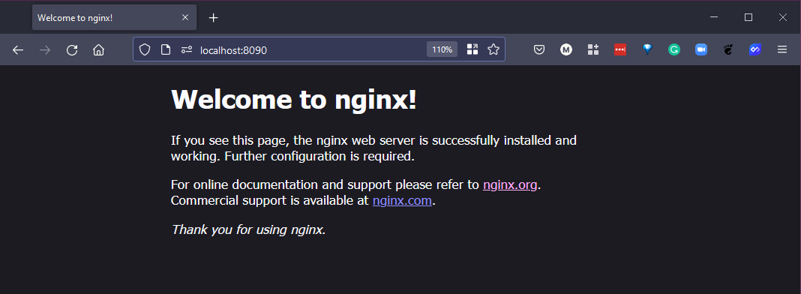

# Triển khai ứng dụng Kubernetes

Bây giờ, chúng ta cuối cùng cũng có thể triển khai một số ứng dụng vào trên các **cluster** của mình, một số người sẽ nói rằng đây là lý do **Kubernetes** tồn tại, để phân phối ứng dụng.

Ý tưởng ở đây là chúng ta có thể lấy các **container images** của mình và triển khai chúng dưới dạng các **pods** trên **Kubernetes cluster** của chúng ta để tận dùng **Kubernetes** như một bộ điều phối **container**.

## Trển khai ứng dụng trên Kubernetes

Có một số cách để chúng ta có thể triển khai các ứng dụng của mình trên **Kubernetes cluster**, chúng ta sẽ đề cập đến hai trong số các cách tiếp cận phổ biến nhất là tệp **YAML** và **Heml charts**.

Chúng ta sẽ sử dụng **minikube cluster** cho các triển khai ứng dụng này. Chúng ta sẽ nhắc lại một số thành phần hoặc khối xây dựng đã đề cập tới trước đó của **Kubernetes**.

Xuyên suốt các bài trước **Container**, chúng ta đã thảo luận về **images** và lợi ích của **Kubernetes** cũng như cách chúng ta có thể xử lý việc mở rộng quy mô khác dễ dàng bằng nền tảng này.

Trong bước đầu tiên này, chúng ta sẽ tạo một ứng dụng không trạng thái trong **minikube cluster** của mình. Chúng ta sẽ sử dụng một ứng dụng không trạng thái theo quy chẩn trong **demo** đầu tiên với **Deployment** của `nginx` sử dụng các **pods** của chúng ta, sau đó chúng ta cũng sẽ tạo một **service** cho phép chúng ta sử dụng một máy chủ **web** được phục vụ bởi **nginx pod**. Tất cả chúng sẽ nằm trong một **namespace**.


## Tạo tệp YAML

Trong **demo** đầu tiên, chúng ta muốn xác định mọi thứ chứng ta muốn làm bằng **YAML**, chúng ta có thể có nguyên một bài nói về **YAML** nhưng tôi sẽ lướt qua phần này và để lại một số tài nguyên ở cuối bài trình bày chi tiết về **YAML**.

Chúng ta có thể tạo các tệp sau dưới dạng một tệp **YAML** hoặc chúng ta có thể chia nhỏ tệp này cho từng phần của ứng dụng của mình, ví dụ: đây có thể là các tệp riêng biệt dành cho **namespace**, **deployement** và **service** nhưng trong **file** này, như bên dưới, chúng ta sử dụng `---` đề tách các phần trong một tệp. Bạn có thể tìm thấy tệp này ở [đây](../../../Scripts/Kubernetes/nginx-stateless-demo.yaml)

```Yaml
apiVersion: v1
kind: Namespace
metadata:
  name: nginx
  "labels": {
    "name": "nginx"
  }
---
apiVersion: apps/v1
kind: Deployment
metadata:
  name: nginx-deployment
  namespace: nginx
spec:
  selector:
    matchLabels:
      app: nginx
  replicas: 1
  template:
    metadata:
      labels:
        app: nginx
    spec:
      containers:
      - name: nginx
        image: nginx
        ports:
        - containerPort: 80
---
apiVersion: v1
kind: Service
metadata:
  name: nginx-service
  namespace: nginx
spec:
  selector:
    app: nginx-deployment
  ports:
    - protocol: TCP
      port: 80
      targetPort: 80
```

### Kiểm tra cluster của chúng ta

Trước khi chúng ta triển khai bất cứ thứ gì, chúng ta chỉ cần đảm bảo rằng chúng ta không có một **namespace** nào là `nginx`. Có thể xác nhận việc này bằng cách chạy lệnh `kubectl get namespace` và như bạn có thể thấy dưới đây, chúng ta không có **namespace** nào là `nginx`.


### Triển khai ứng dụng của chúng ta

Bây giờ chúng ta đã sẵn sàng triển khai ứng dụng của mình lên **minikube cluster**, quy trình tương tự như thế này sẽ hoạt động trên bất kỳ **Kubernetes cluster** nào khác.

Chúng ta cần điều hướng tới vị trị tệp **YAML** của mình và chạy lệnh `kubectl create -f nginx-stateless-demo.yaml`, sau đó bạn có thể thấy 3 đối tượng đã được tạo và chúng ta có một **namespace**, **deployment** và **service**.


Hãy chạy lại lệnh để xem các **namespaces** có sẵn trong **cluster** của chúng ta `kubectl get namespace` và giờ bạn có thể thấy rằng chúng ta có **namespace** mới.



Sau đó, nếu chúng ta kiểm tra các pods cho namespace sử dụng lệnh `kubectl get pods -n nginx` bạn sẽ thấy rằng chúng ta có 1 pod sẵn sàng và đang trong trạng thái chạy.


Chúng ta cũng có thể kiểm tra **service** đã được tạo bằng câu lệnh `kubectl get service -n nginx`


Cuối cùng, chúng ta có thể kiểm tra xem **deployment** ở đâu và làm thể nào chúng ta giữ được cấu hình mong muốn của mình.


Ở trên có vài lệnh chúng ta cần biết nhưng cũng có thể sử dụng lệnh `kubectl get all -n nginx` để xem mọi thứ chúng ta đã triển khai với tệp **YAML** đó.


Bạn có thể nhận thấy như ở trên rằng chúng ta cũng có một **replicaset**, trong **deployment** của mình, chúng ta cấu hình số **replicas** của **image** mà chúng ta muốn triển khai. Ban đầu nó được đặt là 1, nhưng nếu muốn nhanh chóng mở rộng quy mô ứng dụng của mình thì chúng ta có thể làm theo những cách sau.

Chúng ta có thể chỉnh sửa tệp của mình sử dụng  `kubectl edit deployment nginx-deployment -n nginx` sẽ mở trình soạn thảo văn bản trong **terminal** của bạn và cho phép bạn chỉnh sửa **deployment** của mình.


Khi lưu thay đổi bằng trình soạn thảo của bạn trong **terrminal**, nếu không có sự cố nào và cú pháp chính xác đã được sửu dụng thì bạn sẽ thấy một số tài nguyên được triển khai trong **namespace**.



Bạn cũng có thể thay đổi số lượng **replicas** sử dụng **kubectl** với câu lệnh `kubectl scale deployment nginx-deployment --replicas=10 -n nginx`


Chúng ta có thể sử dụng phương pháp này để giảm quy mô ứng dụng của mình xuống 1 bằng cả 2 phương pháp. Tôi đã sử dụng lựa chọn chỉnh sửa nhưng bạn cũng có thể sử dụng lệnh `scale` như trên.



Hy vọng rằng, bạn có thể thấy ở đây không chỉ việc triển khai ứng dụng siêu nhanh mà còn có khả năng tăng và giảm quy mô ứng dụng một cách nhanh chóng. Nếu đây là một máy chủ **web**, chúng ta có thể mở rộng quy mô khi có nhiều người sử dụng và giảm xuống khi tải được giảm.

## Truy cập ứng dụng của chúng ta

Nhưng làm thế nào để chúng ta có thể truy cập vào máy chủ **web** của mình?

Nếu bạn nhìn vào **service** của chúng ta ở trên, bạn sẽ thấy không có sẵn **IP** nào ở bên ngoài để chúng ta có thể mở trình duyệt web và truy cập nó. Để truy cập được, chúng ta có một số lựa chọn.

**ClusterIP** - **IP** mà bạn thấy là **ClusterIP**, **IP** này nằm trên mạng nội bộ của **cluster**, chỉ những thứ trong **cluster** mới có thể truy cập tới **IP** này.

**NodePort** - **Expose** dịch vụ trên cùng một cổng của các **nodes** được chọn trong **cluster** sử dụng **NAT**.

**LoadBalancer** - Tạo một bộ cân bằng tải bên ngoài trên đám mây hiện tại, chúng ta đang sử dụng **minikube** nhưng ví dụ nếu bạn đã xây dựng **Kubernetes cluster** của riêng mình trên **VirtualBox**, bạn cần triển khai một **LoadBalancer** chẳng hạn như **metallb** vào **cluster** của mình để có chức năng này.

**Port-Forward** - Chúng ta cũng có khả năng chuyển tiếp cổng, cho phép bạn truy cập và tương tác với các **process** của **Kubernetes cluster** từ **localhost**. Lựa chọn này chỉ dành cho kiểm thử và tìm lỗi.

Bây giờ chúng ta có một số lựa chọn dể chọn và **Minikube** có vài hạn chế hoặc khác biết so với một **Kubernetes cluste**r thực tế.

Chúng ta có thể chỉ cần chạy lệnh sau để chuyển tiếp cổng để truy cập ứng dụng từ máy trạm cục bộ của mình.

`kubectl port-forward deployment/nginx-deployment -n nginx 8090:80`


Lưu ý rằng khi bạn chạy lệnh trên, **terminal** đó sẽ không sử dụng được vì nó sẽ thực hiện việc chuyển tiếp cổng tới máy và cổng cục bộ của bạn.



Bây giờ chúng ta sẽ xem xét cụ thể với **Minikube** về cách chúng ta có thể **expose** ứng dụng của mình. Chúng ta cũng có thể sử dụng **minikube** để tạo **URL** kết nối tới dịch vụ, [chi tiết cụ thể](https://minikube.sigs.k8s.io/docs/commands/service/)

Trước hết, chúng ta xoá **service** của mình bằng cách sử dụng `kubectl delete service nginx-service -n nginx`

Tiếp theo, chúng ta sẽ tạo một **service** mới sử dụng `kubectl expose deployment nginx-deployment --name nginx-service --namespace nginx --port=80 --type=NodePort` lưu ý ở đây rằng chúng ta sẽ sử dụng **Expose** và thay đổi **type** thành **NodePort**.


Cuối cùng trong terminal mới chạy `minikube --profile='mc-demo' service nginx-service --URL -n nginx` để tạo một tunnel cho service của chúng ta.


Mở trình duyệt và click vài liên kết trong **terminal**.


### Helm

**Helm** là một cách khác để chúng ta có thể triển khai các ứng dụng của mình. Được gọi là "Trình quản lý gói cho **Kubernetes**". Bạn có thể tìm hiểu thêm tại [đây](https://helm.sh/)

**Helm** là trình quản lý gói cho **Kubernetes**. **Helm** có thể được coi như **yum** hoặc **apt** cho **Kubernetes**. **Heml** triển khai các **charts** mà bạn có thể coi như một ứng dụng được đóng gói. Đây là một **blueprint** cho các tài nguyên ứng dụng được định cấu hình trước của bạn. Các **charts** này có thể được triển khai dưới dạng một **easy-to-use chart**. Sau đó, bạn có thể triển khai một phiên bản khác của **chart** với một bộ cấu hình khác.

Họ có một trang mà bạn có thể tham khảo tất cả các **Heml charts** có sẵ và đương nhiên, bạn có thể tạo biểu đồ của riêng mình. Tài liệu rất rõ ràng và ngắn gọn và không gây khó khăn như khi tôi bắt đầu nghe đến **Helm**.

Việc thiết lập và cài đặt **Heml** cực kỳ đơn giản. Bạn có thể tìm thấy các tệp nhị phân và liên kết tải xuống tại đây cho hầu hết các hệ điều hành, bao gồm cả các thiết bị **RaspberryPi arm64**.

Hoặc bạn có thể sử dụng tập lệnh cài đặt và có phiên bản mới nhất của **Heml** được tải xuống và cài đặt.

```Shell
curl -fsSL -o get_helm.sh https://raw.githubusercontent.com/helm/helm/master/scripts/get-helm-3

chmod 700 get_helm.sh

./get_helm.sh
```

Cuối cùng, cũng có tuỳ trọng sử dụng trình quản lý gói của hệ điều hành, **homebrew** cho **mac**, **chocolatey** cho **windows**, **apt** với **Ubuntu/Debian**, hoặc **snap** hay **pkg**.

Cho tới nay, **Helm** dường như là cách tốt nhất để tải xuống và cài đặt các ứng dụng thử nghiệm khác nhau trong **cluster** của bạn.

Một tài nguyên tốt ở đây là [ArtifactHUB](https://artifacthub.io/) giúp tìm, cài đặt và công khai các gói **Kubernetes**. Cũng xin nhắc tới [KubeApps](https://kubeapps.com/) với giao diện người dùng để hiển thị các helm charts.

Bạn có thể tham khảo thêm bài viết về [**Helm**](Helm.md)

## Những kiến thức về Kubernetes

- Kiến trúc Kubernetes
- Các câu lệnh kubectl 
- Kubernetes YAML
- Kubernetes Ingress
- Kubernetes Services
- Helm Package Manager
- Lưu trữ liên tục - Persistent Storage
- Ứng dụng có trạng thái - Stateful Apps

## Tài liệu tham khảo

- [Kubernetes Documentation](https://kubernetes.io/docs/home/)
- [TechWorld with Nana - Kubernetes Tutorial for Beginners [FULL COURSE in 4 Hours]](https://www.youtube.com/watch?v=X48VuDVv0do)
- [TechWorld with Nana - Kubernetes Crash Course for Absolute Beginners](https://www.youtube.com/watch?v=s_o8dwzRlu4)
- [Kunal Kushwaha - Kubernetes Tutorial for Beginners | What is Kubernetes? Architecture Simplified!](https://www.youtube.com/watch?v=KVBON1lA9N8)