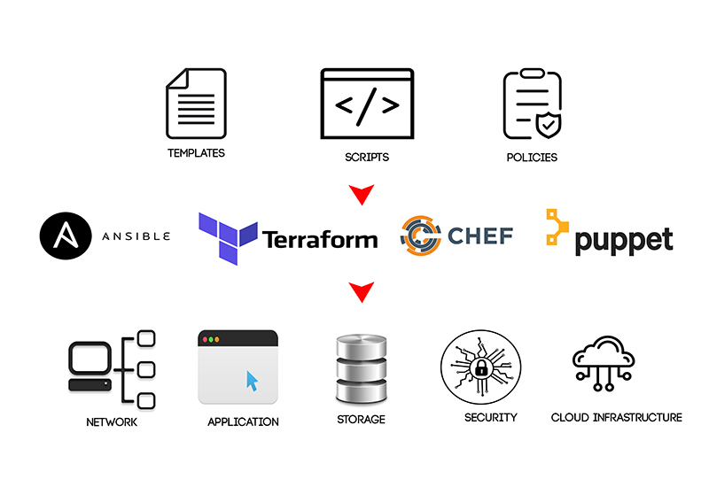

# Infrastructure as Code (IaC) là gì ?

Cơ sở hạ tầng dưới dạng mã (IaC) là một cách tiếp cận quản lý cơ sở hạ tầng bằng cách sử dụng mã. Điều này có nghĩa là cơ sở hạ tầng được mô tả dưới dạng các tài liệu có thể được máy đọc, thay vì được cấu hình theo cách thủ công.

IaC có một số lợi ích, bao gồm:

- **Tăng tính nhất quán**: IaC có thể giúp đảm bảo rằng cơ sở hạ tầng được cấu hình nhất quán trên tất cả các môi trường. Điều này có thể giúp ngăn ngừa lỗi và sự cố.
- **Tăng khả năng mở rộng**: IaC có thể giúp dễ dàng mở rộng cơ sở hạ tầng khi nhu cầu tăng. Điều này có thể giúp doanh nghiệp tiết kiệm thời gian và tiền bạc.
- **Tăng khả năng bảo mật**: IaC có thể giúp cải thiện bảo mật cơ sở hạ tầng bằng cách tự động hóa các quy trình tạo và quản lý cơ sở hạ tầng. Điều này có thể giúp ngăn chặn truy cập trái phép vào cơ sở hạ tầng.
- **Tăng khả năng kiểm tra**: IaC có thể giúp dễ dàng kiểm tra cơ sở hạ tầng bằng cách sử dụng mã. Điều này có thể giúp đảm bảo rằng cơ sở hạ tầng hoạt động bình thường.
- **Tăng khả năng tự động hóa**: IaC có thể giúp tự động hóa các quy trình quản lý cơ sở hạ tầng. Điều này có thể giúp doanh nghiệp tiết kiệm thời gian và tiền bạc.

Có một số công cụ IaC khác nhau có sẵn, bao gồm:

- **Ansible**: Ansible là một công cụ tự động hóa mã nguồn mở có thể được sử dụng để quản lý cơ sở hạ tầng. Ansible sử dụng các kịch bản để quản lý cơ sở hạ tầng và có thể được sử dụng để quản lý các máy chủ, mạng và dịch vụ khác nhau.
- **Chef**: Chef là một công cụ tự động hóa mã nguồn mở khác có thể được sử dụng để quản lý cơ sở hạ tầng. Chef sử dụng các cookbook để quản lý cơ sở hạ tầng và có thể được sử dụng để quản lý các máy chủ, mạng và dịch vụ khác nhau.
- **Puppet**: Puppet là một công cụ tự động hóa mã nguồn mở khác có thể được sử dụng để quản lý cơ sở hạ tầng. Puppet sử dụng các mô hình để quản lý cơ sở hạ tầng và có thể được sử dụng để quản lý các máy chủ, mạng và dịch vụ khác nhau.
- **Terraform**: Terraform là một công cụ IaC mã nguồn mở có thể được sử dụng để quản lý cơ sở hạ tầng đám mây. Terraform sử dụng các tài liệu để quản lý cơ sở hạ tầng và có thể được sử dụng để quản lý các tài nguyên đám mây khác nhau từ nhiều nhà cung cấp khác nhau.

Công cụ IaC tốt nhất cho bạn sẽ phụ thuộc vào nhu cầu và yêu cầu cụ thể của bạn.