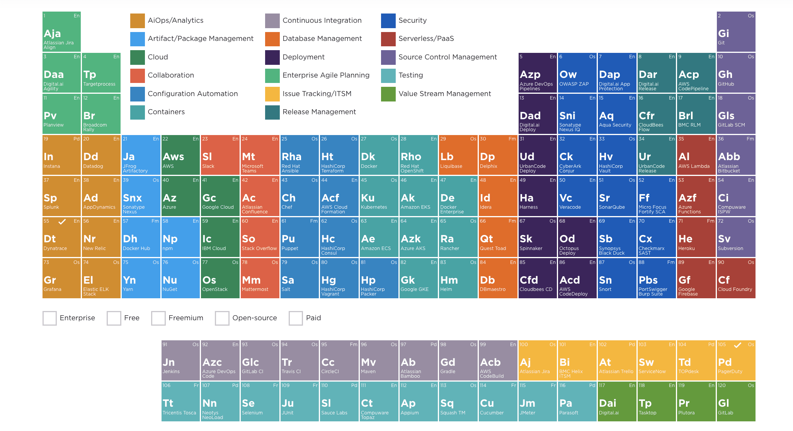

# Bộ sưu tập các Cheatsheets dành cho DevOps

### Các Cheatsheet thông dụng

Cheatsheets cho các ngôn ngữ lập trình thông dụng, framework và công cụ phát triển phổ biến. Chúng bao gồm mọi thứ bạn nên biết trong một tệp duy nhất.

- https://github.com/LeCoupa/awesome-cheatsheets 
- https://lecoupa.github.io/awesome-cheatsheets/

### Bộ sưu tập cheatsheets: 

Một bộ sưu tập các danh sách: hướng dẫn sử dụng, cheatsheets, blog, hacks, one-liners, cli/web tools và hơn thế nữa.

- https://github.com/trimstray/the-book-of-secret-knowledge

### Cheatsheets DevOps

Hướng dẫn DevOps - Development đến Production tất cả các cấu hình với các lưu ý cơ bản để gỡ lỗi hiệu quả.

- https://github.com/Tikam02/DevOps-Guide
- https://github.com/bregman-arie/devops-exercises

### Khóa học miễn phí Làm việc với Terminal & Ubuntu

- https://fullstack.edu.vn/courses/windows-terminal-wsl

### Các lệnh Linux Bash

- https://github.com/trinib/Linux-Bash-Commands
- https://github.com/sk3pp3r/cheat-sheet-pdf

###  Python Cheatsheet

- https://github.com/gto76/python-cheatsheet
- https://gto76.github.io/python-cheatsheet
- https://github.com/trekhleb/learn-python
- https://github.com/FavioVazquez/ds-cheatsheets
- https://github.com/crazyguitar/pysheeet
- https://github.com/matplotlib/cheatsheets
- https://github.com/Tikam02/DevOps-Guide
- https://github.com/wilfredinni/python-cheatsheet
- https://github.com/Fechin/reference
- https://www.pythoncheatsheet.org
- https://quickref.me/python.html

### Kubernetes CheatSheet

- https://github.com/dennyzhang/cheatsheet-kubernetes-A4

### Git CheatSheet

- https://github.com/arslanbilal/git-cheat-sheet

### Learn to Cloud

- https://github.com/learntocloud/learn-to-cloud
- https://github.com/rishabkumar7/the-devops-guide
- https://github.com/rishabkumar7/7DaysOfPython
- https://github.com/rishabkumar7/CloudNotes
- https://github.com/rishabkumar7/cloud-cheat-sheets
- https://github.com/rishabkumar7/LearningKubernetes

### DevOps RoadMap

- https://github.com/raycad/devops-roadmap

