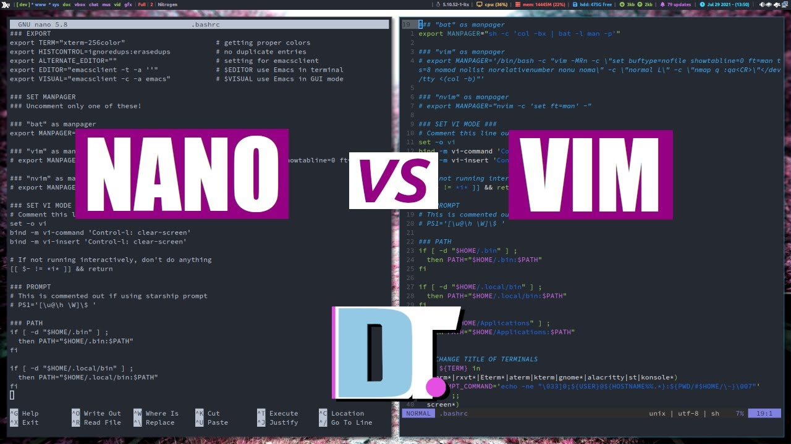

# Hướng dẫn sử dụng Nano và Vim trên Linux

### Hướng dẫn sử dụng Nano trên Linux

Nano là một trình soạn thảo văn bản dòng lệnh đơn giản được cài đặt theo mặc định trên hầu hết các hệ điều hành Linux. Nó là một công cụ tuyệt vời để tạo và chỉnh sửa các tệp văn bản, và nó cũng có thể được sử dụng để tạo các tệp cấu hình.

Để mở trình soạn thảo Nano, hãy chạy lệnh sau trong thiết bị đầu cuối:

    nano <filename>

Ví dụ: để mở tệp có tên "myfile.txt", bạn sẽ chạy lệnh sau:

    nano myfile.txt

Khi Nano được mở, bạn sẽ thấy nội dung của tệp trong cửa sổ chính của nó. Bạn có thể sử dụng các phím mũi tên để di chuyển xung quanh văn bản, và bạn có thể sử dụng các phím Backspace và Delete để xóa văn bản.

Để chèn văn bản mới, hãy di chuyển con trỏ đến vị trí bạn muốn chèn văn bản và bắt đầu gõ. Để lưu tệp, nhấn phím *Ctrl+X*. Bạn sẽ được nhắc lưu các thay đổi của mình. Nhấn *Y* để lưu tệp, và nhấn *Enter* để chọn tên tệp.

Để thoát khỏi Nano mà không lưu các thay đổi, nhấn phím *Ctrl+C*.

Dưới đây là một số phím tắt Nano hữu ích:

- Ctrl+X: Lưu file và thoát
- Ctrl+C: Thoát mà không lưu
- Ctrl+S: Lưu file
- Ctrl+Q: Thoát khỏi Nano
- A: Chuyển đến đầu tệp
- E: Chuyển đến cuối tệp
- B: Di chuyển một ký tự về phía trước
- F: Di chuyển một ký tự về phía sau
- D: Xóa một ký tự
- C: Sao chép một ký tự
- V: Dán một ký tự
- Y: Sao chép dòng hiện tại
- P: Dán dòng hiện tại
- G: Chuyển đến dòng cuối cùng
- 0: Chuyển đến ký tự đầu tiên của dòng hiện tại
- $: Chuyển đến ký tự cuối cùng của dòng hiện tại
- Backspace: Xóa ký tự phía trước con trỏ
- Delete: Xóa ký tự phía sau con trỏ
- Ctrl+A: Di chuyển đến đầu dòng
- Ctrl+E: Di chuyển đến cuối dòng
- Ctrl+B: Di chuyển một từ về phía trước
- Ctrl+F: Di chuyển một từ về phía sau
- Ctrl+U: Xóa dòng hiện tại
- Ctrl+Y: Dán văn bản đã sao chép
- Ctrl+K: Cắt dòng hiện tại
- Ctrl+W: Xóa từ trước con trỏ

Để biết thêm về Nano, hãy tham khảo trang web của Nano: <https://www.nano-editor.org/>

Nano là một công cụ tuyệt vời để tạo và chỉnh sửa các tệp văn bản trên Linux. Nó là một công cụ đơn giản và dễ sử dụng, và nó có thể được sử dụng để tạo các tệp cấu hình.

### Hướng dẫn sử dụng vi/vim trên Linux

Vim là một trình soạn thảo văn bản dòng lệnh mạnh mẽ được cài đặt theo mặc định trên hầu hết các hệ điều hành Linux. Nó là một công cụ tuyệt vời để tạo và chỉnh sửa các tệp văn bản, và nó cũng có thể được sử dụng để tạo các tệp cấu hình.

Để mở trình soạn thảo Vim, hãy chạy lệnh sau trong thiết bị đầu cuối:

    vim <filename>

Ví dụ: để mở tệp có tên "myfile.txt", bạn sẽ chạy lệnh sau:

    vim myfile.txt

Khi Vim được mở, bạn sẽ thấy nội dung của file trong cửa sổ chính của nó. Bạn có thể sử dụng các phím mũi tên để di chuyển xung quanh văn bản, và bạn có thể sử dụng các phím *Backspace* và *Delete* để xóa văn bản.

Để chèn văn bản mới, hãy di chuyển con trỏ đến vị trí bạn muốn chèn văn bản và bắt đầu gõ. Để lưu file, nhấn phím *:w*. Bạn sẽ được nhắc lưu các thay đổi của mình. Nhấn *Enter* để xác nhận.

Để thoát khỏi Vim, nhấn phím* :q*. Bạn sẽ được nhắc lưu các thay đổi của mình. Nhấn *Y* để lưu file, và nhấn *Enter* để chọn tên file. Nhấn n để thoát mà không lưu các thay đổi.

Dưới đây là một số phím tắt Vim hữu ích:

- i: Chèn văn bản
- a: Chèn văn bản sau con trỏ
- c: Xóa văn bản
- d: Xóa văn bản
- s: Thay thế văn bản
- y: Sao chép văn bản
- p: Dán văn bản
- g: Di chuyển đến đầu dòng
- gg: Di chuyển đến đầu tệp
- G: Di chuyển đến cuối dòng
- h: Di chuyển một ký tự về phía trước
- j: Di chuyển một dòng xuống
- k: Di chuyển một dòng lên
- l: Di chuyển một ký tự về phía sau
- w: Di chuyển một từ về phía trước
- b: Di chuyển một từ về phía sau
- n: Tìm kiếm tiếp theo
- N: Tìm kiếm trước
- /: Tìm kiếm
- ?`: Tìm kiếm ngược
- Shift+n: Tìm kiếm ngược
- :h`: Hiển thị trợ giúp
- :q`: Thoát
- :w`: Lưu file
- :wq`: Lưu và thoát

Vim là một công cụ tuyệt vời để tạo và chỉnh sửa các tệp văn bản trên Linux. Nó là một công cụ mạnh mẽ và linh hoạt, và nó có thể được sử dụng để tạo các tệp cấu hình.

### So sánh giữa Nano và Vim

Nano và Vim đều là những trình soạn thảo văn bản dòng lệnh miễn phí và mã nguồn mở. Chúng đều có thể được sử dụng để tạo và chỉnh sửa các tệp văn bản trên các hệ thống giống Unix, bao gồm Linux, macOS và Windows.

Tuy nhiên, có một số điểm khác biệt chính giữa Nano và Vim. Nano là một trình soạn thảo văn bản đơn giản hơn, trong khi Vim là một trình soạn thảo văn bản mạnh mẽ hơn.

Một số điểm khác biệt chính giữa Nano và Vim:

- **Kích thước**: Nano là một trình soạn thảo văn bản nhỏ hơn, trong khi Vim là một trình soạn thảo văn bản lớn hơn.
- **Giao diện người dùng**: Nano có giao diện người dùng đơn giản và trực quan, trong khi Vim có giao diện người dùng phức tạp hơn và có thể tùy chỉnh nhiều hơn.
- **Tính năng**: Nano có một số tính năng cơ bản, trong khi Vim có nhiều tính năng hơn, bao gồm hỗ trợ cho các plugin và macro.
- **Hỗ trợ**: Nano có hỗ trợ cơ bản, trong khi Vim có hỗ trợ tốt hơn.

**Ưu và nhược điểm của Nano:**

*Ưu điểm:*

- Dễ sử dụng
- Giao diện người dùng trực quan
- Ít tính năng, vì vậy dễ tìm hiểu
- Tích hợp tốt với dòng lệnh
- Nhỏ gọn và nhanh chóng

*Nhược điểm:*

- Ít tính năng
- Không thể mở nhiều cửa sổ hoặc tab cùng lúc
- Không thể sử dụng các plugin

**Ưu và nhược điểm của Vim:**

*Ưu điểm:*

- Mạnh mẽ và linh hoạt
- Nhiều tính năng
- Tích hợp tốt với dòng lệnh
- Có thể mở nhiều cửa sổ hoặc tab cùng lúc
- Có thể sử dụng các plugin

*Nhược điểm:*

- Khó sử dụng đối với người dùng mới
- Giao diện người dùng dòng lệnh
- Có thể chậm hơn Nano đối với các tệp lớn

Nhìn chung, Nano là một trình soạn thảo văn bản tốt để sử dụng nếu bạn đang tìm kiếm một công cụ đơn giản và dễ sử dụng. Vim là một trình soạn thảo văn bản tốt hơn để sử dụng nếu bạn đang tìm kiếm một công cụ mạnh mẽ và có thể tùy chỉnh hơn.

Cuối cùng, trình soạn thảo văn bản tốt nhất cho bạn phụ thuộc vào nhu cầu và sở thích cá nhân của bạn.