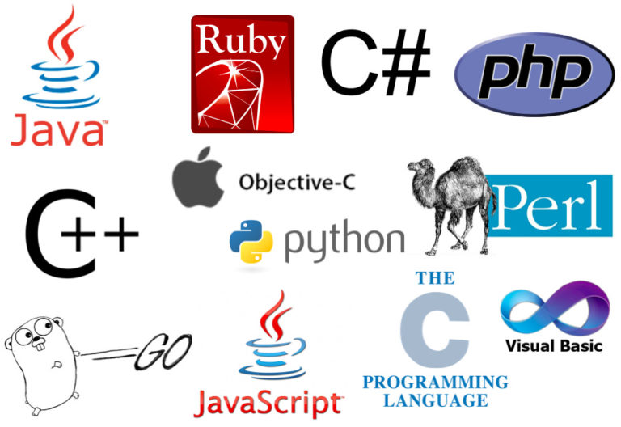

**DevOps** là một phương pháp phát triển và vận hành phần mềm tập trung vào việc tự động hóa và tích hợp các quy trình phát triển và vận hành. Mục tiêu của DevOps là tạo ra một môi trường nơi các nhóm phát triển và vận hành có thể cộng tác chặt chẽ để cung cấp phần mềm nhanh hơn, đáng tin cậy hơn và linh hoạt hơn.

Có một số ngôn ngữ lập trình và công nghệ phổ biến được sử dụng trong DevOps, bao gồm:

- **Python**: Python là một ngôn ngữ lập trình phổ biến được sử dụng cho nhiều mục đích khác nhau, bao gồm cả DevOps. Python có nhiều tính năng phù hợp với DevOps, chẳng hạn như khả năng tự động hóa, khả năng dễ đọc và khả năng dễ sử dụng.
- **Bash**: Bash là một ngôn ngữ lập trình dòng lệnh được sử dụng để điều khiển máy tính. Nó được sử dụng trong DevOps để tự động hóa các tác vụ và quản lý hệ thống.
- **JavaScript**: JavaScript là một ngôn ngữ lập trình được sử dụng để tạo giao diện người dùng cho các trang web và ứng dụng web. JavaScript cũng có thể được sử dụng cho DevOps, chẳng hạn như để tự động hóa các tác vụ và để tạo các công cụ DevOps.
- **Go**: Go là một ngôn ngữ lập trình mới được tạo ra bởi Google. Go là một ngôn ngữ nhanh, mạnh mẽ và dễ sử dụng. Go cũng là một ngôn ngữ được thiết kế đặc biệt cho DevOps.
- **Ruby**: Ruby là một ngôn ngữ lập trình khác được sử dụng cho DevOps. Ruby là một ngôn ngữ năng động và linh hoạt, và có một cộng đồng người dùng lớn và tích cực.
- **Docker**: Docker là một công nghệ container hóa giúp các nhà phát triển và vận hành đóng gói và phân phối phần mềm một cách hiệu quả. Docker là một công nghệ quan trọng trong DevOps.
- **Kubernetes**: Kubernetes là một hệ thống quản lý container giúp các nhà phát triển và vận hành quản lý các cụm container. Kubernetes là một công nghệ quan trọng trong DevOps.
- **Jenkins**: Jenkins là một công cụ tự động hóa được sử dụng để chạy các bài kiểm tra, xây dựng mã và triển khai phần mềm. Nó được sử dụng trong DevOps để tự động hóa các quy trình phát triển và vận hành.
- **Travis CI**, **CircleCI**: là một hệ thống CI mã nguồn mở chạy trên đám mây.
- **Ansible**, **Puppet**, **Chef**, **Terraform**: là một công cụ tự động hóa mã nguồn mở.

Cách tốt nhất để tìm hiểu về DevOps là bắt đầu với một dự án nhỏ. Bạn có thể sử dụng một trong các công cụ hoặc dịch vụ DevOps được đề cập ở trên để tự động hóa các quy trình phát triển và vận hành của mình.

Dưới đây là một số ví dụ về cách bạn có thể sử dụng DevOps để tự động hóa các quy trình phát triển và vận hành của mình:

- Bạn có thể sử dụng **Jenkins** để tự động hóa xây dựng và kiểm tra mã của mình.
- Bạn có thể sử dụng **Travis CI** hoặc **CircleCI** để tự động hóa triển khai mã của mình lên môi trường production.
- Bạn có thể sử dụng **Ansible**, **Puppet** hoặc **Chef** để tự động hóa việc quản lý cơ sở hạ tầng của mình.

Các ngôn ngữ lập trình và công nghệ DevOps khác nhau được sử dụng tùy thuộc vào nhu cầu cụ thể của từng tổ chức. Tuy nhiên, **Python**, **JavaScript**, **Go**, **Docker** và **Kubernetes** là một số ngôn ngữ lập trình và công nghệ DevOps phổ biến nhất.

Ngôn ngữ lập trình tốt nhất cho DevOps là ngôn ngữ mà bạn cảm thấy thoải mái nhất và có kiến thức tốt nhất. Nếu bạn không chắc chắn ngôn ngữ nào nên sử dụng, thì **Python** là một lựa chọn tốt.

### Tham khảo
- https://www.python.org/
- https://vi.wikipedia.org/wiki/Bash
- https://vi.wikipedia.org/wiki/JavaScript
- https://go.dev/
- https://www.ruby-lang.org/en/
- https://www.docker.com/
- https://kubernetes.io/vi/
- https://www.jenkins.io/