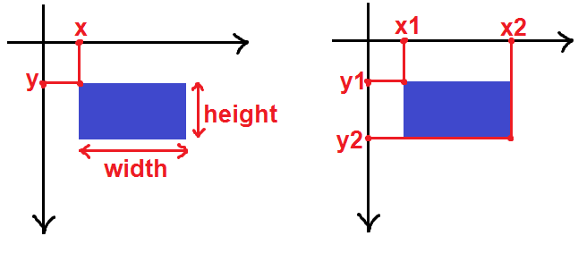
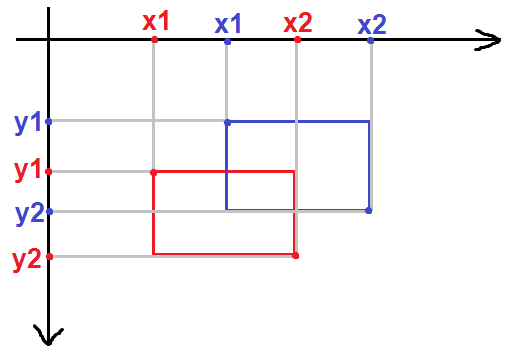
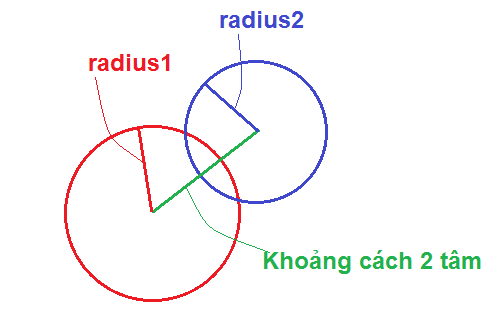

# Xử Lý Va Chạm Trong Game Với Pygame

**Va chạm là một phần quan trọng trong lập trình game. Việc xử lý được các va chạm sẽ giúp xử lý tốt những hoạt động khác trong game. Trong bài hướng dẫn này, các bạn sẽ tìm hiểu cách xử lý những va chạm đơn giản.**

## Va chạm giữa hai hình chữ nhật

Như các bạn đã biết thì một hình chữ nhật có thể được biểu diễn bằng **4** thông số: (**x, y, width, height**) tương ứng với **hoành độ**, **tung độ**, **chiều rộng** và **chiều cao**. Tuy nhiên, còn cách khác để biểu diễn hình chữ nhật đó là biểu diễn qua toạ độ của **2 điểm**.

Cụ thể là (**x1, y1, x2, y**2) với:

- x1 là hoành độ điểm trên cùng bên trái.
- y1 là tung độ điểm trên cùng bên trái.
- x2 là hoành độ điểm dưới cùng bên phải.
- y2 là tung độ điểm dưới cùng bên phải.

Từ cách biểu diễn (**x, y, width, height**) có thể chuyển sang cách biểu diễn (**x1, y1, x2, y2**) như sau:

- x1 = x
- y1 = y
- x2 = x + width
- y2 = y + height



Giả sử chúng ta có 2 hình chữ nhật là **rect1** và **rect2** đều được biểu diễn theo các thông số (**x1, y1, x2, y2**). Hai hình chữ nhật chạm nhau khi thoả mãn tất cả các điều kiện sau:

- x1 của rect1 bé hơn x2 của rect2.
- x1 của rect2 bé hơn x2 của rect1.
- y1 của rect1 bé hơn y2 của rect2.
- y1 của rect2 bé hơn y2 của rect1.



Vì thế, chúng ta có thể viết một hàm để kiểm tra sự va chạm giữa hai hình chữ nhật như sau:

``` python
def rectCollision(rect1, rect2):
    if rect1[0] <= rect2[0]+rect2[2] and rect2[0] <= rect1[0]+rect1[2] and rect1[1] <= rect2[1]+rect2[3] and rect2[1] <= rect1[1]+rect1[3]:
        return True
    return False
```

Các bạn lưu ý là `rect1` và `rect2` được biểu diễn theo (**x, y, width, height**). Vì thế, trong lệnh `if` cần phải đổi các thông số sang dạng (**x1, y1, x2, y2**) rồi xét các điều kiện như trên. Các bạn có thể test thử hàm này nhe.

Đoạn **code** sau đây thể hiện trực quan hơn.

``` python
import pygame, sys
from pygame.locals import *
pygame.init()
FPS = 60
fpsClock = pygame.time.Clock()
DISPLAYSURF = pygame.display.set_mode((400, 400))

def rectCollision(rect1, rect2):
    if rect1[0] <= rect2[0]+rect2[2] and rect2[0] <= rect1[0]+rect1[2] and rect1[1] <= rect2[1]+rect2[3] and rect2[1] <= rect1[1]+rect1[3]:
        return True
    return False

rect1 = [0, 0, 80, 50] # Hình chữ nhật di chuyển
rect2 = [150, 150, 90, 60] # Hình chữ nhật đứng yên

while True:
    for event in pygame.event.get():
        if event.type == pygame.QUIT:
            pygame.quit()
            sys.exit()
    DISPLAYSURF.fill((0, 0, 0))

    rect1[0], rect1[1] = pygame.mouse.get_pos() # Lấy vị trí của chuột

    pygame.draw.rect(DISPLAYSURF, (255, 255, 0), rect2)
    if rectCollision(rect1, rect2) == True:
        pygame.draw.rect(DISPLAYSURF, (255, 0, 0), rect1)
    else:
        pygame.draw.rect(DISPLAYSURF, (0, 255, 0), rect1)

    pygame.display.update()
    fpsClock.tick(FPS)
```

## Va chạm giữa hai hình tròn

Muốn có một hình tròn thì cần xác định tâm và bán kính. Vì vậy, một hình tròn gồm các thông số sau: **center**, **radius**

Trong đó:

- **center** là toạ độ tâm hình tròn, **center** có dạng (**x, y**) với x là hoành độ, y là tung độ.
- **radius** là bán kính hình tròn.

Hai hình tròn chạm nhau khi **khoảng cách giữa hai tâm bé hơn tổng hai bán kính**.



Vì vậy, chúng ta có được hàm kiểm tra sự va chạm giữa hai hình tròn như sau:

``` python
def circleCollision(center1, radius1, center2, radius2):
    d = math.sqrt((center1[0]-center2[0])**2 + (center1[1]-center2[1])**2) # Khoảng cách hai tâm
    if d <= radius1 + radius2:
        return True
    return False
```

Trong đoạn **code** trên: `center1` là tâm hình tròn thứ nhất, `radius1` là bán kính hình tròn thứ nhất, `center2` là tâm hình tròn thứ hai, `radius2` là bán kính hình tròn thứ hai.

Đoạn **code** dưới đây mô phỏng trực quan hơn:

``` python
import pygame, sys, math
from pygame.locals import *
pygame.init()
FPS = 60
fpsClock = pygame.time.Clock()
DISPLAYSURF = pygame.display.set_mode((400, 400))

def circleCollision(center1, radius1, center2, radius2):
    d = math.sqrt((center1[0]-center2[0])**2 + (center1[1]-center2[1])**2) # Khoảng cách hai tâm
    if d <= radius1 + radius2:
        return True
    return False

center1 = [0, 0] # Tâm hình tròn di chuyển
radius1 = 20 # Bán kính hình tròn di chuyển
center2 = [200, 200] # Tâm hình tròn đứng yên
radius2 = 30 # Bán kính hình tròn đứng yên

while True:
    for event in pygame.event.get():
        if event.type == pygame.QUIT:
            pygame.quit()
            sys.exit()
    DISPLAYSURF.fill((0, 0, 0))

    center1[0], center1[1] = pygame.mouse.get_pos() # Lấy vị trí của chuột

    pygame.draw.circle(DISPLAYSURF, (255, 255, 0), center2, radius2)
    if circleCollision(center1, radius1, center2, radius2) == True:
        pygame.draw.circle(DISPLAYSURF, (255, 0, 0), center1, radius1)
    else:
        pygame.draw.circle(DISPLAYSURF, (0, 255, 0), center1, radius1)

    pygame.display.update()
    fpsClock.tick(FPS)
```

## Sử dụng va chạm giữ 2 hình chữ nhật và va chạm giữa 2 hình tròn

Hai loại va chạm trên được dùng cho các đối tượng có hình dáng tương tự hình chữ nhật (hoặc hình tròn). Các bạn xem những ví dụ bên dưới.


Tuy nhiên, do hình dạng của các đối tượng không thể chính xác với hình chữ nhật (hoặc hình tròn) nên nhiều trường hợp hàm kiểm tra va chạm hoạt động sai so với thực tế. Các bạn xem ví dụ bên dưới: trong thực tế, chim vẫn chưa chạm vào cột nhưng hàm kiểm tra va chạm vẫn trả về kết quả `True`.


Để khắc phục điều này thì chúng ta hãy tìm hiểu phần tiếp theo.

## Va chạm giữa hai hình bất kì

Giả sử mình có hai hình như thế này và muốn xét sự va chạm của 2 hình đó:


Có thể thấy rằng, việc sử dụng va chạm giữa hai hình chữ nhật hay va chạm giữa hai hình tròn đều không hiệu quả. Vì thế, mình có một cách khác để thực hiện việc này. Các bạn xem đoạn **code** bên dưới nhé!

``` python
import pygame, sys
from pygame.locals import *
pygame.init()
FPS = 60
fpsClock = pygame.time.Clock()
DISPLAYSURF = pygame.display.set_mode((400, 400))

def collision(surface1, pos1, surface2, pos2):
    mask1 = pygame.mask.from_surface(surface1)
    mask2 = pygame.mask.from_surface(surface2)
    x = pos2[0] - pos1[0]
    y = pos2[1] - pos1[1]
    if mask1.overlap(mask2, (x, y)) != None:
        return True
    return False

star1 = pygame.image.load('star1.png') # Sao di chuyển
star1_pos = [0, 0] # Vị trí sao di chuyển
star2 = pygame.image.load('star2.png') # Sao đứng yên
star2_pos = [50, 50] # Vị trí sao đứng yên

while True:
    for event in pygame.event.get():
        if event.type == pygame.QUIT:
            pygame.quit()
            sys.exit()
    DISPLAYSURF.fill((0, 0, 0))

    star1_pos = pygame.mouse.get_pos() # Lấy vị trí của chuột

    DISPLAYSURF.blit(star2, star2_pos)
    DISPLAYSURF.blit(star1, star1_pos)
    if collision(star1, star1_pos, star2, star2_pos) == True:
        pygame.draw.rect(DISPLAYSURF, (255, 0, 0), (50, 350, 300, 40))

    pygame.display.update()
    fpsClock.tick(FPS)
```
Các bạn tự chạy và trải nghiệm đoạn code nhé.

Bây giờ hãy tìm hiểu hàm `collision(surface1,pos1,surface2,pos2)` đây chính là hàm để kiểm tra va chạm. Trong đó tham số `pos1` có dạng (**x, y**) là vị trí của `surface1`, `pos2` cũng tương tự.

Hai dòng dưới đây để tạo 2 **mask** từ 2 **suface**:

``` python
mask1 = pygame.mask.from_surface(surface1)
mask2 = pygame.mask.from_surface(surface2)
```

Các **mask** ở đây là những **pixel không trong suốt** của các **surface**. Các bạn có thể đọc thêm về **mask** [tại đây](https://www.pygame.org/docs/ref/mask.html).

Hai dòng dưới đây để xác định vị trí của `surface2` so với `surface1`.

``` python
x = pos2[0] - pos1[0]
y = pos2[1] - pos1[1]
```


Dòng `if` dưới đây dùng để kiểm tra sự va chạm.

``` python
if mask1.overlap(mask2, (x, y)) != None:
```

Hàm `overlap()` trả về **pixel** trùng đầu tiên của **mask1** và **mask2**, nếu không có **pixel** trùng thì trả về `None`.

## Kết
Vậy là chúng ta đã kết thúc bài hướng dẫn tại đây. Hy vọng bài hướng dẫn sẽ giúp các bạn xử lý được một số loại va chạm đơn giản. Tạm biệt các bạn và hẹn gặp lại ở những bài hướng dẫn tiếp theo.

Phần này mình không để **code**, các bạn tự tìm hiểu và làm theo hướng dẫn nhé.

- https://codelearn.io/sharing/xu-ly-va-cham-trong-game-voi-pygame