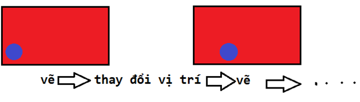
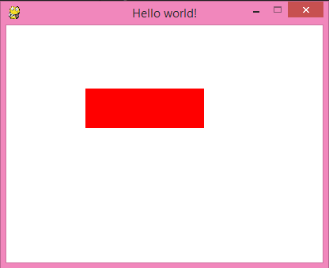
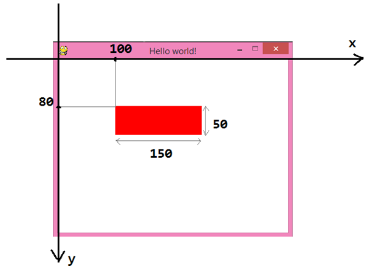

# Lập Trình Game Cơ Bản Với Pygame - Phần 1

Chào mọi người! Trong bài hướng dẫn này chúng ta sẽ tìm hiểu về thư viện **Pygame** của **Python** cùng với những yếu tố trong lập trình **game**. Trong những bài hướng dẫn sau mình sẽ giúp các bạn vận dụng kiến thức cơ bản để tạo ra những **game** đơn giản để chơi nha!

Để có thể bắt đầu tìm hiểu **pygame**, các bạn phải biết [**python** cơ bản](Bat-Dau-Voi-Python.md) kèm theo một tí kiến thức về đồ hoạ. Các bạn nhớ cài thêm thư viện **pygame** nhé!

## Cài đặt python và thư viện kèm

### Cài đặt python
Nếu các bạn chưa cài **python** click [tại đây](Introduction-to-Python.md) để được hướng dẫn.

    pip install pygame

Trong bài hướng dẫn mình không thể giải thích hết cho các bạn những hàm, lệnh... trong **pygame**. Vì thế, các bạn cần phải tự tìm hiểu thêm qua **google**, **youtube**,... Các bạn cũng có thể lên [trang này](https://www.pygame.org/docs) để tìm hiểu thêm về các hàm, lệnh... trong **pygame**.

Và đây là hướng dẫn lập trình game cho người mới bắt đầu

- Tạo cửa sổ game
- Vòng lặp game
- Bắt sự kiện
- Vẽ hình đơn giản

Trong bài hướng dẫn có những đoạn **code**, các bạn hãy tự tay gõ vào và chạy thử nhé! Đừng copy **code** nhé!

### Tạo cửa sổ game
Bây giờ chúng ta tìm hiểu 1 ví dụ đơn giản như sau. Mình sẽ giải thích từng dòng cho các bạn, nên hãy yên tâm nha!

``` python
import pygame, sys
from pygame.locals import *

pygame.init()

DISPLAYSURF = pygame.display.set_mode((400, 300))
pygame.display.set_caption('Hello world!')

while True:
    for event in pygame.event.get():
        if event.type == QUIT:
            pygame.quit()
            sys.exit()
```

Đây là kết quả có được:


Nào, chúng ta hãy tìm hiểu từng dòng code.

``` python
import pygame, sys
from pygame.locals import *
```

Hai dòng trên dùng để khai báo các thư viện cần thiết.

``` python
pygame.init()
```

Dòng trên cần phải có để sử dụng các hàm của **pygame**, Chỉ cần biết khi dùng **pygame** thì nhớ thêm dòng này vào.

``` python
DISPLAYSURF = pygame.display.set_mode((400, 300))
```

Dòng này dùng để tạo cửa sổ game. Hai số trong **tuple (400, 300)** chính là chiều rộng và chiều cao của cửa sổ. Đơn vị độ dài hay toạ độ của đối tượng trong **pygame** là **pixel**. **DISPLAYSURF** là 1 biến dạng **surface**. **Surface** là gì thì mình sẽ giải thích kĩ ở phần sau nhe. Bây giờ các bạn cứ hiểu đơn giản **DISPLAYSURF** là cái khung đen đen ấy là được.

``` python   
pygame.display.set_caption('Hello world!')
```

Dòng trên dùng để tạo cái tiêu đề thôi!


``` python
while True:
    for event in pygame.event.get():
        if event.type == QUIT:
            pygame.quit()
            sys.exit()
```

Đây là đoạn khá phức tạp với các bạn mới học lập trình **game**. Các bạn tập trung đoạn này nhe. Tớ sẽ giải thích đoạn **code** này trong các phần tiếp theo.

### Vòng lặp game

Để nói cho dễ hiểu thì các chuyển động trong **game** cũng giống như trong phim hoạt hình. Tức là để tạo ra các chuyển động thì người ta sẽ **“phát”** liên tục các hình ảnh. Trong **game** cũng tương tự thế. Vì vậy, chúng ta cần có một vòng lặp để **“vẽ”** liên tục những hình ảnh. Vòng lặp `while` trong đoạn **code** trên chính là vòng lặp **game**.

Ví dụ, muốn cho một viên bi màu xanh chuyển động từ trái sang phải, phía sau là một nền đỏ thì phải làm như sau:

- Vẽ nền đỏ, vẽ viên bi
- Thay đổi vị trí viên bi (cho sang phải một tí)
- Lặp lại bước đầu tiên



Trong vòng lặp **game** còn một phần quan trọng nữa là bắt “**sự kiện**”. Tiếp theo chúng ta sẽ tìm hiểu về sự kiện nhé!

### Sự kiện

Sự kiện trong **game** có thể là một cái **click** chuột, ấn phím….

Bây giờ cùng xem lại đoạn **code** này:

``` python
for event in pygame.event.get():
    if event.type == QUIT:
        pygame.quit()
        sys.exit()
```

Dòng **code** này có tác dụng: Khi **click** vào nút **X** trên cửa sổ thì kết thúc **game** và đóng cửa sổ lại. Dùng biến **event** trong vòng `for` để lấy các sự kiện xảy ra. Dòng `if` để kiểm tra sự kiện có phải là “**click nút X**” hay không. Hai dòng cuối dùng để đóng chương trình.

Quay lại ví dụ về viên bi lúc nãy, nếu muốn khi ấn phím `space` thì viên bi nhảy lên thì phải bắt sự kiện ấn phím `space`, sau đó **code** để xử lý cho viên bi nhảy lên.

Trong lập trình **game** có rất nhiều sự kiện khác nhau, mình sẽ dành một phần riêng để nói về các sự kiện thường gặp.

**Tóm lại, nói nãy giờ thì có thể hiểu rằng: Trong vòng lặp game có 3 việc chính: Vẽ, bắt sự kiện, thay đổi đối tượng.**


Vậy là chúng ta vừa tìm hiểu xong đoạn **code** đầu tiên. Nếu các bạn vẫn chưa hiểu thì cũng đừng quá lo lắng, hồi xưa mình cũng vậy thôi. Hãy đọc lại, tìm hiểu thêm trên **google**, hoặc cũng có thể liên hệ với mình nhe!

### Vẽ vài thứ lên màn hình

Như đã tìm hiểu về vòng lặp **game**, những lệnh vẽ sẽ nằm trong vòng lặp **game**. Nào, bây giờ chúng ta hãy thử tô lên cửa sổ một cái nền màu trắng và vẽ một hình chữ nhật màu đỏ nha!

``` python
import pygame, sys
from pygame.locals import *

pygame.init()

DISPLAYSURF = pygame.display.set_mode((400, 300))
pygame.display.set_caption('Hello world!')

while True:
    for event in pygame.event.get():
        if event.type == QUIT:
            pygame.quit()
            sys.exit()
    
    DISPLAYSURF.fill((255, 255, 255))
    pygame.draw.rect(DISPLAYSURF, (255, 0, 0), (100, 80, 150, 50))
    pygame.display.update()
```

Đây là kết quả nhận được:



Tiếp tục chú ý những dòng mới thêm vào nhe!

``` python    
DISPLAYSURF.fill((255, 255, 255))
```

Dòng trên dùng để tô màu cho cửa sổ game. Hàm `fill` có tham số là một `tuple` (hoặc **list**) thể hiện cho màu sắc. **(255, 255, 255)** thể hiện màu trắng trong hệ màu **RGB**.

``` python
pygame.draw.rect(DISPLAYSURF, (255, 0, 0), (100, 80, 150, 50))
```

Dòng này dùng để vẽ hình chữ nhật. Trong hàm `rect` có các tham số cơ bản như sau: 

``` python
pygame.draw.rect(surface, color, rect, width)
```

- `surface` là “chỗ” vẽ vào, cụ thể ở đây là DISPLAYSURF (tức là cái cửa sổ đấy)
- `color` là một tuple (hoặc list) thể hiện màu sắc, cụ thể ở đây là màu đỏ
- `rect` là một tuple (hoặc list) có 4 phần tử thể hiện cho các thông số của hình chữ nhật: hoành độ góc trên bên trái, tung độ góc trên bên trái, chiều dài, chiều cao. Gốc toạ độ là góc trên cùng bên trái, trục hoành nằm ngang hướng sang phải, trục tung thẳng đứng hướng xuống dưới, đơn vị toạ độ và độ dài là pixel. Xem hình minh hoạ cho dễ hiểu nhe!



- `width` là độ dày của nét vẽ, nếu không truyền vào tham số này thì mặc định là hình chữ nhật sẽ được tô kín. Các bạn có thể thêm thông số này vào để xem thử nha!

### Tìm hiểu về surface

Nếu các bạn có biết qua **photoshop** thì chắc hẳn các bạn biết đến khái niệm `layer`. **Surface** trong **pygame** cũng tương tự như thế, nó là một **“lớp”** ảnh trong suốt. Các **surface** có thể được vẽ chồng lên nhau. Biến `DISPLAYSURF` được dùng từ đầu đến giờ là một **surface** đặc biệt, nó có kích thước bằng cửa sổ **game** và nằm dưới cùng.

Để hiểu rõ về **surface**, chúng ta hãy đến 1 ví dụ cụ thể:

``` python
import pygame, sys
from pygame.locals import *

pygame.init()

DISPLAYSURF = pygame.display.set_mode((400, 300))
pygame.display.set_caption('Hello world!')

while True:
    for event in pygame.event.get():
        if event.type == QUIT:
            pygame.quit()
            sys.exit()
    
    DISPLAYSURF.fill((255, 255, 255))
    
    surface2rect = pygame.Surface((150, 50))
    surface2rect.fill((0, 255, 0))
    pygame.draw.rect(surface2rect, (255, 0, 0), (20, 20, 50, 20))
    DISPLAYSURF.blit(surface2rect, (100, 80))
    
    pygame.display.update()
```

Đây là kết quả:


Bây giờ tiếp tục nghiên cứu những dòng **code** thôi!

``` python
surface2rect = pygame.Surface((150, 50))
```

Dòng trên dùng để tạo một **surface** dài **150 pixel** và cao **50 pixel**. Biến `surface2rect` đại diện cho **surface** đó.

``` python
surface2rect.fill((0, 255, 0))
```

Dòng này dùng để tô màu xanh lá cho `surface2rect`.

``` python
pygame.draw.rect(surface2rect, (255, 0, 0), (20, 20, 50, 20))
```

Dòng trên dùng để vẽ hình chữ nhật màu đỏ lên `surface2rect`. Cần chú ý là hoành độ và tung độ được tính theo `surface2rect` chứ không phải tính theo cửa sổ **game** nhe!

``` python
DISPLAYSURF.blit(surface2rect, (100, 80))
```

Hàm `blit` dùng để vẽ 1 **surface** lên 1 **surface** khác. Cụ thể ở đây là vẽ `surface2rect` lên **DISPLAYSURF**. **(100, 80)** là vị trí để vẽ (tương tự như hoành độ và tung độ hình chữ nhật). Các bạn có thể xem ảnh minh hoạ dưới đây nhé!


Chắc sẽ có nhiều bạn nghĩ rằng chỉ cần vẽ 2 hình chữ nhật lên **DISPLAYSURF** là được rồi, cần gì phải tạo thêm cái `surface2rect` cho phức tạp. Thực ra, nếu vẽ 2 hình chữ nhật thì nếu muốn di chuyển cái hình đó thì phải thay đổi vị trí của 2 hình chữ nhật, còn nếu có `suface2rect` thì chỉ cần thay đổi vị trí trong hàm `blit` là được, nếu vẽ 1 hình càng phức tạp thì nó càng hữu ích đấy. Ngoài ra, việc sử dụng **surface** còn có nhiều lợi ích khác nữa, các bạn hãy tự tìm hiểu thêm nhe!

## Tạm kết
Bài viết cũng sẽ khá dài rồi. Mình sẽ chia bài hướng dẫn thành nhiều phần để các bạn tiện theo dõi. Chào các bạn và hẹn gặp lại ở những bài hướng dẫn sau. Nếu có thắc mắc gì thì hãy để lại comment ở đây nha các bạn, chúng ta sẽ cùng thảo luận.

Bạn có thể tham khảo đoạn code đầy đủ [tại đây](/Scripts/Python/Pygame01.py)

- https://codelearn.io/sharing/lap-trinh-game-co-ban-voi-pygame