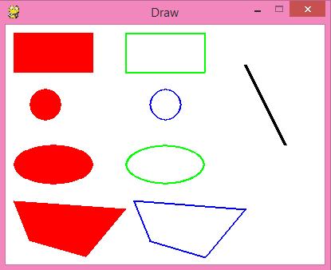
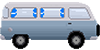

# Lập Trình Game Cơ Bản Với Pygame - Phần 2

Trong bài [hướng dẫn trước](Python-Pygame01.md), mình đã giới thiệu khá nhiều thứ trong **pygame**. Trong bài hướng dẫn lần này, chúng ta sẽ tiếp tục tìm hiểu những thứ cơ bản khác của **pygame**. Đây là những phần các bạn cần nắm để có thể làm được một **game** hoàn chỉnh, bao gồm: cách thêm hình ảnh vào **game**, tạo chuyển động trong **game**, bắt sự kiện,... Bây giờ chúng ta cùng bắt đầu thôi!

## Một số hàm vẽ thường gặp

Trong bài hướng dẫn trước chúng ta đã tìm hiểu kĩ cách vẽ một hình chữ nhật. Trong phần này mình sẽ giới thiệu nhanh qua những hàm vẽ thường dùng trong **pygame**. Thực tế, trong các **game** người ta ít dùng các hàm để vẽ những hình ảnh, mà người ta sẽ dùng những file ảnh để thêm vào trong **game**. Mình thì dùng các hàm vẽ này trong lúc **test** thử hoạt động của **game** trước khi đặt những hình ảnh vào. Ví dụ, nếu mình muốn làm **game** `Flappy Bird` thì mình sẽ vẽ con chim là hình **elip** trước, sau khi mọi thứ hoạt động ổn định thì mình sẽ tìm hình ảnh con chim để thay thế. Cách để thêm hình ảnh vào thì mình sẽ nói trong phần sau. Bây giờ các bạn hãy xem nhanh qua đoạn **code** này nhe.

``` python
import pygame, sys
from pygame.locals import *

pygame.init()

DISPLAYSURF = pygame.display.set_mode((400, 300))
pygame.display.set_caption('Draw')

# Tạo sẵn các màu sắc
BLACK = (  0,   0,   0)
WHITE = (255, 255, 255)
RED   = (255,   0,   0)
GREEN = (  0, 255,   0)
BLUE  = (  0,   0, 255)

while True:
    for event in pygame.event.get():
        if event.type == QUIT:
            pygame.quit()
            sys.exit()
    
    DISPLAYSURF.fill(WHITE)

    pygame.draw.rect(DISPLAYSURF, RED, (10, 10, 100, 50))# Hình chữ nhật
    pygame.draw.rect(DISPLAYSURF, GREEN, (150, 10, 100, 50), 2)# Hình chữ nhật rỗng
    pygame.draw.circle(DISPLAYSURF, RED, (50, 100), 20) # Hình tròn
    pygame.draw.circle(DISPLAYSURF, BLUE, (200, 100), 20, 1)# Hình tròn rỗng
    pygame.draw.ellipse(DISPLAYSURF, RED, (10, 150, 100, 50))# Hình elip
    pygame.draw.ellipse(DISPLAYSURF, GREEN, (150, 150, 100, 50), 3)# Hình elip rỗng
    pygame.draw.polygon(DISPLAYSURF, RED, ((10, 220), (150, 230), (100 ,290), (30, 270)))# Đa giác
    pygame.draw.polygon(DISPLAYSURF, BLUE, ((160, 220), (300, 230), (250 ,290), (180, 270)), 2)# Đa giác rỗng
    pygame.draw.line(DISPLAYSURF, BLACK, (300, 50), (350, 150), 4)# Đoạn thẳng

    pygame.display.update()
```

Đây là kết quả khi chạy đoạn **code** trên:



Hàm vẽ hình chữ nhật đã được giới thiệu ở phần trước. Bây giờ chúng ta tìm hiểu các hàm vẽ khác.

### Hàm này dùng để vẽ hình tròn

``` python
pygame.draw.circle(surface, color, center, radius, width) 
```

- `surface` là nơi để vẽ lên.
- `color` là màu được vẽ.
- `center` là một tuple (hoặc list) thể hiện toạ độ tâm hình tròn.
- `radius` là bán kính hình tròn.
- `width` là độ dày nét vẽ (tương tự hình chữ nhật).

### Hàm này dùng để vẽ hình elip

``` python
pygame.draw.ellipse(surface, color, rect, width) 
```

- `surface` là nơi để vẽ lên.
- `color` là màu để vẽ.
- `rect` là một tuple (hoặc list) gồm 4 phần tử là các thông số hình chữ nhật (như đã tìm hiểu ở phần trước). Hình elip được vẽ nội tiếp hình chữ nhật đó.
- `width` là độ dày nét vẽ (tương tự hình chữ nhật).

### Hàm này dùng để vẽ đa giác

``` python
pygame.draw.polygon(surface, color, points, width) 
```

- `surface` là nơi để vẽ lên.
- `color` là màu được vẽ.
- `points` là tuple (hoặc list) thể hiện các đỉnh của đa giác. Mỗi đỉnh là một tuple (hoặc list) thể hiện toạ độ.
- `width` là độ dày nét vẽ (tương tự hình chữ nhật).

### Hàm này dùng để vẽ một đoạn thẳng

``` python
pygame.draw.line(surface, color, start_pos, end_pos, width)
```

- `surface` là nơi để vẽ lên.
- `color` là màu được vẽ.
- `start_pos` là tuple (hoặc list) thể hiện toạ độ điểm đầu của đoạn thẳng.
- `end_pos` là tuple (hoặc list) thể hiện toạ độ điểm cuối của đoạn thẳng.
- `width` là độ dày nét vẽ.

Các bạn lưu ý là các giá trị toạ độ hay độ dài là những số nguyên, đơn vị là **pixel**.

## Tạo chuyển động trong game

Sau khi tìm hiểu qua một số hàm vẽ thì chúng ta đã vẽ được vài thứ lên màn hình. Bây giờ, các bạn sẽ tìm hiểu cách làm cho các hình ảnh ấy chuyển động. Các bạn chạy thử đoạn **code** này nhé, mình sẽ giải thích sau.

``` python
import pygame, sys
from pygame.locals import *

WINDOWWIDTH = 400 # Chiều dài cửa sổ
WINDOWHEIGHT = 300 # Chiều cao cửa sổ

WHITE = (255, 255, 255)
RED   = (255,   0,   0)
GREEN = (  0, 255,   0)

pygame.init()

### Xác định FPS ###
FPS = 60
fpsClock = pygame.time.Clock()

DISPLAYSURF = pygame.display.set_mode((WINDOWWIDTH, WINDOWHEIGHT))
pygame.display.set_caption('Animation')

### Tạo surface và vẽ hình chiếc xe ###
car_x = 0 # Hoành độ của xe
carSurface = pygame.Surface((100, 50), SRCALPHA)
pygame.draw.polygon(carSurface, RED, ((15, 0), (65, 0), (85, 15), (100, 15), (100, 40), (0, 40), (0, 15)))
pygame.draw.circle(carSurface, GREEN, (15, 40), 10)
pygame.draw.circle(carSurface, GREEN, (85, 40), 10)


while True:
    for event in pygame.event.get():
        if event.type == QUIT:
            pygame.quit()
            sys.exit()
    
    DISPLAYSURF.fill(WHITE)
    DISPLAYSURF.blit(carSurface, (car_x, 100))

    ### Thay đổi vị trí xe ###
    car_x += 2
    if car_x + 100 > WINDOWWIDTH:
        car_x = WINDOWWIDTH - 100

    pygame.display.update()
    fpsClock.tick(FPS)
```

Các bạn chạy để xem kết quả nhé


Trước khi tìm hiểu những dòng code thì các bạn cần biết thêm 1 khái niệm là **FPS** (**F**rames **P**er **S**econd). Hiểu theo nghĩa tiếng Việt thì **FPS** là số lượng khung hình trong **1 giây**. Ví dụ: nếu **FPS** là **60** thì trong **1 giây** sẽ có **60 khung** hình xuất hiện liên tiếp. Có thể ai cũng biết vòng lặp **while** chạy rất nhanh, trong **1 giây** sẽ lặp rất nhiều lần và tốc độ phụ thuộc vào nhiều yếu tố như **code** trong vòng lặp, **CPU**... Vì thế để đảm bảo **game** hoạt động ổn định thì cần phải thiết lập **FPS** để vòng lặp **game** thực hiện với tốc độ nhất định. Để thiết lập **FPS** thì các bạn hãy chú ý những dùng dòng **code** sau:

Đặt 2 dòng này bên ngoài vòng lặp **game**, trường hợp này thì **FPS** là **60**:

``` python
FPS = 60
fpsClock = pygame.time.Clock()
```

Đặt dòng này ở cuối vòng lặp game:

``` python
fpsClock.tick(FPS)
```

Các dòng **code** trên hoạt động thế nào thì các bạn có thể tự tìm hiểu thêm nhe!

Bây giờ chúng ta hãy tìm hiểu những dòng **code** khác.

``` python
### Tạo surface và vẽ hình chiếc xe
car_x = 0 # Hoành độ của xe
carSurface = pygame.Surface((100, 50), SRCALPHA)
pygame.draw.polygon(carSurface, RED, ((15, 0), (65, 0), (85, 15), (100, 15), (100, 40), (0, 40), (0, 15)))
pygame.draw.circle(carSurface, GREEN, (15, 40), 10)
pygame.draw.circle(carSurface, GREEN, (85, 40), 10)
```

Những dòng **code** trên dùng để tạo một `surface` chứa hình chiếc xe. Biến `car_x` là hoành độ của chiếc xe, dựa vào biến này để vẽ chiếc xe, vì thế muốn thay đổi vị trí chiếc xe thì cần phải thay đổi biến này. Biến `carSurface` đại diện cho **surface** của chiếc xe, biến này được truyền vào các hàm vẽ phía dưới. Khi tạo **surface** thì có một điểm khác với phần trước là có thêm tham số `SRCALPHA` được truyền vào. `SRCALPHA` dùng để xác định đây là 1 **surface** có đặc tính trong suốt, nếu không có tham số này thì **surface** sẽ có 1 nền màu đen, các bạn có thể bỏ `SRCALPHA` và chạy lại để thấy sự khác biệt. Các hàm phía dưới dùng để vẽ các hình lên `carSurface` để tạo thành chiếc xe. Qua đây có thể thấy rõ lợi ích của việc dùng **surface**, **surface** được tạo bên ngoài vòng lặp **game** và được vẽ sẵn lên đó, vì thế trong vòng lặp **game** chỉ cần thay đổi vị trí cả **surface** mà không cần chỉnh lại từng hình đã vẽ.

Bây giờ hãy nhìn vào bên trong vòng lặp **game** nhé!

``` python
DISPLAYSURF.blit(carSurface, (car_x, 100))
```

Dòng **code** trên để vẽ chiếc xe (`carSurface`) lên cửa sổ (`DISPLAYSURF`). Vị trí vẽ có hoành độ là `car_x`, biến này sẽ được thay đổi để tạo chuyển động cho chiếc xe. Thay đổi thế nào thì xem đoạn **code** bên dưới nhe!

``` python
### Thay đổi vị trí xe ###
car_x += 2
if car_x + 100 > WINDOWWIDTH:
    car_x = WINDOWWIDTH - 100
```

Sau mỗi vòng lặp thì hoành độ của chiếc xe tăng lên 2 **pixel**. Điều kiện trong `if` để cho chiếc xe không chạy ra ngoài màn hình, khi phần đầu của xe ra khỏi màn hình thì vẽ chiếc xe sát lại lề bên phải. Vậy là có thể tạo ra chuyển động cho chiếc xe rồi. Đơn giản quá đúng không nhỉ!!

Sẵn đây mình cũng sẽ giới thiệu cho các bạn cách dùng **class** cho đoạn **code** chiếc xe. Việc dùng **class** sẽ giúp quản lý các đối tượng trong **game** dễ dàng hơn. Các bạn chạy thử đoạn **code** này nhe. Kết quả chạy thì cũng như trên thôi.

``` python
import pygame, sys
from pygame.locals import *

WINDOWWIDTH = 400 # Chiều dài cửa sổ
WINDOWHEIGHT = 300 # Chiều cao cửa sổ

WHITE = (255, 255, 255)
RED   = (255,   0,   0)
GREEN = (  0, 255,   0)

pygame.init()

### Xác định FPS ###
FPS = 60
fpsClock = pygame.time.Clock()

DISPLAYSURF = pygame.display.set_mode((WINDOWWIDTH, WINDOWHEIGHT))
pygame.display.set_caption('Animation')

class Car():
    def __init__(self):
        self.x = 0 # Vị trí của xe

        ## Tạo surface và vẽ hình chiếc xe lên đó ##
        self.surface = pygame.Surface((100, 50), SRCALPHA)
        pygame.draw.polygon(self.surface, RED, ((15, 0), (65, 0), (85, 15), (100, 15), (100, 40), (0, 40), (0, 15)))
        pygame.draw.circle(self.surface, GREEN, (15, 40), 10)
        pygame.draw.circle(self.surface, GREEN, (85, 40), 10)
    
    def draw(self): # Hàm dùng để vẽ xe
        DISPLAYSURF.blit(self.surface, (self.x, 100))

    def update(self): # Hàm dùng để thay đổi vị trí xe
        car_x += 2
        if car_x + 100 > WINDOWWIDTH:
            car_x = WINDOWWIDTH - 100

car = Car()
while True:
    for event in pygame.event.get():
        if event.type == QUIT:
            pygame.quit()
            sys.exit()
    
    DISPLAYSURF.fill(WHITE)
    
    car.draw()
    car.update()

    pygame.display.update()
    fpsClock.tick(FPS)​
``` 
Có thể các bạn dễ nhận ra vị trí của xe (`self.x`) và suface của xe (`self.surface`) được tạo trong hàm khởi tạo `__init__`. Có 2 hàm là `draw` và `update` có tác dụng là vẽ và thay đổi vị trí của xe. Đây cũng là cấu trúc cơ bản của một đối tượng khi lập trình **game**. Tất nhiên là những đối tượng khác nhau có thể có những cấu trúc khác hơn, có những hàm đặc biệt hơn.


### Vẽ chữ
Phần này cũng không quá phức tạp nên mình sẽ lướt nhanh nhé! Các bạn hãy chạy thử đoạn **code** và xem kết quả.

``` python
import pygame, sys
from pygame.locals import *

WINDOWWIDTH = 400
WINDOWHEIGHT = 300

WHITE = (255, 255, 255)
RED   = (255,   0,   0)
GREEN = (  0, 255,   0)

pygame.init()

FPS = 60
fpsClock = pygame.time.Clock()

DISPLAYSURF = pygame.display.set_mode((WINDOWWIDTH, WINDOWHEIGHT))
pygame.display.set_caption('Text')

font = pygame.font.SysFont('consolas', 30)
textSurface = font.render('Hello world!', True, GREEN, RED)

while True:
    for event in pygame.event.get():
        if event.type == QUIT:
            pygame.quit()
            sys.exit()
    
    DISPLAYSURF.fill(WHITE)
    DISPLAYSURF.blit(textSurface, (50, 100))

    pygame.display.update()
    fpsClock.tick(FPS)
```

Trước tiên cần phải xác định **font** chữ cần vẽ. Dòng dưới đây để tạo **font** chữ:

``` python
font = pygame.font.SysFont('consolas', 30)
```

Biến `font` dùng để đại diện cho **font** chữ đó, font **được** dùng là **consolas**, **size** chữ là **30**.

Tiếp đến là tạo một **suface** và vẽ chữ lên đó. Dòng dưới này có nhiệm vụ đó:

``` python
textSurface = font.render('Hello world!', True, GREEN, RED)
```

Tham số `Hello world!` là chữ cần vẽ. Tham số thứ 2 là **True**, cái này gọi là **antialias**, nếu giải thích kĩ thì khá dài dòng, hiểu đơn giản là nó sẽ làm "**mềm**" nét vẽ, các bạn có thể thử đổi thành **False** rồi chạy lại, kết quả cũng không quá khác biệt đâu. Tham số thứ 3 là màu chữ, ở đây là màu xanh. Tham số cuối là màu nền, ở đây là màu đỏ. Nếu không truyền vào tham số cuối thì chữ sẽ không có màu nền, các bạn có thể thử bỏ nó rồi chạy lại thử.

### Thêm hình ảnh

Trước giờ chúng là chỉ tạo ra những **surface** rồi vẽ hình lên đó. Tuy nhiên, có những hình phức tạp (một con **mario** chẳng hạn) thì không thể dùng các hàm để vẽ được, hoặc nếu vẽ được thì rất là phức tạp. Vì thế, người ta phải dùng những file hình ảnh có sẵn để thêm vào trong **game**. Nào, bây giờ hãy tìm hiểu cách để thêm hình ảnh vào. Để cho đơn giản thì mình sẽ dùng phần code chiếc xe ở phần trước. Mình sẽ thêm hình ảnh chiếc xe vào để thay thế cho các hàm vẽ.

Trước hết chúng ta sẽ tìm hình 1 chiếc xe trước. Hình này mình lấy ở [đây](https://opengameart.org/) và có chỉnh lại cho phù hợp với kích thước (**100, 50**). Chúng ta sẽ lưu **file** ảnh với tên `car.png` và đặt cùng thư mục với **file code**.



Nào, bây giờ chúng ta đến phần **code**. Các bạn hãy chạy thử đoạn **code** này nhe!

``` python
import pygame, sys
from pygame.locals import *

WINDOWWIDTH = 400 # Chiều dài cửa sổ
WINDOWHEIGHT = 300 # Chiều cao cửa sổ

WHITE = (255, 255, 255)
RED   = (255,   0,   0)
GREEN = (  0, 255,   0)

pygame.init()

### Xác định FPS ###
FPS = 60
fpsClock = pygame.time.Clock()

DISPLAYSURF = pygame.display.set_mode((WINDOWWIDTH, WINDOWHEIGHT))
pygame.display.set_caption('Animation')

class Car():
    def __init__(self):
        self.x = 0 # Vị trí của xe

        ## Tạo surface và thêm hình chiếc xe vào ##
        self.surface = pygame.image.load('car.png')
    
    def draw(self): # Hàm dùng để vẽ xe
        DISPLAYSURF.blit(self.surface, (self.x, 100))

    def update(self): # Hàm dùng để thay đổi vị trí xe
        self.x += 2
        if self.x + 100 > WINDOWWIDTH:
            self.x = WINDOWWIDTH - 100

car = Car()
while True:
    for event in pygame.event.get():
        if event.type == QUIT:
            pygame.quit()
            sys.exit()
    
    DISPLAYSURF.fill(WHITE)
    
    car.draw()
    car.update()

    pygame.display.update()
    fpsClock.tick(FPS)
```

Kết quả là chiếc xe cũ đã được thay thành 1 hình khác, nhìn thú vị hơn đúng không!

Nếu để ý kĩ thì **code** chỉ thay đổii một chút so với đoạn **code** cũ. Cụ thể trong hàm khởi tạo `__init__` của **class** `Car`, dòng tạo **surface** và các hàm vẽ được thay bằng dòng:

``` python
self.surface = pygame.image.load('car.png')
```

Đây là dòng để thêm hình ảnh vào **pygame.image.load()** có tham số truyền vào là đường dẫn đến hình ảnh, ở đây do **file** ảnh cùng thư mục hiện tại nên không cần đường dẫn đầy đủ. Hàm này có kết quả trả về là một **surface**, vì thế có thể sử dụng biến `self.surface` như một **surface** bình thường.

### Sự kiện

Một **game** cần phải có sự tương tác với người chơi. Tất nhiên người chơi **game** thích điều khiển một chiếc xe hơn là xem nó tự chạy. Vì thế, chúng ta hãy tìm cách để có thể điều khiển được chiếc xe trong đoạn **code** trên nhe! Ý tưởng là thế này, khi nhấn giữ phím mũi tên trái thì chiếc xe chạy sang trái, khi ấn giữ phím mũi tên phải thì chiếc xe chạy sang phải, đơn giản thế thôi!

Đoạn **code** sau đây sẽ thực hiện điều đó, các bạn hãy gõ vào và chạy thử nhé! À mà các bạn nhớ đặt file `car.png` lúc nãy vào cùng thư mục nhe!

``` python
import pygame, sys
from pygame.locals import *

WINDOWWIDTH = 400 # Chiều dài cửa sổ
WINDOWHEIGHT = 300 # Chiều cao cửa sổ

WHITE = (255, 255, 255)
RED   = (255,   0,   0)
GREEN = (  0, 255,   0)

pygame.init()

### Xác định FPS ###
FPS = 60
fpsClock = pygame.time.Clock()

DISPLAYSURF = pygame.display.set_mode((WINDOWWIDTH, WINDOWHEIGHT))
pygame.display.set_caption('Event')

class Car():
    def __init__(self):
        self.x = 100 # Vị trí của xe

        ## Tạo surface và thêm hình chiếc xe vào ##
        self.surface = pygame.image.load('car.png')
    
    def draw(self): # Hàm dùng để vẽ xe
        DISPLAYSURF.blit(self.surface, (self.x, 100))

    def update(self, moveLeft, moveRight): # Hàm dùng để thay đổi vị trí xe
        if moveLeft == True:
            self.x -= 2
        if moveRight == True:
            self.x += 2

        if self.x + 100 > WINDOWWIDTH:
            self.x = WINDOWWIDTH - 100
        if self.x < 0:
            self.x = 0

car = Car()
moveLeft = False
moveRight = False
while True:
    for event in pygame.event.get():
        if event.type == QUIT:
            pygame.quit()
            sys.exit()

        if event.type == KEYDOWN:
            if event.key == K_LEFT:
                moveLeft = True
            if event.key == K_RIGHT:
                moveRight = True
        
        if event.type == KEYUP:
            if event.key == K_LEFT:
                moveLeft = False
            if event.key == K_RIGHT:
                moveRight = False

    DISPLAYSURF.fill(WHITE)
    
    car.draw()
    car.update(moveLeft, moveRight)

    pygame.display.update()
    fpsClock.tick(FPS)
```

Đây là kết quả, khi ấn giữ phím mũi tên trái thì xe chạy sang trái, khi ấn giữ phím mũi tên phải thì xe chạy sang phải ( các bạn tự chạy để xem kết quả)

Phần này hơi phức tạp tí nên các bạn nhớ chú ý nhe!

Bây giờ hãy nhìn vào hàm `update` của **class** `Car`.

``` python
def update(self, moveLeft, moveRight): # Hàm dùng để thay đổi vị trí xe
    if moveLeft == True:
        self.x -= 2
    if moveRight == True:
        self.x += 2

    if self.x + 100 > WINDOWWIDTH:
        self.x = WINDOWWIDTH - 100
    if self.x < 0:
        self.x = 0
```

Có thêm 2 tham số đó là `moveLeft` và `moveRight` dùng để kiểm tra xem xe chạy sang trái, sang phải hay đứng im. Các dòng if khá đơn giản nên mình không giải thích nhiều về nó. Điều quan trọng ở đây là làm sao để điều chỉnh các tham số `moveLeft` và `moveRight` ứng với việc ấn phím mũi tên. Chúng ta hãy tìm hiểu những dòng **code** khác.

Có thêm 2 biến được tạo bên ngoài vòng lặp **game**:

``` python
moveLeft = False
moveRight = False
```

Đây là 2 biến tương ứng được truyền vào `car.update(moveLeft, moveRight)`. Bây giờ, hãy chú ý đến phần bắt sự kiện bên trong vòng lặp `for`:

``` python
if event.type == KEYDOWN:
    if event.key == K_LEFT:
        moveLeft = True
    if event.key == K_RIGHT:
        moveRight = True

if event.type == KEYUP:
    if event.key == K_LEFT:
        moveLeft = False
    if event.key == K_RIGHT:
        moveRight = False
```

Dòng `if event.type == KEYDOWN:` để kiểm tra xem có xảy ra sự kiện `KEYDOWN` hay không. `KEYDOWN` là sự kiện xảy ra khi có 1 phím được ấn xuống. Các bạn lưu ý là sự kiện này chỉ xảy ra vào khoảnh khắc phím được ấn xuống, khi phím đang giữ thì sự kiện này không xảy ra nữa (trừ khi có phím khác được ấn). Nghe có vẻ khó hiểu đúng không, các bạn cố gắng nhe, hãy tìm hiểu thêm nhiều nguồn khác nhau để hiểu rõ hơn. Trong đoạn `if` đó thì có 2 dòng `if` nữa để kiểm tra phím được ấn là phím nào, dòng i`f event.key == K_LEFT:` để xem phím được ấn có phải là phím mũi tên trái hay không, nếu đúng thì gán cho `moveLeft = True` để xe chạy sang trái, tương tự thế đối với trường hợp nhấn phím mũi tên phải.

Dòng `if event.type == KEYUP:` để kiểm tra xem có xảy ra sự kiện `KEYUP` hay không. `KEYUP` là sự kiện xảy ra khi có 1 phím được thả ra. Cũng tương tự như `KEYDOWN`, sự kiện `KEYUP` chỉ xảy ra vào khoảnh khắc phím được thả ra. Các đoạn `if` bên trong cũng tương tự phần trên. Khi phím mũi tên trái được thả ra thì `moveLeft = False` (xe không chạy sang trái nữa), tương tự đối với trường hợp phím mũi tên phải.

Ngoài hai sự kiện `KEYDOWN` và `KEYUP` thì trong **pygame** còn rất nhiều sự kiện khác. Mình dùng hai sự kiện này để làm ví dụ về cách bắt sự kiện trong **pygame**, các sự kiện khác thì các bạn có thể tự tìm hiểu thêm hoặc mình sẽ giới thiệu trong từng bài hướng dẫn khác.

## Kết

Qua hai bài hướng dẫn, mình đã giới thiệu cho các bạn những phần cơ bản của **pygame** và lập trình **game**. Như mình đã nói từ trước, mình không thể hướng dẫn cho các bạn mọi thứ trong **pygame**. Điều quan trọng vẫn là khả năng tự tìm hiểu của các bạn. Trong bài hướng dẫn tiếp theo, mình sẽ cùng các bạn làm ra 1 game hoàn chỉnh. 

Bạn có thể tham khảo đoạn code đầy đủ [tại đây](/Scripts/Python/Pygame02.py) và hình ảnh [car.png](/Scripts/Python/car.png)

**Lưu ý**: bạn nên `cd` vào thư mục chứa **source code** và có đầy đủ 02 file `Pygame02.py` & `car.png` để chạy, nếu không sẽ báo lỗi không tìm thấy file **car.png**

- https://codelearn.io/sharing/lap-trinh-game-co-ban-voi-pygame-p2