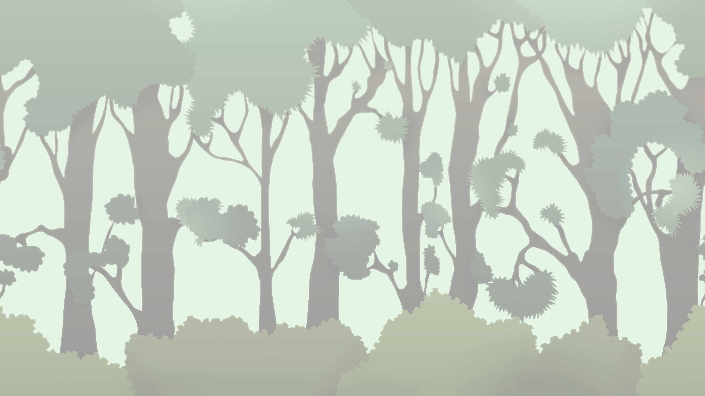
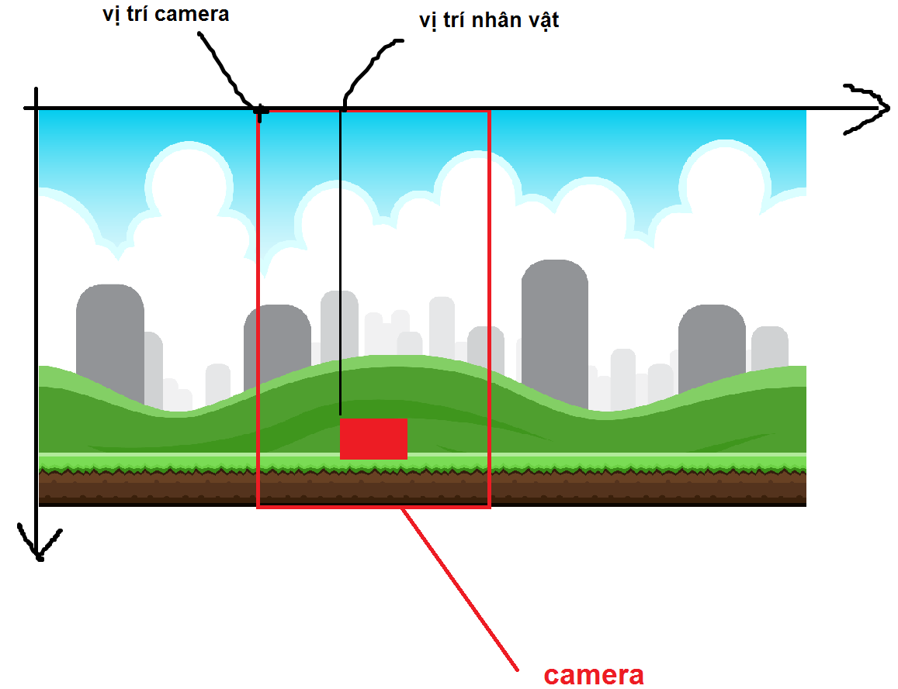

# Cuộn Nền Trong Game Với Pygame

Cuộn nền (**scrolling background**) xuất hiện ở rất nhiều **game**. Trong bài viết, các bạn sẽ tìm hiểu cách cuộn nền vô hạn và cuộn nền theo nhân vật. Bài hướng dẫn này khá đơn giản, mình sẽ giới thiệu cách mình hay dùng để cuộn nền. Các bạn cũng có thể có những cách khác để làm việc này. Nào, hãy cùng bắt đầu! Trong bài viết, mình có dùng một số hình ảnh lấy từ [OpenGameArt.org](https://opengameart.org/)

## Cuộn nền vô hạn

Mình sử dụng một ảnh nền như sau:


Bây giờ hãy tiến hành **code** thôi, các bạn đặt **file** ảnh đúng tên và cùng thư mục với file **code** nhé!

``` python
import pygame, sys
from pygame.locals import *
pygame.init()
FPS = 60
fpsClock = pygame.time.Clock()

BG = pygame.image.load('background.png')
BG = pygame.transform.scale(BG, (960, 540))

DISPLAYSURF = pygame.display.set_mode((350, 540))
pygame.display.set_caption('SCROLLING BACKGROUND')

class Background():
    def __init__(self):
        self.x = 0
        self.y = 0
        self.speed = 3
        self.img = BG
        self.width = self.img.get_width()
        self.height = self.img.get_height()
    def draw(self):
        DISPLAYSURF.blit(self.img, (int(self.x), int(self.y)))
    def update(self):
        self.x -= self.speed

def main():
    bg = Background()
    while True:
        for event in pygame.event.get():
            if event.type == pygame.QUIT:
                pygame.quit()
                sys.exit()
        bg.draw()
        bg.update()
        pygame.display.update()
        fpsClock.tick(FPS)

if __name__ == '__main__':
    main()
```

Các bạn chạy thử nhé! **Code** này thì đơn giản thôi, dòng nào chưa rõ thì các bạn có thể tự tìm hiểu nhé.

Các bạn có thể thấy rằng, nền đã cuộn sang trái. Tuy nhiên, **code** chỉ chạy hiệu quả được 1 lúc. Lúc sau, do hình ảnh không đủ dài nên **code** chạy không chính xác nữa. Để giải quyết vấn đề này thì mình có ý tưởng là vẽ nối tiếp 2 cái nền là để tạo thành nền dài hơn. Các bạn thêm vào hàm **draw** như sau:

``` python
def draw(self):
    DISPLAYSURF.blit(self.img, (int(self.x), int(self.y)))
    DISPLAYSURF.blit(self.img, (int(self.x + self.width), int(self.y)))
```

Trong đoạn **code** trên có thể thấy rằng `self.x` là hoành độ nền thứ nhất, `self.x+self.width` là hoành độ nền thứ 2.

Để vẽ nối tiếp 2 nền thì phần cuối của nền đầu phải khớp với phần đầu của nền sau. Thông thường, những ảnh nền người ta đều vẽ như thế.

Tuy nhiên, 2 nền vẫn chưa đủ dài do nền của chúng ta sẽ **cuộn vô hạn**. Vì thế, cần suy nghĩ cách khác để giải quyết vấn đề này.

Khi nền thứ nhất đi hết màn hình thì có thể đặt lại hoành độ của nó bằng hoành độ nền thứ hai. Tức là kéo cả 2 nền về bên phải sao cho nền thứ nhất lúc sau ứng với nền thứ 2 lúc đầu. Các bạn xem ảnh minh hoạ bên dưới nhé.


Vậy là chúng ta chỉ cần vẽ 2 nền và đến thời điểm thích hợp thì kéo cả 2 nền sang phải sao cho hình ảnh không đổi so với lúc đầu.

Các bạn thêm code vào hàm `update` để thực hiện điều đó:

``` python
def update(self):
    self.x -= self.speed
    if self.x < -self.width:
        self.x += self.width
```

Vậy là chúng ta đã hoàn thành phần cuộn vô hạn rồi.

Các bạn cũng có thể tạo các lớp nền chồng lên nhau để thể hiện sự xa gần. Nền ở xa cuộn với tốc độ chậm hơn.

Mình dùng 2 hình ảnh tương ứng với nền xa và gần:




Các bạn tự tìm hiểu **code** bên dưới nhé:

``` python
import pygame, sys
from pygame.locals import *
pygame.init()
FPS = 60
fpsClock = pygame.time.Clock()

FAR_BG = pygame.image.load('far-background.png')
FAR_BG = pygame.transform.scale(FAR_BG, (960, 540))

NEAR_BG = pygame.image.load('near-background.png')
NEAR_BG = pygame.transform.scale(NEAR_BG, (960, 540))

DISPLAYSURF = pygame.display.set_mode((350, 540))
pygame.display.set_caption('SCROLLING BACKGROUND')

class Background():
    def __init__(self, img, speed):
        self.x = 0
        self.y = 0
        self.speed = speed
        self.img = img
        self.width = self.img.get_width()
        self.height = self.img.get_height()
    def draw(self):
        DISPLAYSURF.blit(self.img, (int(self.x), int(self.y)))
        DISPLAYSURF.blit(self.img, (int(self.x + self.width), int(self.y)))
    def update(self):
        self.x -= self.speed
        if self.x < -self.width:
            self.x += self.width

def main():
    far_bg = Background(FAR_BG, 2)
    near_bg = Background(NEAR_BG, 3)
    while True:
        for event in pygame.event.get():
            if event.type == pygame.QUIT:
                pygame.quit()
                sys.exit()
        far_bg.draw()
        far_bg.update()
        near_bg.draw()
        near_bg.update()
        pygame.display.update()
        fpsClock.tick(FPS)

if __name__ == '__main__':
    main()
```

Các bạn chạy **code** để xem kết quả nhé

## Cuộn nền theo nhân vật

Mình có một nhân vật trong **game**, mình muốn giữ nó luôn ở vị trí giữa màn hình khi di chuyển thì phải làm thế nào? Các bạn hãy xem ví dụ mình đã làm nhé! Để cho đơn giản thì mình cho nhân vật đó là hình chữ nhật luôn.

Mình có dùng 1 ảnh để làm nền.


Bây giờ chúng ta hãy cùng **code** thôi. Hãy vẽ nền và nhân vật trước. Dùng sự kiện nhấn phím mũi tên trái và phải để di chuyển nhân vật.

``` python
import pygame, sys
from pygame.locals import *
pygame.init()
FPS = 60
fpsClock = pygame.time.Clock()

WINDOWWIDTH = 400
WINDOWHEIGHT = 500

BG = pygame.image.load('background.png')
BG = pygame.transform.scale(BG, (1000, 500))
DISPLAYSURF = pygame.display.set_mode((WINDOWWIDTH, WINDOWHEIGHT))
pygame.display.set_caption('SCROLL')

class Background():
    def __init__(self):
        self.x = 0
        self.y = 0
        self.img = BG
        self.width = self.img.get_width()
        self.height = self.img.get_height()
        
    def draw(self):
        DISPLAYSURF.blit(self.img, (int(self.x), int(self.y)))

    def update(self):
        pass
        
class Player():
    def __init__(self):
        self.width = 50
        self.height = 40
        self.x = 0
        self.y = 400
        self.surface = pygame.Surface((self.width, self.height))
        self.surface.fill((255, 0, 0))
        self.speed = 5

    def draw(self, bg):
        DISPLAYSURF.blit(self.surface, (int(self.x + bg.x), int(self.y + bg.y)))

    def update(self, bg, left, right):
        if left == True:
            self.x -= self.speed
        if right == True:
            self.x += self.speed
        if self.x < 0:
            self.x = 0
        if self.x + self.width > bg.width:
            self.x = bg.width - self.width

def main():
    bg = Background()
    player = Player()
    left = False
    right = False
    while True:
        for event in pygame.event.get():
            if event.type == pygame.QUIT:
                pygame.quit()
                sys.exit()
            if event.type == pygame.KEYDOWN:
                if event.key == pygame.K_LEFT:
                    left = True
                if event.key == pygame.K_RIGHT:
                    right = True
            if event.type == pygame.KEYUP:
                if event.key == pygame.K_LEFT:
                    left = False
                if event.key == pygame.K_RIGHT:
                    right = False
        bg.draw()
        player.draw(bg)

        player.update(bg, left, right)
        bg.update()
        
        pygame.display.update()
        fpsClock.tick(FPS)

if __name__ == '__main__':
    main()
```

Các bạn cần chú ý đến **class** `Player`. Trong hàm `__init__` thì `self.x` và `self.y` là **vị trí của nhân vật so với nền** (không phải so với `DISPLAYSURF`). Vì thế, trong hàm  , vị trí được vẽ trên `DISPLAYSURF` là `self.x` + `bg.x` và `self.y` + `bg.y`. Các bạn có thể thử thay đổi vị trí của nền để thấy rõ, vị trí của nhân vật không đổi so với nền.

Ảnh nền của chúng ra rất dài, `DISPLAYSURF` chỉ vẽ được một phần nhìn thấy của nền thôi. Mình tạm gọi phần nhìn thấy của nền là phần **camera**. Vì thế chúng ta cần phải điều chình phần **camera** sao cho nhân vật luôn nằm chính giữa (trừ trường hợp **camera** đi sát bên trái hoặc bên phải). Các bạn có thể xem hình dưới để hiểu rõ hơn.



Sau khi có **vị trí camera so với nền** thì suy ra **vị trí nền so với** `DISPLAYSURF`. Các bạn chỉnh lại hàm `update` của **class** `Background` như sau:

``` python
def update(self, player):
    x_camera = player.x - (WINDOWWIDTH/2 - player.width/2)
    if x_camera < 0:
        x_camera = 0
    if x_camera + WINDOWWIDTH > self.width:
        x_camera = self.width - WINDOWWIDTH
    self.x = -x_camera
```

Trong vòng lặp **game**, các bạn nhớ thêm truyền thêm `player` vào hàm `bg.update()` như thế này `bg.update(player)`.

Như vậy là chúng ta đã cuộn được nền theo nhân vật rồi. Các bạn cũng có thể thử chỉnh lại **code** để cuộn nền theo cả chiều dọc đối với những nền lớn hơn nhe!

## Kết
Vậy là chúng ta đã kết thúc phần cuộn nền rồi! Phần này theo mình cũng khá đơn giản và được ứng dụng trong rất nhiều game đấy. Trên đây chỉ là ý tưởng của mình cho việc cuộn nền. Nếu các bạn có những cách khác thì hãy để lại comment để mọi người cũng học hỏi nhé. 

Phần này mình không để **code**, các bạn tự tìm hiểu và làm theo hướng dẫn nhé.

- https://codelearn.io/sharing/cach-cuon-nen-trong-game-voi-pygame