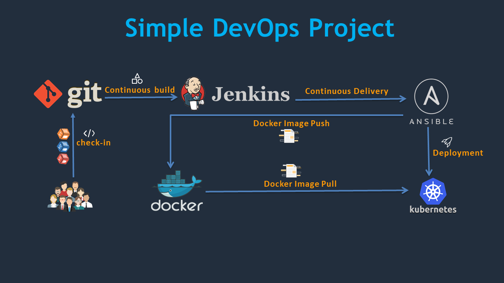

# Jenkins là gì ?

**Jenkins** là một công cụ tự động hóa quy trình **Tích hợp liên tục (CI)** và **Phát hành liên tục (CD)**. Nó là một nền tảng mã nguồn mở, miễn phí và có thể được sử dụng để tự động hóa các nhiệm vụ như xây dựng, kiểm tra và triển khai mã. **Jenkins** có thể được triển khai trên máy chủ cục bộ hoặc máy chủ đám mây và có thể được sử dụng với nhiều ngôn ngữ lập trình và khung công tác khác nhau.

### Công dụng của Jenkins

**Jenkins** là một công cụ mạnh mẽ có thể được sử dụng để tự động hóa nhiều nhiệm vụ khác nhau trong quy trình phát triển phần mềm, bao gồm:

- **Tích hợp liên tục (CI)**: Jenkins có thể được sử dụng để tự động hóa quá trình xây dựng và kiểm tra mã. Điều này giúp phát hiện và khắc phục lỗi sớm hơn, đồng thời giảm thiểu rủi ro khi triển khai mã mới.

- **Phát hành liên tục (CD)**: Jenkins có thể được sử dụng để tự động hóa quá trình triển khai mã lên môi trường sản xuất. Điều này giúp đảm bảo rằng mã được triển khai một cách nhất quán và đáng tin cậy.

- **Quản lý bản phát hành**: Jenkins có thể được sử dụng để quản lý các bản phát hành mã. Điều này giúp dễ dàng theo dõi các thay đổi đối với mã và quản lý các phiên bản của mã.

- **Theo dõi lỗi**: Jenkins có thể được sử dụng để theo dõi lỗi. Điều này giúp dễ dàng theo dõi các lỗi và đảm bảo rằng các lỗi được khắc phục.

- **Báo cáo**: Jenkins có thể được sử dụng để tạo báo cáo về các hoạt động của Jenkins. Điều này giúp dễ dàng theo dõi hiệu suất của Jenkins và đảm bảo rằng Jenkins đang hoạt động hiệu quả.

**Jenkins** là một công cụ mạnh mẽ có thể được sử dụng để tự động hóa nhiều nhiệm vụ khác nhau trong quy trình phát triển phần mềm. **Jenkins** là một công cụ mã nguồn mở, có nghĩa là nó miễn phí để sử dụng và có thể được tùy chỉnh để đáp ứng nhu cầu của bất kỳ tổ chức nào.

**Jenkins** có thể được cài đặt trên máy chủ cục bộ hoặc trên máy chủ đám mây. Nó cũng có thể được sử dụng với một loạt các công cụ và nền tảng khác nhau, bao gồm **Git**, **GitHub**, **Docker** và **Kubernetes**.

### Lợi ích khi sử dụng Jenkins

Dưới đây là một số lợi ích của việc sử dụng Jenkins:

- **Tăng chất lượng code**: Jenkins có thể giúp phát hiện và khắc phục lỗi sớm hơn, đồng thời giảm thiểu rủi ro khi triển khai mã mới.

- **Tăng tốc độ phát triển**: Jenkins có thể giúp các nhóm phát triển xây dựng và triển khai mã mới nhanh hơn.

- **Giảm thiểu rủi ro**: Jenkins có thể giúp giảm thiểu rủi ro khi triển khai mã mới bằng cách tự động hóa các quy trình kiểm tra và triển khai.

- **Tăng khả năng mở rộng**: Jenkins có thể giúp các nhóm phát triển dễ dàng mở rộng quy mô của các dự án của họ.

- **Tăng khả năng bảo mật**: Jenkins có thể giúp các nhóm phát triển phát hiện và khắc phục các lỗ hổng bảo mật sớm hơn.

**Jenkins** là một công cụ hữu ích cho các nhóm phát triển phần mềm của mọi quy mô. Nó có thể giúp cải thiện chất lượng mã, tăng tốc độ phát triển và giảm thiểu rủi ro khi triển khai mã mới.

### Tham khảo

- https://www.jenkins.io/