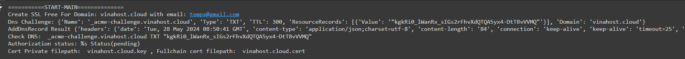
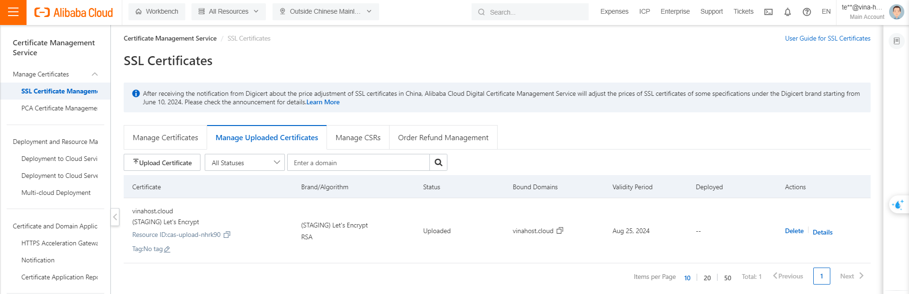

# Tự động triển khai DCDN bằng SDK với Free SSL từ Let's encrypt (Phần 2)

> Trong bài viết trước, mình đã chuẩn bị vài hàm tạo key cơ bản cho việc request SSL, trong bài viết này, mình sẽ xây dựng vài hàm cơ bản để tương tác với **Aliababa Cloud DNS, CAS**, trỏ domain và tự động hóa quá trình xác thực DNS mà Let's Encrypt yêu cầu. Cuối cùng là hàm request một SSL certificate hoàn chỉnh và upload lên Alibaba Certificate Management Service.

> Để sử dụng các chức năng như mô tả, domain được sử dụng phải được thiết lập trên **Alibaba Cloud DNS service** (nameserver nằm ở Alibaba Cloud).


### **1. Alibaba Cloud DNS service và DNS Python SDK.**
- **DNS hay Domain Name System** là một giao thức, một dịch vụ Internet có nhiệm vụ phân giải **domain name** thành địa chỉ **IP**. Domain name là các tên mà con người dễ đọc và dễ nhớ, nhưng trình duyệt hay máy tính chỉ làm việc với các địa chỉ IP, vậy nên cần có DNS để chuyển domain name mà người dùng nhập trên trình duyệt thành các địa chỉ IP mà trình duyệt có thể xử lý. Domain name được tổ chức theo dạng phân cấp. Ví dụ như tên miền client.vinahost.cloud. Nó bao gồm **top level** domain là ".cloud", "vinahost.cloud" là primary hay **first-level** domain, "client.vinahost.cloud" là subdomain hay **second-level** domain. 
> **DCDN** của Alibaba Cloud có thể sử dụng với second-level domain, nhưng để xác thực domain lúc triển khai cần phải **xác thực trên first-level domain**. Vậy nên các tên miền có đuôi như .id.vn, .name.vn sẽ không thể sử dụng DCDN. Do user không sở hữu  first-level domain là id.vn
- **Alibaba Cloud DNS** hay cu thể hơn là Public Authoritative DNS Resolution là dịch vụ của Alibaba cung cấp các hoạt động phân giải tên miền hiệu quả, linh hoạt và an toàn. Có thể quản lý các bản ghi DNS thống nhất trên giao diện của Alibaba Cloud và liên kết với các dịch vụ khác trong hệ sinh thái của Alibaba Cloud.
- Alibaba Cloud SDK hỗ trợ nhiều ngôn ngữ như Java, Python, Golang, C#...
- Để có quyền truy cập vào dịch vụ của Alibaba cần cung cấp **AccessKey**.
### **2. Tương tác với Alibaba Cloud DNS qua Python SDK**
- Để sử dụng gói python SDK của Alibaba Cloud DNS cần phải cài đặt gói **alibabacloud_alidns20150109**.
- Tham khảo tài liệu của Alibaba Cloud, có thể sử dụng Access Key, khởi tạo kết nối đến Alibaba Cloud để thực hiện request, dùng hàm add_domain_record. Cần chuẩn bị nội dung record bao gồm RR (hostname) và Value. Ví dụ muốn trỏ A record cho domain blog.vinahost.cloud thì PrimaryDomain là vinahost.cloud, RR là "blog" và Value là IP muốn trỏ. Cuối cùng, cần lưu ý đến **region và endpoint** gửi request.
```python
def addDnsRecord(AccessKey, SecretKey, PrimaryDomain,Type,RR, Value): # RR is hostname
  config = open_api_models.Config(
            access_key_id=AccessKey,
            access_key_secret=SecretKey,
            region_id="ap-southeast-1"
  )
  config.endpoint="alidns.ap-southeast-1.aliyuncs.com"
  #[product_code].[region_id].aliyuncs.com
  dns_client=AlidnsClient(config)
  add_domain_record_request = alidns_models.AddDomainRecordRequest(
    domain_name=PrimaryDomain,
    rr=RR, #host
    type=Type,
    value=Value,
  )
  try:
      repons = dns_client.add_domain_record_with_options(add_domain_record_request, util_models.RuntimeOptions())
      return repons
  except Exception as error:
      print(error)
```
- Ví dụ mẫu về việc trỏ subdomain blog.vinahost.cloud về địa chỉ IP 146.196.65.2, việc cập nhật dns trên Alibaba Cloud rất nhanh, khoảng 10s sau khi chạy code, đã có thể kiểm tra kết quả trên www.dnswatch.info:
```python
def main():
    print("===========START-MAIN==============")
    AccessKey='XXXXXXXX'
    SecretKey='XXXXXXXXXXXXXXXXXXX'
   res=addDnsRecord(AccessKey,SecretKey,'vinahost.cloud','A','blog','146.196.65.3')
    print(res)
main()
```

### **3. Request chứng chỉ SSL cho domain**.
- Các bước để tạo chứng chỉ SSL được khái quát theo flow sau:
	- Tạo **CSR** 
	- **Order SSL** trên Let's encrypt với CSR vừa tạo.
	- Sau khi order, Let's encrypt sẽ trả về một danh sách các **Challenge**s, lọc và chọn lấy **DNS challenge**.
	- Trỏ dns record theo nội dung của challenge. Record là TXT và có name là **_acme-challenge.domain** và Value là một **chuỗi ngẫu nhiên** do Let's Encrypt cung cấp.    
	- Nên có khoảng nghỉ để dns được cập nhật.
	- Yêu cầu Let's Encrypt xác thực.
	- Nếu xác thực thành công, Let's Encypt sẽ trả về certificate của domain.
	- Lưu tất cả vào file ở local, tránh bị mất dữ liệu.
- Hàm GenSSL ví dụ như sau:
```python
def GenSSLCert(acme_client,domainName,emailAddress,accessKey, secretKey):

    KEY_FILE = domainName + '.key'  #Binary File
    CSR_FILE = domainName + '.csr'
    CERT_FILE= domainName + '.cert' #Full Chain.pem
    print("Create SSL Free For Domain:",domainName,"with email:",emailAddress)

    pkey, csr= genCSR(domainName,emailAddress)
    orderr = acme_client.new_order(csr.public_bytes(serialization.Encoding.PEM))
    authz_list = orderr.authorizations

    for authz in authz_list:
        # Choosing challenge.
        # authz.body.challenges is a set of ChallengeBody objects.
      for item in authz.body.challenges:
        if isinstance(item.chall, challenges.DNS01):
          r_authz = authz
          dns_challenge = item
          dns_txt_value=dns_challenge.validation(acme_client.net.key)
          if domainName != r_authz.body.identifier.value:
              print("Domain Request Error:",r_authz.body.identifier.value)
              continue
          parts=r_authz.body.identifier.value.split('.')
          RR = '.'.join(parts[:-2])
          primary_domain='.'.join(parts[-2:])
          if(len(parts)>2):
            DnsRecord ={
                                'Name': f"_acme-challenge.{RR}",
                                'Type': 'TXT',
                                'TTL': 300,
                                'ResourceRecords': [{'Value': '"{}"'.format(dns_txt_value)}],
                                'Domain':f"{primary_domain}"
                            }
          else:
            DnsRecord ={
                                'Name': "_acme-challenge",
                                'Type': 'TXT',
                                'TTL': 300,
                                'ResourceRecords': [{'Value': '"{}"'.format(dns_txt_value)}],
                                'Domain':f"{primary_domain}"
                            }
          print("Dns Challenge:", DnsRecord)
          result=addDnsRecord(accessKey,secretKey,DnsRecord['Domain'],"TXT",DnsRecord['Name'],DnsRecord['ResourceRecords'][0]['Value'])
          print("AddDnsRecord Result",result)
          print("Check DNS: ",DnsRecord['Name']+DnsRecord['Domain'],"TXT",DnsRecord['ResourceRecords'][0]['Value'])
          sleep(30)
          try:
              acme_client.answer_challenge(dns_challenge, dns_challenge.response(acme_client.net.key))
              rauthz = acme_client.poll(r_authz)
              print('Authorization status: %s', rauthz[0].body.status)
              order = acme_client.poll_and_finalize(orderr)
              cert = order.fullchain_pem
              with open(CERT_FILE, "wt") as f:
                  f.write(cert)
              print("Cert Private filepath: ",KEY_FILE,", Fullchain cert filepath: ",CERT_FILE)
              return cert
          except acme_errors.ValidationError:
              print("Validation failed. Please check your DNS record")
          return 0
```
- Mẫu sử dụng hàm này như sau:
```python
def main():
    print("===========START-MAIN==============")
    AccessKey='XXXX'
    SecretKey='XXXXXX'
    genAccoutKey()
    acme_client=getACMEAccount('temp@gmail.com',True)
    GenSSLCert(acme_client,'vinahost.cloud','tempx@gmail.com',AccessKey,SecretKey)
main()
```
- Output ví dụ:

### **4. Upload SSL Cert lên Certificate Management Service.** 
- **Certificate Management Service** là một dịch vụ của Alibaba cloud cho phép quản lý, hoặc order SSL từ Alibaba Cloud, là một nơi lưu trữ SSL certificate cá nhân an toàn và cũng được liên kết rộng rãi với các dịch vụ khác của Alibaba Cloud (như DCDN). 
- Với chứng chỉ vừa có được, đã lưu trên file ở localhost, lúc này cần upload lên Certificate Management Service của Alibaba Cloud để tiện cho việc sử dụng sau này.
- Để thực hiện việc này, cần có một số hàm cơ bản khác bổ sung.
- Cần hàm **đọc Private Key từ file**, do lúc lưu đã chọn wb là ghi với Binary mode, nên khi dùng code xử lý nó ở dạng binary phải encode thành chuỗi mới có thể upload lên được. Và cần thêm hàm đọc và xử lý file Full Chain vừa nhận được.
- Ví dụ về hàm đọc Private Key, trong đây, đọc private byte thành một dãy byte (keystring) và encode lại thành chuỗi string thông thường:
```python
def LoadPrivateKeyAsText(fileName):
    with open(fileName, "rb") as keyfile:
      key_data=keyfile.read()
      pkey=serialization.load_pem_private_key(key_data,None)
      pem = pkey.private_bytes(
          encoding=serialization.Encoding.PEM,
          format=serialization.PrivateFormat.PKCS8,
          encryption_algorithm=serialization.NoEncryption()
        )
    keystring = b''.join([kp + bytes("\n",encoding='utf-8') for kp in pem.splitlines()])
    private_key_text= str((keystring)[:-1], encoding='utf-8')
    return private_key_text
```
- Do file FullChain mà Let's Encrypt trả về gồm có 2 certificate theo thứ tự là **domain certificate** và **CA certificate**, khi load lên biến của python, nó gồm cả 2 cert, nên cần có hàm chia 2 cert này riêng biệt. Ví dụ như dưới, input của hàm là biến của python, sau khi read file fullchain:
```python
def SplitFullChainPem(fullchain_data):
    split_full_chain=fullchain_data.split('\n\n')
    cert_pem=split_full_chain[0]
    chain_pem=split_full_chain[1]
    return cert_pem,chain_pem
```
- Sau khi đã có đủ dữ liệu, có thể thực hiện upload cert lên Alibaba Cloud thông qua thư viện python cas (**alibabacloud_cas20200407**). Khi Upload cert lên Alibaba cloud, sẽ có một mã ID được trả về, có thể lưu mã này để sử dụng lại về sau.
```python
def UploadUserCertToCAS(AccessKey,SecretKey,CertPem,PrivatePem,CACertPem,DomainName):
    # Endpoint: https://api.alibabacloud.com/product/cas.
    # Enpoint: <product iD><region><aliyuncs.com> , exam: cas.ap-southeast-1.aliyuncs.com (Outside China Mainland)
    config = open_api_models.Config(
            access_key_id=AccessKey,
            access_key_secret=SecretKey,
            region_id="ap-southeast-1"
      )
    config.endpoint = f'cas.ap-southeast-1.aliyuncs.com'
    cas_client = casClient(config)
    key_data=PrivatePem
    cert_data=CertPem
    ca_data=CACertPem
    upload_cert_request = cas_20200407_models.UploadUserCertificateRequest(
        cert=cert_data,
        key=key_data,
        sign_cert=ca_data,
        name=DomainName,
    )
    try:
        response= cas_client.upload_user_certificate_with_options(upload_cert_request, util_models.RuntimeOptions())
        print("Upload Cert to Alibaba Cloud Certificate Management Service Success")
        with open("CERT_ID_MAP.txt","a") as f:
          cert_id_record=DomainName +" " + str(response.body.cert_id) + "\n"
          f.write(cert_id_record)
        print(response.body.cert_id)
        return response.body.cert_id
    except Exception as error:
        print(error)
def main():
    print("===========START-MAIN==============")
    AccessKey='XXXXXX'
    SecretKey='XXXXXXXXXXXXXXXXXXXXXx'
    domainName='vinahost.cloud'
    with open('vinahost.cloud.cert', "rt") as f:
          cert_file=f.read()
    cert_pem,ca_pem=SplitFullChainPem(cert_file)
    pri_pem=LoadPrivateKeyAsText('vinahost.cloud.key')    
cert_id=UploadUserCertToCAS(AccessKey,SecretKey,cert_pem,pri_pem,ca_pem,domainName)
main()
```
- Sau khi hoàn tất, có thể kiểm tra trên giao diện phần "hallenge,", nếu code báo thành công, nhưng không thấy chứng chỉ trên giao diện, có thể chọn sang **Region khác** (ví dụ: Chinese Mainland). Nếu chứng chỉ được upload, nhưng không nằm ở region mong muốn, có thể **thiết lập lại endpoint** phù hợp hơn. 

### **5. Tạm kết**
- Các gói cần cài đặt:
	- **alibabacloud_alidns20150109**
	- **alibabacloud_cas20200407**
- Các thư viện cần import:
```python
from alibabacloud_tea_openapi import models as open_api_models
from alibabacloud_alidns20150109.client import Client as AlidnsClient
from alibabacloud_alidns20150109 import models as alidns_models
from alibabacloud_tea_util import models as util_models
from time import sleep
from alibabacloud_cas20200407.client import Client as casClient
from alibabacloud_tea_openapi import models as open_api_models
from alibabacloud_cas20200407 import models as cas_20200407_models
```
- Ở phần trên này, mình đã thử nghiệm hoàn thành việc **order một chứng chỉ** ssl, t**rỏ TXT record** để xác thực domain, sau đó lưu cert ở local và **upload cert** lên Certificate Management Service của Alibaba Cloud và **lưu ID** của cert đó lại. Tuy nhiên, sẽ có **rất nhiều lỗi** có thể xảy ra trong các quá tình này, nhất là giao tiếp với CA và Alibaba Cloud, nhưng phần này nằm ngoài phạm vi bài viết.
- Ở phần tiếp theo, mình sẽ thử nghiệm kích hoạt DCDN, bật thiết lập kết nối https bằng file SSL vừa upload. 

### **6. Tham khảo**
1. [Certbot ACME Example](https://github.com/certbot/certbot/blob/master/acme/examples/http01_example.py)
2. [Alibaba CloudDns](https://api.alibabacloud.com/product/Alidns)
3. [Python ACME doc](https://acme-python.readthedocs.io/en/stable/api/client.html)
4. [Alibaba Cloud CAS](https://api.alibabacloud.com/product/cas)
5. [Alibaba Python SDK](https://github.com/aliyun/alibabacloud-python-sdk)