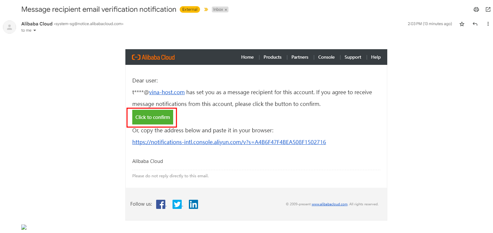

# Hướng dẫn thiết lập cảnh báo số dư về Email trên Alibaba Cloud

> Để tiện lợi và tránh bị gián đoạn trong lúc sử dụng dịch vụ trên Alibaba Cloud, bài viết này sẽ hướng dẫn thiết lập cảnh báo gửi về email khi số dư trong tài khoản dưới một ngưỡng nào đó, giúp người dùng dễ dàng cập nhật tình trạng hiện tại hay kịp thời xem lại các dịch vụ của mình. 
## 1. Tổng quan
Quy trình cơ bản như sau: Truy cập **Billing Management** -> **Available Credit Alert** -> Thiết lập alert -> **Save** 
## 2. Hướng dẫn chi tiết
#### Bước 1: Truy cập Expenses từ web console: 
Trên giao diện webconsole của Alibaba Cloud, trên thanh menu ở header, chọn vào **Expenses** (cạnh thanh search), người dùng sẽ được chuyển sang giao diện **Billing Management**. Trang này cung cấp các thông tin về số dư, các hóa đơn, coupon,... mục **Spending Overview** là mức chi tiêu trong tháng, **Available Credit** là số dư còn lại trong tài khoản.

 
#### Bước 2: Kích hoạt cảnh báo
Có 2 cảnh báo (Alert) có thể kích hoạt, là cảnh báo khi **số dư còn lại dưới một ngưỡng** nào đó, và **mức chi tiêu hàng tháng vượt quá một ngưỡng** nào đó. Trong hình bên dưới, nếu mục **Available Credit Alert: OFF** thì nhấn vào nút ****Setting**** ở ngay bên cạnh để kích hoạt cảnh báo (thực hiện tương tự cho Spending Overview) . 

#### Bước 3: Cấu hình cảnh báo
Khi nhấn vào Setting, giao diện cấu hình sẽ hiện ra, chỉnh trạng thái Alert từ **OFF thành ON**, sau đó **nhập con số** (ngưỡng) mà bạn muốn, nếu Available Credit **dưới con số** này (below the threshold), thì một mail sẽ được gửi đến email ở dòng "Send notification to". Nếu bạn không có thay đổi gì, có thể nhấn Save để áp dụng cấu hình.

#### Bước 4: Thêm Email nhận thông báo
Nếu người dùng muốn thêm email nhận thông báo, có thể điều chỉnh trong **Message Center**, có thể truy cập vào nó nhanh chóng bằng cách nhấn vào *Message Setting* ở bước 3. Tại giao diện Common Setting, alert là một thông báo "**Account Message - Notifications of Account Expenses**", nhấn vào nút **Modify**, khi giao diện Setting hiện ra, nhấn vào **Add Receiver**.

Sau đó, người dùng cần nhập Tên, địa chỉ Email và lựa chọn chức danh, sau đó nhấn **OK**.

Sau khi nhấn OK, recevier mới sẽ ở trạng thái **chờ xác nhận**, một mail xác nhận sẽ được gửi đến Email vừa được thêm vào, người dùng cần kiểm tra hộp thư của email (ví dụ kh****p@vinahost.vn), và nhấn xác nhận trong vòng **60 giây** (nếu vượt quá 60s phải nhấn Resend).

Sau khi thêm thành công, nếu trên giao diện vẫn không hiển thi tên mới, cần vào Modify và tick chọn vào tài khoản mới, sau đó nhấn Save.

Cuối cùng, kiểm tra lại trên giao diện và trên cấu hình Alert lúc nãy:

##### Chúc các bạn thành công.