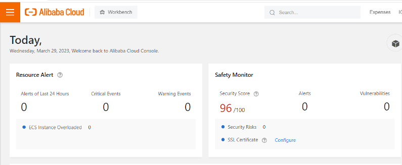
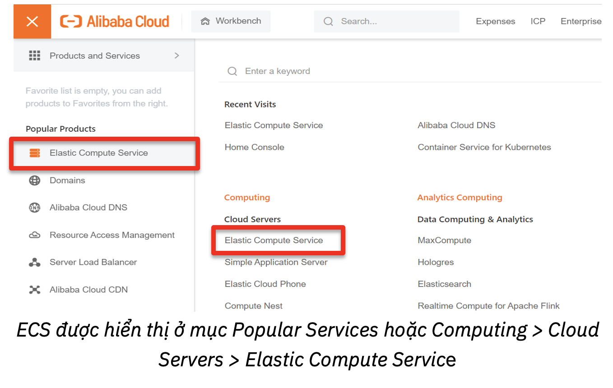
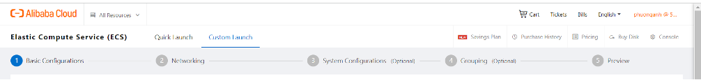
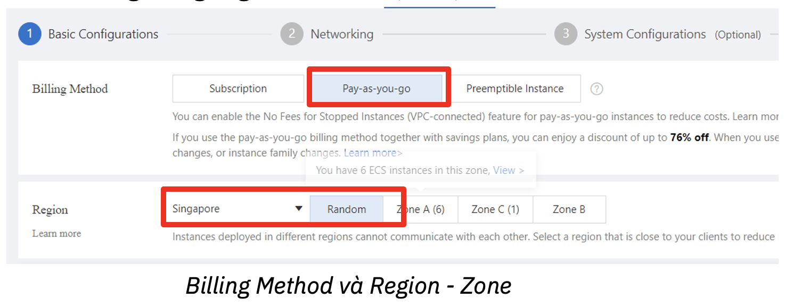
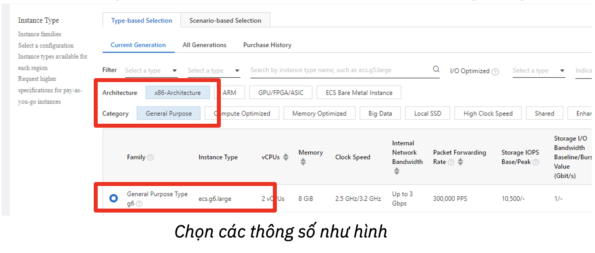
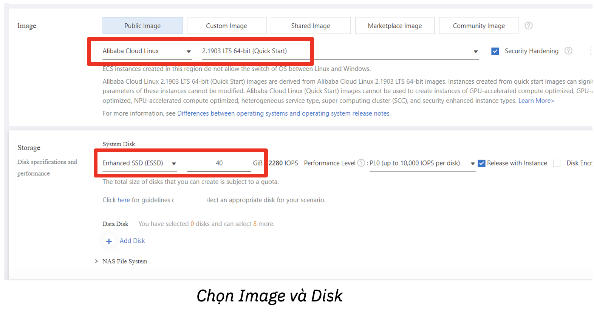
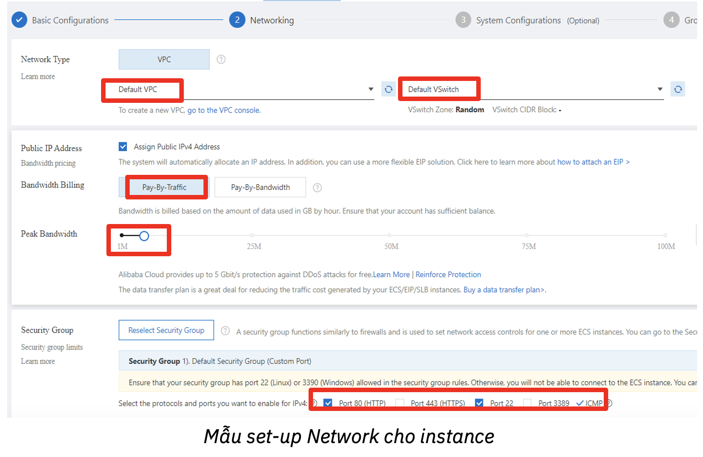
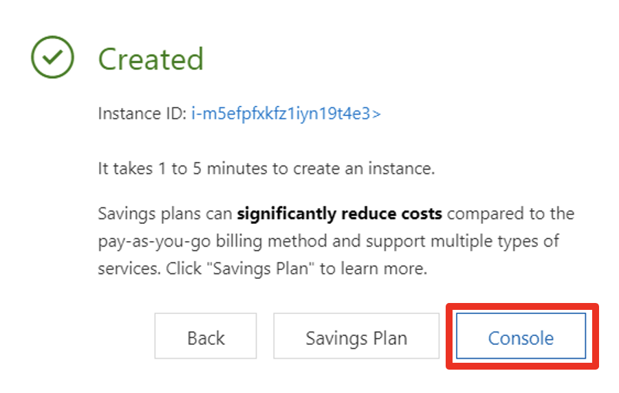

# Elastic Compute Service là gì?

**Elastic Compute Service (ECS)** là một sản phẩm của **Alibaba Cloud** cung cấp các máy ảo vận hành trên đám mây.

Để bắt đầu sử dụng ECS, bạn có thể một máy ảo (**ECS instance**) từ giao diện **Console** của Alibaba Cloud.

### Các bước tạo máy ảo ECS

Đầu tiên, để tạo một máy ảo trên ECS, bạn cần có một tài khoản **Alibaba Cloud** và đăng nhập vào tài khoản.

Sau khi đăng nhập thành công, từ giao diện console của Alibaba Cloud, chọn vào menu ở góc trái, chọn **Elastic Compute Service**.

Sau đó chọn **Create Instance** trong phần **My Resources**.

Sau khi chọn **Create Instance**, chọn **Custom Launch** để có thể xem được tất cả các thông số của máy ảo mới. Để tạo một máy ảo, ta sẽ đi qua 5 giai đoạn:

- **Basic Configuration** (các thông số cơ bản)
- **Networking** (thông tin về mạng)
- **System Configurations** (thông số hệ thống) - không bắt buộc
- **Grouping** (chọn nhóm bảo mật cho máy ảo) - không bắt buộc
- **Preview** (xem lại các thông số chi tiết đã lựa chọn cho máy ảo).

### Giai đoạn 1: Set-up các thông số cơ bản (Basic Configurations)

- **Billing Method**: Alibaba Cloud cung cấp ba phương thức chính để thanh toán đối với máy ảo ECS
- - **Subscription** (trả trước theo tháng/năm)
- - **Pay-as-you-go** (trả tiền khi sử dụng)
- Ở đây, chúng ta chọn **Pay-as-you-go**.

**Region và Zone:**

- **Region** là khu vực của data center mà máy ảo của bạn sẽ được deploy, nên chọn khu vực ở gần nhất để đạt được hiệu suất truy cập ổn định. Bạn có thể Region là **Singapore**.
- **Zone** là vùng tương ứng với mỗi khu vực, chọn Random.

**Instance Type:** loại máy ảo mà bạn chọn sử dụng.

- Alibaba Cloud hỗ trợ nhiều loại kiến trúc (**architecture**) và loại máy ảo (**category**) khác nhau. Chọn kiến trúc x86, loại **ecs.g6.large**.

- **Quantity:** số lượng instance, để mặc định là 1.
- **Image:** hệ điều hành và các dịch vụ (nếu có) chạy cho máy ảo. Alibaba Cloud cung cấp nhiều hình thức để lựa chọn image:
- Trong bài hướng dẫn này, ta sẽ sử dụng **Public Image** là các hệ điều hành được cung cấp bởi Alibaba và các nhà phát hành hệ điều hành khác, chọn Public Image > Alibaba Cloud Linux > 2.1903 LTS 64-bit.

- **Storage:** Elastics Block Storage dùng cho ECS Instance. Chọn **Enhanced SSD (ESSD)** với 40 GiB.

Sau khi chọn xong, chọn **Next** ở cuối trang.

### Giai đoạn 2: Set-up thông tin về mạng (Network)

**Network Type** - mặc định là VPC: giữ nguyên ở Default VPC và Default VSwitch.

**Public IP Address:** tick vào mục Assign Public IPv4 Address. Sau đó chọn:

- **Pay-by-Traffic** (trong chế độ Pay-By-Traffic, phí được tính dựa trên lượng dữ liệu được truyền vào)
- **Peak Bandwidth**: 200 Mbps

**Security Group**: Chọn Security Group có sẵn hoặc các port được cho phép truy cập cho instance của bạn. Chọn các port mà bạn muốn, một số port:

- Port 80 là cổng mặc định được sử dụng cho các dịch vụ web.
- Port 22 được sử dụng để đăng nhập vào các phiên bản Linux ECS.
- Port 3389 được sử dụng để đăng nhập vào Remote Desktop trên Windows.

Hoàn tất set-up **Network**, chọn **Next**.

### Giai đoạn 3: Set-up các thông số hệ thống (System Configurations)

Tại phần này, hai thông tin cần quan tâm nhất là **Log-on Credential** và **Instance Name**.

- **Log-on Credential**: thông tin để kết nối vào instance. Bạn có thể chọn **Password** để cài đặt password cho instance, hoặc chọn **Set Later** nếu chưa cần cài ngay.
- **Instance Name:** đặt tên cho Instance, nếu không điền bước này. Tên của ECS Instance sẽ được đặt tự động.
- Nhấn **Next** để chuyển sang phần tiếp theo.

### Giai đoạn 4: Nhóm (grouping)

Giữ bước này ở mặc định và chọn **Next**.

### Giai đoạn 5: Review và hoàn tất

Xem lại tất cả các thông tin của instance sắp được tạo, cùng với giá tiền bạn phải trả tại tab **Preview**. Sau đó tại mục E**CS Terms and Service**, tick để đồng ý với điều khoản sử dụng, sau đó nhấn **Create Instance** để tiến hành tạo máy ảo.

**Popup** xác nhận như bên dưới sẽ hiện lên, nhấn **Console** để hoàn tất và di chuyển để tab **Instances**.

Sau khi nhấn **Console**, **Instance** được tạo thành công sẽ có trạng thái **Running**!

Chúc mừng bạn đã tạo thành công máy ảo trong ECS! Để thực hiện các thao tác liên quan với instance, nhấn vào các tên thao tác trong mục **Actions** được hiển thị cùng dòng với thông tin máy ảo.

*Author*: **Vo Thi Phuong Anh**

*Solution Architect* - **Alibaba Cloud Intelligence**

### Tham Khảo 

- https://www.alibabacloud.com/blog/600134
- https://www.alibabacloud.com/product/ecs
- https://www.alibabacloud.com/help/en/elastic-compute-service
- https://vinahost.vn/alibaba-cloud-ecs-elastic-compute-service