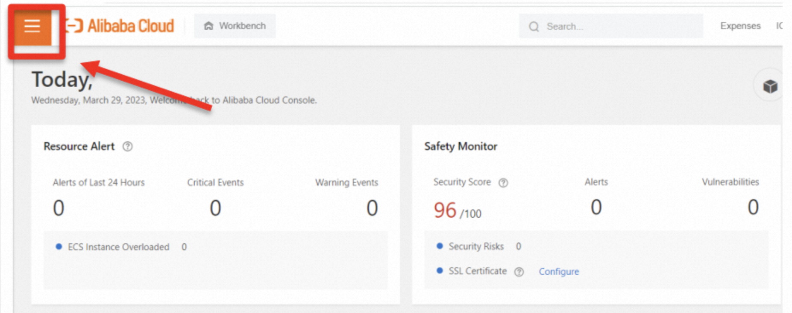
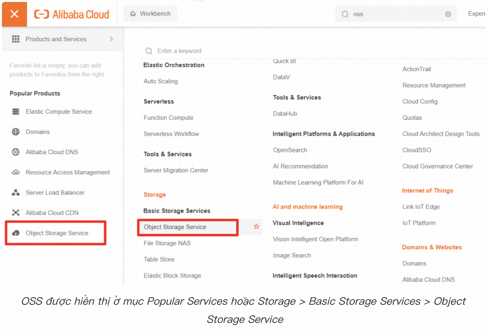
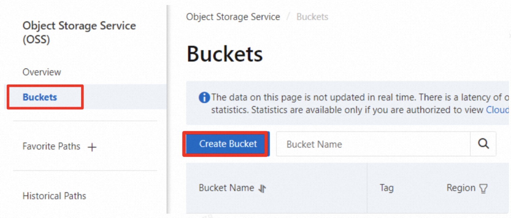
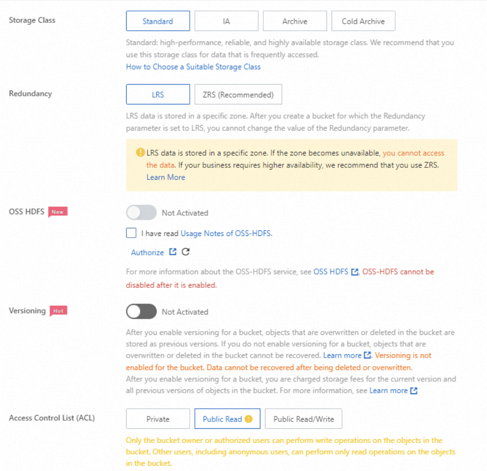
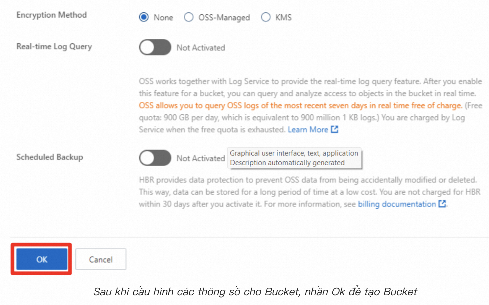
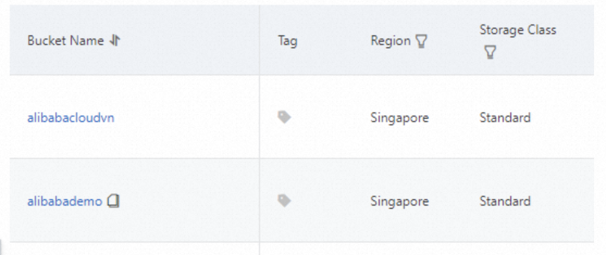
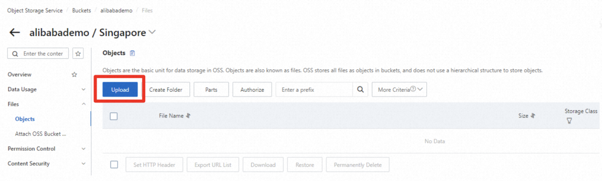
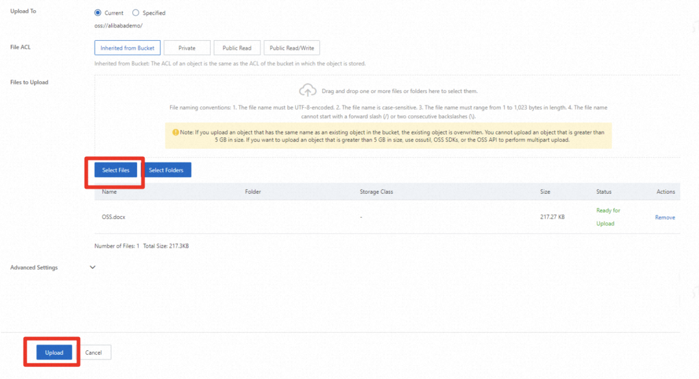
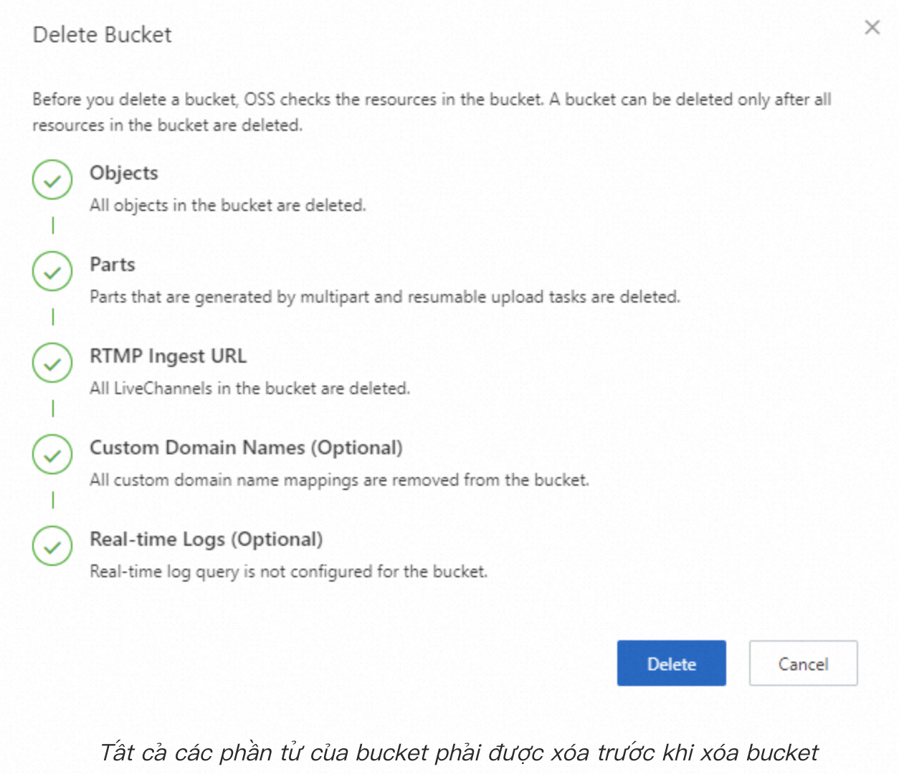

# Alibaba Cloud Object Storage Service là gì?

**Alibaba Cloud Object Storage Service (OSS)** là dịch vụ lưu trữ đối tượng trên đám mây. **OSS** cung cấp các bộ nhớ bảo mật, giữ được sự toàn vẹn của dữ liệu lên đến **99.9999999999%** và độ khả dụng dữ liệu đạt **99.995%**. **OSS** cung cấp nhiều lớp lưu trữ để giúp bạn quản lý tốt với chi phí tiết kiệm.

**OSS** cung cấp các **API** độc lập về mặt nền tảng, cho phép người dùng tải lên và truy cập dữ liệu từ bất kỳ ứng dụng nào mọi lúc mọi nơi.

### Cách tạo Bucket trên OSS

OSS lưu trữ dữ liệu trong các **buckets**. Vì thế, để bắt đầu sử dụng và lưu trữ dữ liệu của bạn với OSS, trước tiên bạn phải tạo một bucket. Trong bài viết này chúng ta sẽ đi qua các bước để tạo một bucket trong Alibaba Cloud OSS thông qua giao diện **Alibaba Cloud Console**.

Đầu tiên, để tạo một máy ảo trên ECS, bạn cần có một tài khoản **Alibaba Cloud** và đăng nhập vào tài khoản.

Sau khi đăng nhập thành công, từ giao diện console của Alibaba Cloud, chọn vào menu ở góc trái, chọn **Object Storage Service**.

Tiếp tục chọn **Object Storage Service**

Tại trang **OSS Console**, chọn **Buckets**. Sau đó chọn vào **Create Bucket** để bắt đầu tạo một bucket.

Sau đó, cửa sổ **Create Bucket** sẽ hiện lên để bắt đầu nhập thông tin của Bucket cần tạo.

- **Bucket Name**: nhập tên của Bucket (ví dụ: alibabademo), Bucket Name là duy nhất trên toàn hệ thống (không trùng lặp) và không thể chỉnh sửa sau khi Bucket được tạo thành công.
- **Region**: Chọn khu vực cho Bucket của bạn. Nếu bạn cần dùng OSS cùng với các dịch vụ khác của Alibaba Cloud (như ECS), bạn cần chọn khu vực của hai bên là giống nhau.
- **Endpoint**: Để mặc định
- **Resource Group** (không bắt buộc): để mặc định. Nếu bạn cần phân chia tài nguyên vào các nhóm, chọn Resource Group tương ứng của bạn.

- **Storage Class**: chọn **Standard**. Đây là bộ nhớ được dùng phổ biến nhất, xử lý tốt các dữ liệu cần truy cấn thường xuyên.
- **Redundancy**: chọn **LRS**. LRS là chế độ Locally redundant storage, sử dụng cơ chế single-zone (một vùng) để phân phổi dữ liệu. LRS sẽ có mức giá rẻ hơn so với ZRS – sử dụng cơ chế multi-zone (đa vùng).
- **OSS HDFS**: giữ mặc định (**Not Activated**). OSS HDFS được sử dụng trong trường hợp cần xây dựng Data Lake từ dữ liệu trong OSS.
- **Versioning**: giữ mặc định (**Not Activated**). Versioning là chế độ giúp lưu trữ lại cái phiên bản của các file trong bucket OSS, nghĩa là nếu một file bị ghi đè, versioning sẽ thể hiện nó dưới dạng phiên bản.
- **Access Control List (ACL)**: chọn **Public Read**. Chế độ này cho phép những người dùng bên ngoài có thể xem dữ liệu bên trong Bucket OSS.

- **Encryption Method**: Chọn **None**.
- **Real-time Log Query**: giữ mặc định (**Not Activated**). Trong trường hợp bạn cần truy vấn và phân tích các đối tượng trong bối cảnh thời gian thực, bạn có thể chọn **Activate Real-time Log Query**.
- **Scheduled Backup**: dùng để tự động Back-up tự động dữ liệu sau một khoảng thời gian – mặc định là một lần một ngày (được hỗ trợ bởi **Hybrid Backup Recovery**). Trong bài hướng dẫn này, chúng ta sẽ giữ mặc định – **Not Activated**.

Sau khi nhấn tạo, **Bucket** được tạo thành công sẽ được hiển thị trong tab **Bucket** của OSS.

### Upload dữ liệu vào bucket
Sau khi tạo thành công một bucket, bạn có thể bắt đầu thêm dữ liệu vào Bucket. Để thêm file vào OSS Bucket, nhấn vào tên **Bucket**, tại tab **Objects**, chọn **Upload**.

Tại trang **Upload** hiện ra, chọn S**elect File** hoặc **Select Folder** để chọn **File/Folder**. Sau khi chọn xong các files, nhấn **Upload** ở cuối trang để hoàn tất.

### Xóa một bucket
Bạn có thể xóa một bucket trong OSS bằng cách nhấn vào tên **Bucket** đó trong mục các **Bucket**. Tại cửa sổ chi tiết của bucket, chọn **Delete** và kiểm tra các điều kiện để xóa bucket:

Nhấn **Delete** để xóa bucket.

*Author*: **Vo Thi Phuong Anh**

*Solution Architect* - **Alibaba Cloud Intelligence**

### Tham khảo

- https://www.alibabacloud.com/blog/600182
- https://www.alibabacloud.com/product/object-storage-service
- https://www.alibabacloud.com/help/en/object-storage-service
- https://vinahost.vn/object-storage-service