# Hướng dẫn gởi ticket trên Alibaba Cloud

1) Alibaba Cloud After-Sales Support Plan

Đối với mọi khách hàng sử dụng các giải pháp, sản phẩm của **Alibaba Cloud** đều được cung cấp gói hỗ trợ **Basic** (hỗ trợ theo **Ticket**) đi kèm hoàn toàn miễn phí.

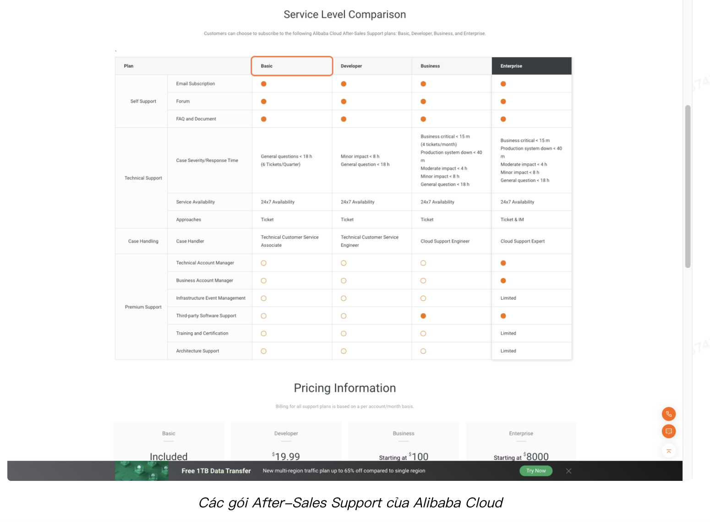

Để sử dụng gói hỗ trợ **Basic**, người dùng có thể gởi một **ticket** yêu cầu được hỗ trợ từ đội ngũ kỹ thuật của **Alibaba Cloud**. Trong bài viết này chúng ta sẽ cùng điểm qua cách tạo một **ticket** khi bạn gặp sự cố hoặc cần hỗ trợ về kỹ thuật/sản phẩm của **Alibaba Cloud**.

2) Cách tạo một ticket yêu cầu hỗ trợ kỹ thuật
 
Để tạo một **ticket** trên **Alibaba Cloud**, truy cập vào **Console** của **Alibaba Cloud**, sau đó chọn **Tickets** > **Submit Ticket**.

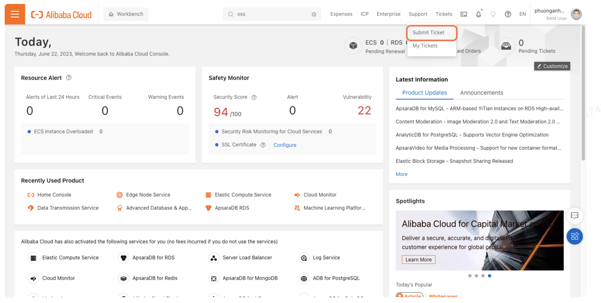

 Một số loại ticket phổ biến trên **Alibaba Cloud** được phân loại thành **Consulting Ticket**, **Technical Ticket** and **Product Ticket**.

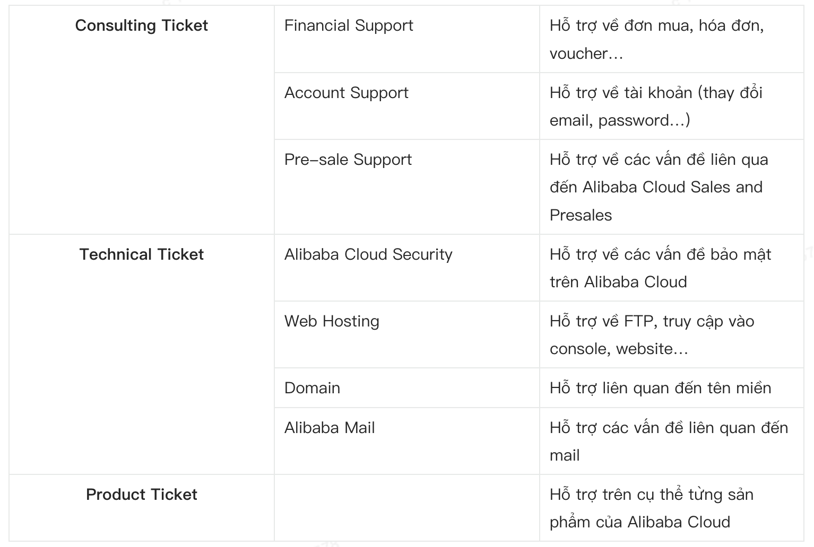

Tại trang **New Ticket**, chọn loại **support ticket** tương ứng với nhu cầu của bạn,

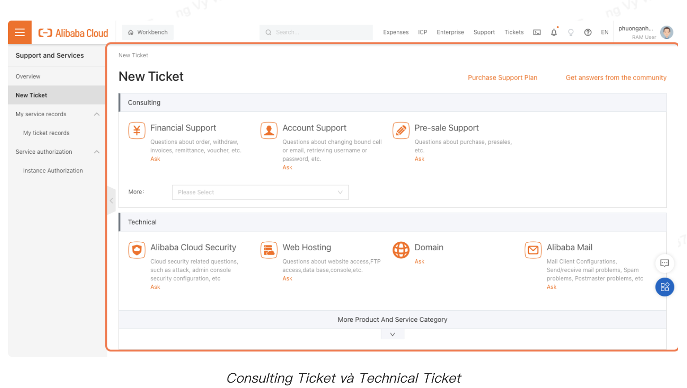

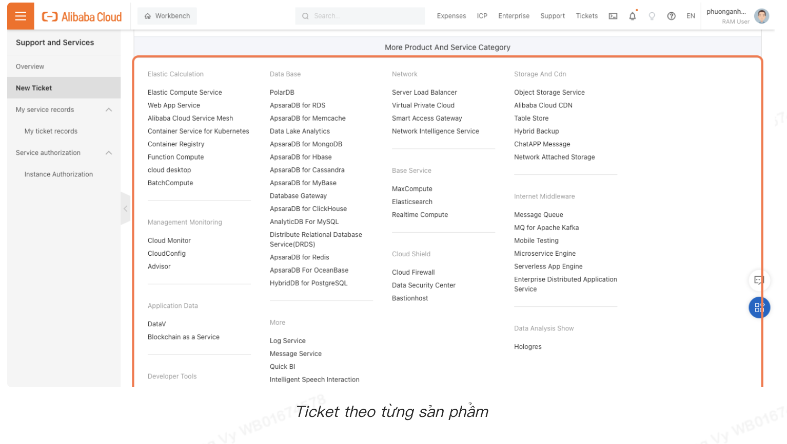

Chọn loại **Ticket** phù hợp với nhu cầu của bạn. Nhấn **Ask** đối với **Consulting & Technical Ticket** hoặc nhấp vào tên sản phẩm bạn cần được hỗ trợ đối với **Product Ticket**.

### Hướng dẫn tạo support ticket trên Alibaba CLoud

Ví dụ bạn cần được hỗ trợ vấn đề liên quan đến việc sử dụng **ECS**, bạn có thể chọn **Elastic Compute Service**.

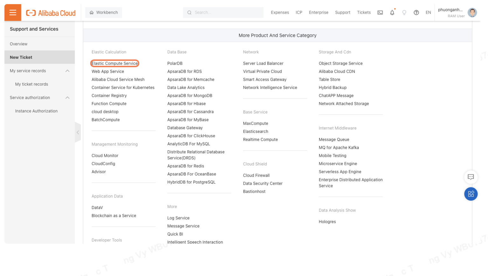

Trên trang **New Ticket** hiện ra, nhập các thông tin cụ thể bạn cần được hỗ trợ, lần lượt là **Current issue**, **Case Severity**, **Case Content**, và **Upload** hình ảnh minh họa.

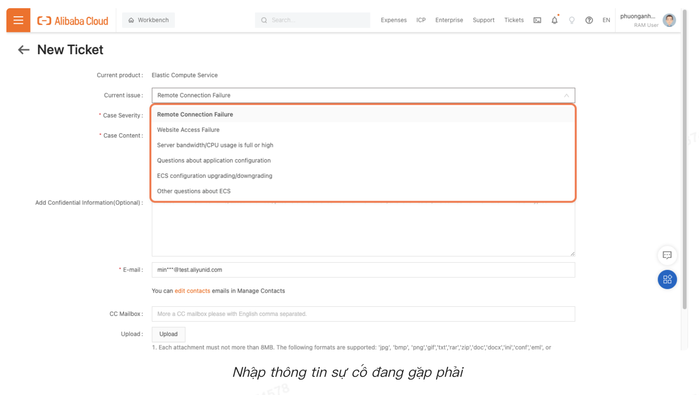

Tiếp theo là thông tin về mức độ nghiêm trọng của sự cố. Sự cố nghiêm trọng, cấp bách hơn đồng nghĩa với việc bạn cần và sẽ được hỗ trợ nhanh hơn. Tuy nhiên hãy lưu ý rằng số lần bạn được **raise ticket** cho những trường hợp nghiêm trọng sẽ ít hơn so với **ticket** thường (*đối với gói hỗ trợ miễn phí*).

Cụ thể, **Critical** sẽ được dùng cho những trường hợp cần hỗ trợ nhanh (bạn sẽ được hỗ trợ trong vòng **15 phút**) và **Consulting** sẽ được dùng với những sự cố nhỏ và ít ảnh hưởng hơn (bạn sẽ được hỗ trợ được trong thời gian **18 tiếng**).

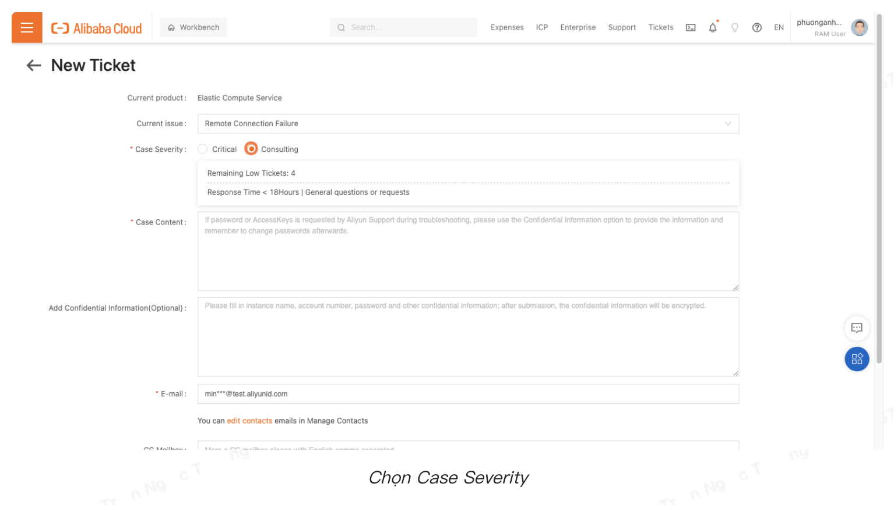

Kế đến, nhập mô tả chi tiết về vấn đề bạn gặp phải.

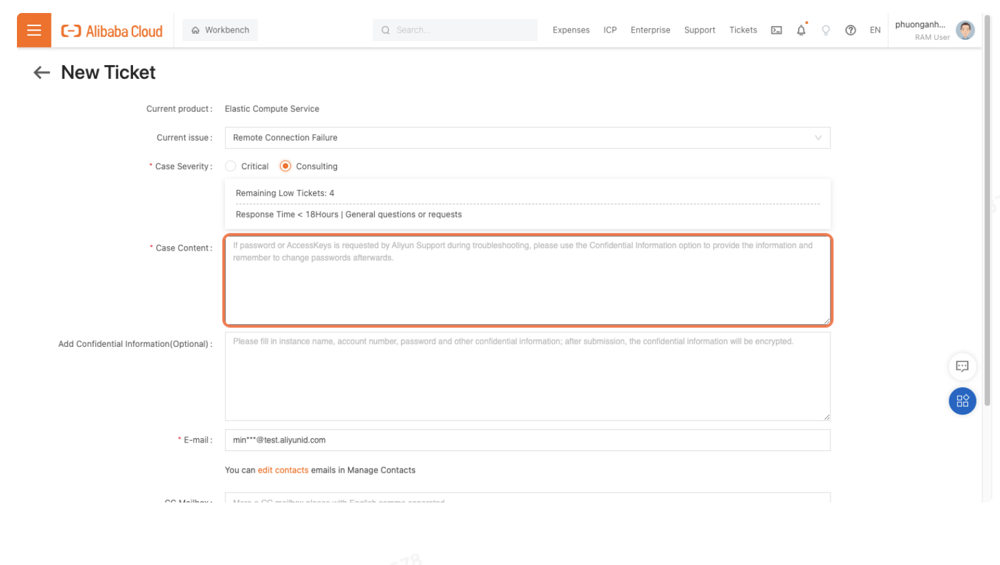

**Upload** hình ảnh cụ thể về sự cố bạn gặp phải. Bạn có thể không **upload**, nhưng có hình ảnh sẽ giúp đội hỗ trợ hiểu vấn đề và hỗ trợ bạn tốt hơn.

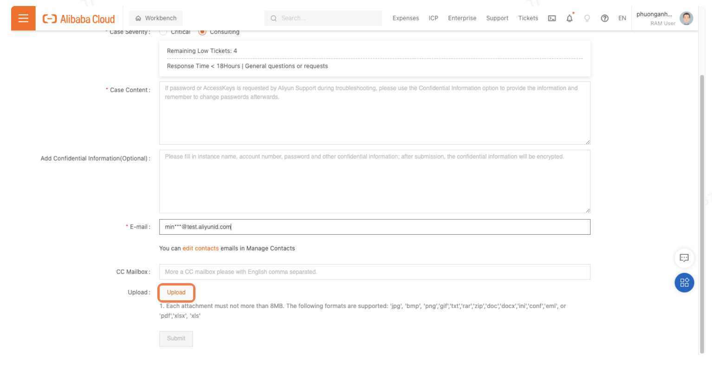

Sau khi hoàn tất, nhấn **Submit** để gửi **Ticket**.

Khi quá trình gởi **Ticket** đã hoàn tất, bạn có thể kiểm tra thông tin **ticket** trong **My ticket records**.

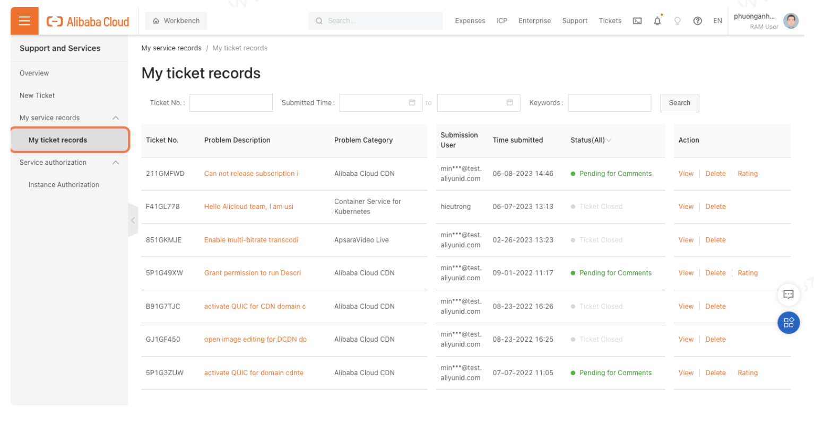

Vậy là chúng ta đã hoàn tất việc tìm hiểu về các **Support Package** của **Alibaba Cloud** và **raise ticket** yêu cầu hỗ trợ.

Chúc bạn sẽ có những trải nghiệm tốt với dịch vụ của **Alibaba Cloud** nhé!

*Author*: **Vo Thi Phuong Anh**

*Solution Architect* - **Alibaba Cloud Intelligence**

### Tham khảo

- https://www.alibabacloud.com/blog/how-to-submit-a-ticket-to-request-technical-support-on-alibaba-cloud_600146
