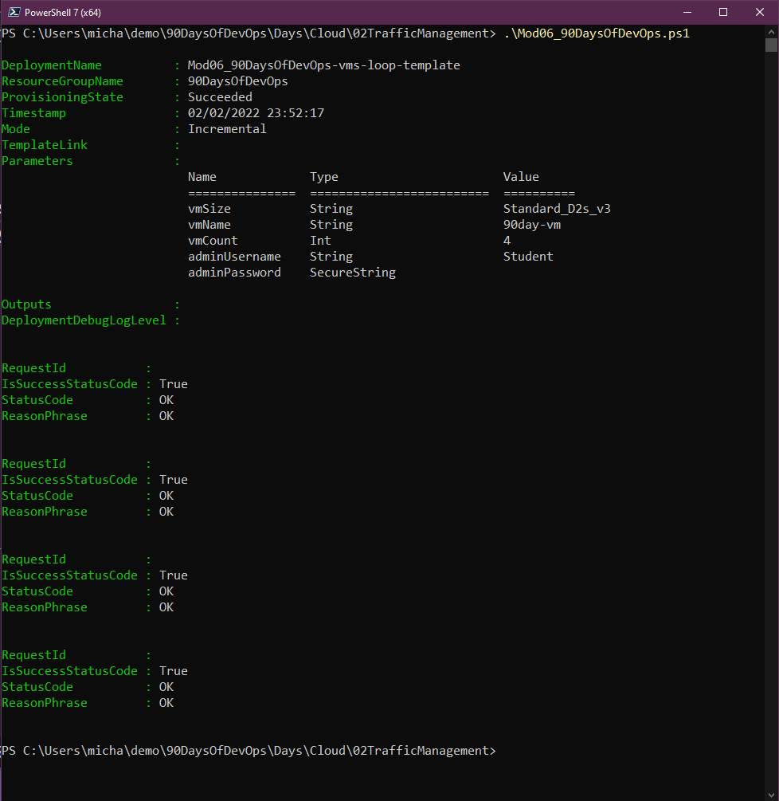
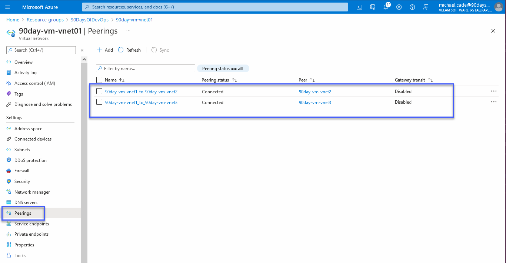
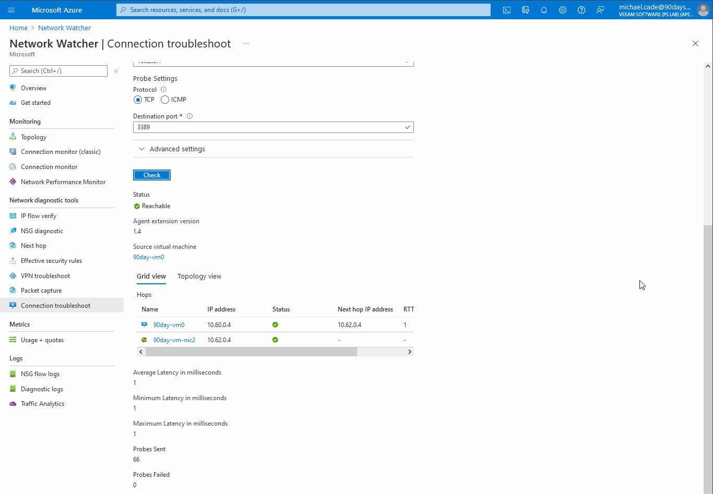
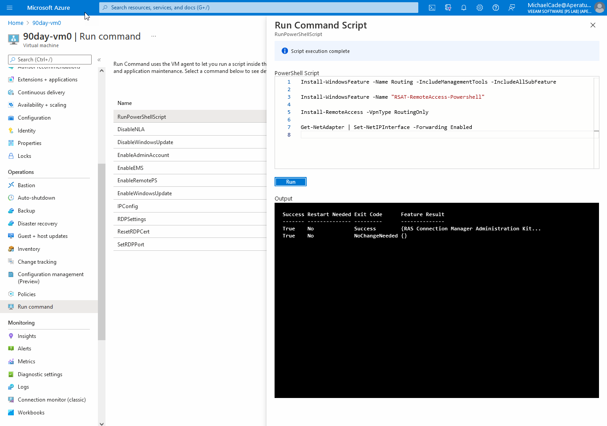
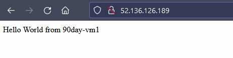
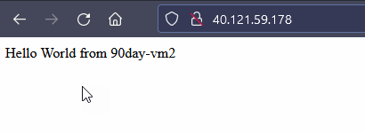
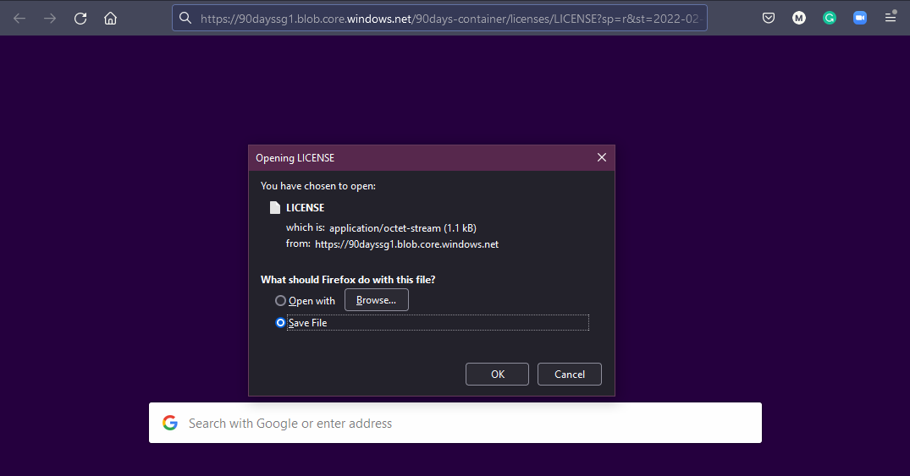
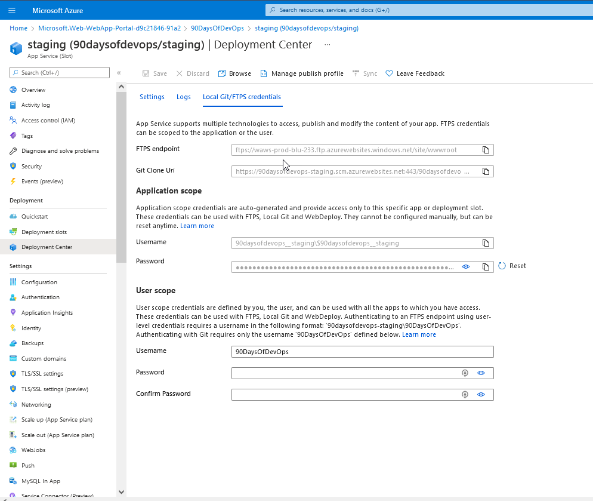
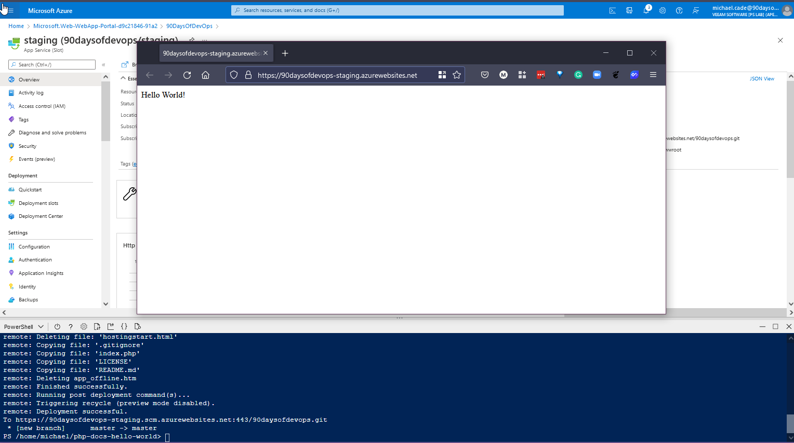

## Thực hành với Microsoft Azure

Chúng ta đã tập trung vào **Microsoft Azure** nói riêng và đám mây công cộng nói chung trong suốt các bài trước, phần lớn các kiến thức này chứa nhiều lý thuyết để hiểu được các khối xây dựng cơ bản của **Azure**, nhưng điều này cũng cũng sẽ có thể liên kết và áp dụng với các nhà cung cấp đám mây khác.

Tôi đã đề cập ngay từ đầu về việc có kiến thức cơ bản về đám mấy công cộng và chọn ít nhất một nhà cung cấp để bắt đầu, nếu bạn đang nhảy giữa các đám mây khác nhau thì tôi tin rằng rất dễ bị rối. Trong khi chọn một nhà cung cấp và sau khi hiểu các nguyên tắc cơ bản, bạn sẽ dễ dàng học, tìm hiểu về những đám mây khác và tăng tốc việc học của mình.

Trong bài cuối cùng này, tôi sẽ chọn và chọn các tình huống thực hành của mình từ trang này. Đây là tài liệu tham khảo do **Microsoft** tạo và được sử dụng để chuẩn bị cho [AZ-104 Microsoft Azure Administrator](https://microsoftlearning.github.io/AZ-104-MicrosoftAzureAdministrator/)

Có một số ví dụ ở đây chẳng hạn như **Container** và **Kubernetes**, các chủ đề chưa được đề cập đến vì vậy tôi chưa muốn đi sâu vào chúng.

Trong các bài viết trước, chúng ta đã tạo hầu hết các Module 1,2 và 3.

### Mạng ảo - Virtual Networking

Làm theo [Module 04](https://microsoftlearning.github.io/AZ-104-MicrosoftAzureAdministrator/Instructions/Labs/LAB_04-Implement_Virtual_Networking.html):

Tôi đã xem qua phần trên và thay đổi một vài tên cho phù hợp với **#90DaysOfDevOps**. Thay vì sử dụng **Cloud Shell**, tôi cũng đã đăng nhập bằng người dùng mới được tạo vào những ngày trước sử dụng **Azure CLI** trên máy **Windows** của mình.

Bạn có thể làm điều này bằng cách sử dụng `az login`, sau đó một trình duyệt sẽ được mở và cho phép bạn xác thực tài khoản của mình.

Sau đó, tôi đã tạo tập lệnh **PowerShell** và tham khảo từ **module** để sử dụng nhằm xây dựng một số tác vụ bên dưới. Bạn có thể tìm thấy các tập tin liên quan trong thư mục này.
[Cloud\01VirtualNetworking](/Scripts/Cloud/01VirtualNetworking.zip)

Vui lòng đảm bảo rằng bạn thay đổi vị trí tệp trong tập lệnh phù hợp với môi trường của mình.

Ở giai đoạn đầu tiên này, chúng tôi không có mạng ảo hoặc máy ảo nào được tạo trong môi trường của mình, tôi chỉ có một **cloud shell storage** được định cấu hình trong **resource group** của mình.

Trước hết, tôi chạy [PowerShell script](/Scripts/Cloud/01VirtualNetworking/Module4_90DaysOfDevOps.ps1) của mình

- Nhiệm vụ 1: Tạo và cấu hình mạng ảo

- Nhiệm vụ 2: Triển khai máy ảo vào mạng ảo

- Nhiệm vụ 3: Cấu hình địa chỉ IP private và public của máy ảo Azure

- Nhiệm vụ 4: Cấu hình các network security groups

- Nhiệm vụ 5: Cấu hình Azure DNS để phân giải tên nội bộ

### Quản lý lưu lượng mạng - Network Traffic Management

Làm theo [Module 06](https://microsoftlearning.github.io/AZ-104-MicrosoftAzureAdministrator/Instructions/Labs/LAB_06-Implement_Network_Traffic_Management.html):

Hướng dẫn tiếp theo, từ hướng dẫn cuối cùng, chúng ta đã vào **resource group** và xoá tài nguyên của mình. Nếu bạn chưa thiết lập tài khoảng người dùng như tôi để chỉ có quyền truy cập vào một nhóm tài nguyên đó, bạn có thể làm theo **module** đổi tên thành `90Days*`, điều này sẽ xoá tất cả các tài nguyên và nhóm tài nguyên. Đây sẽ là quy trình của tôi cho tất cả các bài **labs** sau này.

Đối với **lab** này, tôi cũng đã tạo tập lệnh **PowerShell** và một số tài liệu tham khảo từ **module** sử dụng cho việc xây dựng một số tác vụ bên dưới. Bạn có thể tìm thấy các tập tin liên quan trong thư mục này.
[Cloud\02TrafficManagement](/Scripts/Cloud/02TrafficManagement.zip)

- Nhiệm vụ 1: Tạo môi trường cho lab

Đầu tiên tôi chạy [PowerShell script](/Scripts/Cloud/02TrafficManagement/Mod06_90DaysOfDevOps.ps1) của mình

- Nhiệm vụ 2: Cấu hình topo mạng cho mạng hub-spoke

- Nhiệm vụ 3: Kiểm tra tính bắc cầu của virtual network peering

**Group 90DaysOfDevOps** của tôi không có quyền truy cập vào **Network Watcher** do không có quyền, tôi cho rằng điều này là do **Network Watcher** là một trong những tài nguyên không được liên kết với nhóm tài nguyên mà **RBAC** của chúng ta đã khai báo. Tôi đã thêm vai trò **East US Network Watcher contributor** vào group **90DaysOfDevOps**.

^ Điều này được mong đợi vì hai spoke virtual networks không peer với nhau (network peering không mang tính bắc cầu).

- Nhiệm vụ 4: Cấu hình định tuyến trong topo hub-spoke

Tôi gặp một vấn đề khác ở đây là tài khoản của tôi không thể chạy tập lệnh với tư cách là người dùng trong nhóm **90DaysOfDevOps** và vì không chắc lắm nên tôi đã quay lại tài khoản quản trị viên chính của mình. Nhóm **90DaysOfDevOps** là chủ sở hữu của mọi thứ trong Nhóm tài nguyên **90DaysOfDevOps**, vì vậy tôi rất muốn hiểu tại sao tôi không thể chạy lệnh bên trong **VM**?

Sau đó, tôi có thể quay lại tài khoản **michael.cade@90DaysOfDevOps.com** của mình và tiếp tục phần này. Ở đây chúng tôi đang chạy lại vài bài **test** tương tự nhưng bây giờ đã có thể truy cập được.

- Nhiệm vụ 5: Triển khai Azure Load Balancer

- Nhiệm vụ 6: Triển khai Azure Application Gateway

### Azure Storage

Làm theo [Module 07](https://microsoftlearning.github.io/AZ-104-MicrosoftAzureAdministrator/Instructions/Labs/LAB_07-Manage_Azure_Storage.html):

Đối với bài Lab này, tôi cũng đã tạo tập lệnh **PowerShell** và tham khảo từ **module** sử dụng cho việc xây dựng một số tác vụ bên dưới. Bạn có thể tìm thấy các tập tin liên quan trong thư mục này.
[Cloud/03Storage](/Scripts/Cloud/03Storage.zip)

- Nhiệm vụ 1: Tạo môi trường cho lab

Trước hết, tôi chạy [PowerShell script](/Scripts/Cloud/03Storage/Mod07_90DaysOfDevOps.ps1) của mình

- Nhiệm vụ 2: Tạo và cấu hình tài khoản Azure Storage

- Nhiệm vụ 3: Quản lý lưu trữ blob

- Nhiệm vụ 4: Quản lý xác thực và cấp quyền cho Azure Storage

Tôi hơi thiếu kiên nhẫn chờ đợi điều này được cho phép nhưng cuối cùng thì nó cũng hoạt động.

- Nhiệm vụ 5: Tạo và cấu hình Azure file share

Khi chạy lệnh, lệnh này sẽ không hoạt động với **michael.cade@90DaysOfDevOps.com** nên tôi đã sử dụng tài khoản **admin** của mình.

- Nhiệm vụ 6: Quản lý truy cập mạng cho Azure Storage

### Serverless (Triển khai ứng dụng web)

Làm theo [Module 09a](https://microsoftlearning.github.io/AZ-104-MicrosoftAzureAdministrator/Instructions/Labs/LAB_09a-Implement_Web_Apps.html):

- Nhiệm vụ 1: Tạo Azure web app

- Nhiệm vụ 2: Tạo staging deployment slot

- Nhiệm vụ 3: Định cấu hình cài đặt triển khai ứng dụng web

- Nhiệm vụ 4: Triển khai mã vào staging deployment slot

- Nhiệm vụ 5: Đổi staging slots

- Nhiệm vụ 6: Định cấu hình và kiểm tra tính năng tự động thay đổi quy mô (auto-scaling)của Azure web app

Tập lệnh tôi đang sử dụng có thể được tìm thấy trong [Cloud/04Serverless](/Scripts/Cloud/04Serverless.zip)

Bài **lab** này kết thúc phần tìm hiểu về **Microsoft Azure** nói riêng và đám mây công cộng nói chung. Tôi có thể nói rằng tôi đã rất vui khi thử sức và giải quyết các tình huống trên đây.

## Tài liệu tham khảo

- [Hybrid Cloud and MultiCloud](https://www.youtube.com/watch?v=qkj5W98Xdvw)
- [Microsoft Azure Fundamentals](https://www.youtube.com/watch?v=NKEFWyqJ5XA&list=WL&index=130&t=12s)
- [Google Cloud Digital Leader Certification Course](https://www.youtube.com/watch?v=UGRDM86MBIQ&list=WL&index=131&t=10s)
- [AWS Basics for Beginners - Full Course](https://www.youtube.com/watch?v=ulprqHHWlng&t=5352s)

Tiếp theo, chúng ta sẽ đi sâu vào các hệ thống kiểm soát phiên bản, cụ thể là xung quanh **git** và sau đó là tổng quan về kho lưu trữ mã và chúng tôi sẽ chọn **GitHub** vì đây là lựa chọn ưa thích của tôi.