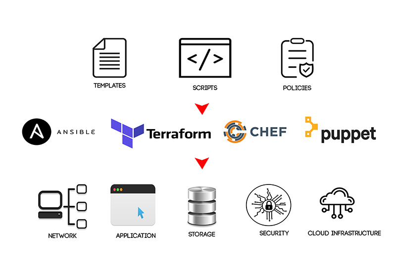

# Infrastructure as Code (IaC) là gì ?

**Infrastructure as Code (IaC)** hay **Cơ sở hạ tầng dưới dạng mã (IaC)** là một phương pháp quản lý và cung cấp cơ sở hạ tầng thông qua code. Thay vì cấu hình cơ sở hạ tầng thủ công, IaC sử dụng các tệp định nghĩa có thể được máy đọc, chẳng hạn như **JSON**, **YAML**, hoặc **HCL**... Các tệp này mô tả các thành phần cơ sở hạ tầng, chẳng hạn như máy ảo (**VM**), mạng (**Network**), và bộ cân bằng tải (**Load Balancing**). Khi các tệp này được thực thi, chúng sẽ tự động tạo ra và cấu hình cơ sở hạ tầng.

### Lợi ích khi sử dụng IaC

IaC có một số lợi ích, bao gồm:

- **Tăng tính nhất quán**: IaC có thể giúp đảm bảo rằng cơ sở hạ tầng được cấu hình nhất quán trên tất cả các môi trường. Điều này có thể giúp ngăn ngừa lỗi và sự cố.
- **Tăng khả năng mở rộng**: IaC có thể giúp dễ dàng mở rộng cơ sở hạ tầng khi nhu cầu tăng. Điều này có thể giúp doanh nghiệp tiết kiệm thời gian và tiền bạc.
- **Tăng khả năng bảo mật**: IaC có thể giúp cải thiện bảo mật cơ sở hạ tầng bằng cách tự động hóa các quy trình tạo và quản lý cơ sở hạ tầng. Điều này có thể giúp ngăn chặn truy cập trái phép vào cơ sở hạ tầng.
- **Tăng khả năng kiểm tra**: IaC có thể giúp dễ dàng kiểm tra cơ sở hạ tầng bằng cách sử dụng mã. Điều này có thể giúp đảm bảo rằng cơ sở hạ tầng hoạt động bình thường.
- **Tăng khả năng tự động hóa**: IaC có thể giúp tự động hóa các quy trình quản lý cơ sở hạ tầng. Điều này có thể giúp doanh nghiệp tiết kiệm thời gian, tiền bạc và công sức.

### Các công cụ IaC thường dùng

Có một số công cụ IaC khác nhau có sẵn, bao gồm:

- **Ansible**: Ansible là một công cụ tự động hóa mã nguồn mở có thể được sử dụng để quản lý cơ sở hạ tầng. Ansible sử dụng các kịch bản để quản lý cơ sở hạ tầng và có thể được sử dụng để quản lý các máy chủ, mạng và dịch vụ khác nhau.
- **Chef**: Chef là một công cụ tự động hóa mã nguồn mở khác có thể được sử dụng để quản lý cơ sở hạ tầng. Chef sử dụng các cookbook để quản lý cơ sở hạ tầng và có thể được sử dụng để quản lý các máy chủ, mạng và dịch vụ khác nhau.
- **Puppet**: Puppet là một công cụ tự động hóa mã nguồn mở khác có thể được sử dụng để quản lý cơ sở hạ tầng. Puppet sử dụng các mô hình để quản lý cơ sở hạ tầng và có thể được sử dụng để quản lý các máy chủ, mạng và dịch vụ khác nhau.
- **Terraform**: Terraform là một công cụ IaC mã nguồn mở có thể được sử dụng để quản lý cơ sở hạ tầng đám mây. Terraform sử dụng các tài liệu để quản lý cơ sở hạ tầng và có thể được sử dụng để quản lý các tài nguyên đám mây khác nhau từ nhiều nhà cung cấp khác nhau.

**Infrastructure as Code (IaC)** là một công nghệ quan trọng trong **DevOps**. Nó cho phép các nhà phát triển và vận hành hợp tác chặt chẽ hơn trong việc cung cấp và quản lý cơ sở hạ tầng.

Công cụ **IaC** tốt nhất cho bạn sẽ phụ thuộc vào nhu cầu và yêu cầu cụ thể của bạn.

## Tài liệu Tham khảo

- [What is Infrastructure as Code? Difference of Infrastructure as Code Tools](https://www.youtube.com/watch?v=POPP2WTJ8es)
- [Terraform Tutorial | Terraform Course Overview 2021](https://www.youtube.com/watch?v=m3cKkYXl-8o)
- [Terraform explained in 15 mins | Terraform Tutorial for Beginners](https://www.youtube.com/watch?v=l5k1ai_GBDE)
- [Terraform Course - From BEGINNER to PRO!](https://www.youtube.com/watch?v=7xngnjfIlK4&list=WL&index=141&t=16s)
- [HashiCorp Terraform Associate Certification Course](https://www.youtube.com/watch?v=V4waklkBC38&list=WL&index=55&t=111s)
- [Terraform Full Course for Beginners](https://www.youtube.com/watch?v=EJ3N-hhiWv0&list=WL&index=39&t=27s)
- [KodeKloud - Terraform for DevOps Beginners + Labs: Complete Step by Step Guide!](https://www.youtube.com/watch?v=YcJ9IeukJL8&list=WL&index=16&t=11s)
- [Terraform Simple Projects](https://terraform.joshuajebaraj.com/)
- [Terraform Tutorial - The Best Project Ideas](https://www.youtube.com/watch?v=oA-pPa0vfks)
- [Awesome Terraform](https://github.com/shuaibiyy/awesome-terraform)