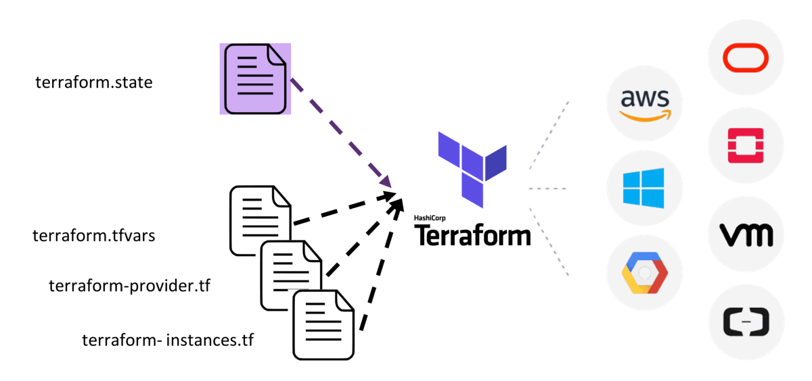
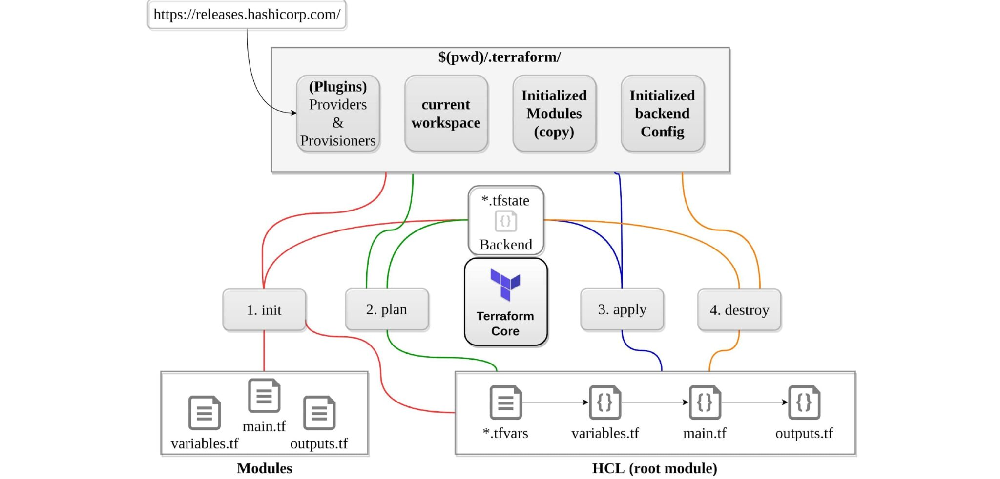

# Terraform là gì?

**Terraform** là một công cụ mã nguồn mở cho phép bạn định nghĩa **Infrastructure as Code - IaC** với đa dạng **cloud provider** ví dụ: **Alibaba Cloud**, **AWS**, **Azure** … được quản lý bởi **HashiCorp**. **Terraform** giúp bạn quản lý hệ thống bằng **code** và tự động hóa việc triển khai hạ tầng của bạn. Bạn có thể sử dụng **Terraform** để quản lý các tài nguyên như máy chủ, mạng, cơ sở dữ liệu và các tài nguyên khác của các nhà cung cấp đám mây khác nhau.

- Quản lý tài nguyên đám mây đa nền tảng.
- Quản lý các phiên bản khác nhau của cơ sở hạ tầng.
- Quản lý các phụ thuộc giữa các tài nguyên.
- Tự động hóa việc triển khai và cập nhật cơ sở hạ tầng.

**Terraform** sử dụng ngôn ngữ **HCL** (*HashiCorp Configuration Language*) để định nghĩa cấu trúc hạ tầng của bạn và có thể được sử dụng để quản lý hạ tầng trên nhiều nhà cung cấp đám mây khác nhau.


> "**Terraform** là một công cụ phần mềm cơ sở hạ tầng dưới dạng mã mã nguồn mở cung cấp quy trình làm việc với **CLI** để quản lý hàng trăm dịch vụ điện toán đám mây. **Terraform** mã hoá các **API** của các nhà cung cấp thành các tệp cấu hình khai báo"

**HashiCorp** có nguồn tài nguyên tuyệt vời tại [**HashiCorp Learn**](https://developer.hashicorp.com/terraform/tutorials) bao gồm tất cả các sản phẩm của họ và cung cấp một số bản **demo** hướng dẫn rất tốt khi bạn đang cố gắng làm việc với Cơ sở hạ tầng dưới dạng mã (**IaC**)

### Các công cụ thay thế Terraform

Một số công cụ tương đương với **Terraform** mà bạn có thể tham khảo bao gồm:

- Chef Infra
- Ansible
- Puppet
- SaltStack
- Pulumi
- CloudFormation của AWS
- Azure Resource Manager
- Google Cloud Deployment Manager

**Terraform** được chọn vì nó có thể giúp quản lý cơ sở hạ tầng đám mây dễ dàng và hiệu quả hơn bằng cách viết mã để tự động hóa các quy trình triển khai và cập nhật.

**Terraform** cũng hỗ trợ cho **Alibaba Cloud** thông qua **provider** của **Alibaba Cloud**. Bạn có thể sử dụng **Terraform** để quản lý các tài nguyên trên A**libaba Cloud** như **ECS instances**, **VPCs**, **ApsaraDB for RDS instances** và nhiều hơn nữa.

Ngoài ra, **Alibaba Cloud** cũng cung cấp một giải pháp sử dụng **Terraform** để triển khai và quản lý hạ tầng của mình.

### Tổng quan về Terraform

**Terraform** là một công cụ tập trung vào việc cung cấp hạ tầng, **Terraform** là một **CLI** có khả năng khởi tạo, cung cấp các môi trường cơ sở hạ tầng phức tạp. Với **Terraform**, chúng ta có thể xác định các yêu cầu cơ sở hạ tầng phức tạp tồn tại cục bộ hoặc từ xa (điện toán đám mây). 

**Terraform** không chỉ cho phép chúng ta xây dựng mọi thứ từ đầu mà còn duy trì và cập nhật các tài nguyên đó theo suốt vòng đời của chúng.

Chúng ta sẽ đề cập tới **high level** trong bài viết này, bạn có thể biết thêm chi tiết và tìm hiểu các tài nguyên khác tại trang [terraform.io](https://www.terraform.io/)

#### Write

**Terraform** cho phép chúng ta tạo các tệp cấu hình khai báo để xây dựng môi trường của chúng ta. Các tệp được viết bằng ngôn ngữ cấu hình của **HashiCorp** (*HCL - HashiCorp Configuration Language*) cho phép mô tả ngắn gọn các tài nguyên bằng cách sử dụng các khối, đối số và biểu thức. Tất nhiên, chúng ta sẽ xem xét những điều này một cách chi tiết khi triển khai **VM**, **Container** và **Kubernetes**.

#### Plan

Khả năng kiểm tra xem các tệp cấu hình trên có triển khai những gì chúng ta muốn thấy hay không bằng cách sử dụng các chức năng cụ thể của **Terraform CLI** trước khi triển khai hoặc thay đổi bất cứ thứ gì. Hãy nhớ rằng **Terraform** là một công cụ được sử dụng xuyên suốt cho cơ sở hạ tầng của bạn, nếu bạn muốn thay đổi các khía cạnh của cơ sở hạ tầng của mình, bạn nên thực hiện điều đó thông qua **Terraform** để tất cả mọi thứ được nắm bắt thông qua mã.

#### Apply

Khi đã hài lòng, bạn có thể áp dụng cấu hình này cho nhiều **providers** có sẵn trong **Terraform**. Bạn có thể thấy danh sách các **provider** có sẵn [tại đây](https://registry.terraform.io/browse/providers)

Một điều khác cần đề cập là cũng có sẵn các **modules**, nó tương tự như **container images** ở chỗ các **modules** này đã được tạo và chia sẻ công khai, do đó bạn không phải tạo đi tạo lại chúng mà chỉ cần sử dụng lại cách tốt nhất để triển khai một tài nguyên cụ thể theo cùng một cách ở mọi nơi. Bạn có thể tìm thấy các **module** có sẵn [tại đây](https://registry.terraform.io/browse/modules)

### Quy trình làm việc của Terraform


### Terraform vs Vagrant

Trong thử thách này, chúng ta đã sử dụng **Vagrant**, một công cụ mã nguồn mở khác của **Hashicorp** tập trung vào các môi trường phát triển.

- **Vagrant** là một công cụ tập trung vào việc quản lý môi trường phát triển
- **Terraform** là một công cụ để xây dựng cơ sở hạ tầng.

Bạn có thể tìm thấy sự so sánh giữa hai công cụ tại đây trên trang web chính thức của [Hashicorp](https://www.vagrantup.com/intro/vs/terraform)

### Cài đặt Terraform


**Terraform** hỗ trợ nhiều hệ điều hành khác nhau như **Windows**, **Linux**, **MacOS**, **Solaris**, **FreeBSD** và **OpenBSD**... Bài viết này sẽ hướng dẫn các bạn cài trên hệ điều hành **Ubuntu**

```js
wget -O- https://apt.releases.hashicorp.com/gpg | sudo gpg --dearmor -o /usr/share/keyrings/hashicorp-archive-keyring.gpg
echo "deb [signed-by=/usr/share/keyrings/hashicorp-archive-keyring.gpg] https://apt.releases.hashicorp.com $(lsb_release -cs) main" | sudo tee /etc/apt/sources.list.d/hashicorp.list
sudo apt update && sudo apt install terraform

```  
Kiểm tra phiên bản **terraform** được cài đặt trên hệ thống của bạn

```js
$ terraform --version
Terraform v1.4.5

```  
Để xem danh sách các **commands** có trong **terraform** có thể sử dụng lệnh `terraform -help`

```js
$ terraform -help
Usage: terraform [global options] <subcommand> [args]

The available commands for execution are listed below.
The primary workflow commands are given first, followed by
less common or more advanced commands.

Main commands:
  init          Prepare your working directory for other commands
  validate      Check whether the configuration is valid
  plan          Show changes required by the current configuration
  apply         Create or update infrastructure
  destroy       Destroy previously-created infrastructure

All other commands:
  console       Try Terraform expressions at an interactive command prompt
  fmt           Reformat your configuration in the standard style
  force-unlock  Release a stuck lock on the current workspace
  get           Install or upgrade remote Terraform modules
  graph         Generate a Graphviz graph of the steps in an operation
  import        Associate existing infrastructure with a Terraform resource
  login         Obtain and save credentials for a remote host
  logout        Remove locally-stored credentials for a remote host
  metadata      Metadata related commands
  output        Show output values from your root module
  providers     Show the providers required for this configuration
  refresh       Update the state to match remote systems
  show          Show the current state or a saved plan
  state         Advanced state management
  taint         Mark a resource instance as not fully functional
  test          Experimental support for module integration testing
  untaint       Remove the 'tainted' state from a resource instance
  version       Show the current Terraform version
  workspace     Workspace management

Global options (use these before the subcommand, if any):
  -chdir=DIR    Switch to a different working directory before executing the
                given subcommand.
  -help         Show this help output, or the help for a specified subcommand.
  -version      An alias for the "version" subcommand.

```  
**Terraform** sử dụng các **file** cấu hình để quản lý các tài nguyên **cloud**. Các **file** cấu hình này được viết bằng ngôn ngữ **HashiCorp Configuration Language (HCL)** hoặc **JSON**. Các **file** cấu hình này được chia thành các **module**, mỗi **module** đại diện cho một tài nguyên **cloud** cụ thể



- terraform init: đây là một lệnh bắt buộc cần thực hiện đầu tiên để khởi tạo một Terraform Project.
- terraform validate: sẽ tiến hành kiểm tra tất cả các Terraform configuration để đảm bảo rằng toàn bộ syntax đều chính xác. Thường sử dụng sau khi configuration files được sửa chữa để kiểm tra hợp lệ.
- terraform plan: là một dry-run command, khi thực thi terraform sẽ cấp cho mình một execution plan, có highlight các thay đổi để mình có thể xác định được các thay đổi trong configuration.
- terraform apply: Trong trường hợp chưa run CMD plan trước khi run cmd apply. Terraform sẽ tự động rerun plan và mình cần xác nhận đồng ý với execution plan mới có thể tiến hành apply.
- terraform destroy: là lệnh dùng destroy các provided, vì vậy cần cẩn thận và hiểu rõ ý nghĩa những việc đang thực hiện khi sử lệnh này đặc biệt là trên môi trường production.

### Cách thành phần chính trong Terraform

Một **RootModule** thông thường sẽ có 3 **Terraform** files chính:

- main.tf: file là file tập trung các config Terraform chính, nằm ở root project.
- variables.tf: là file tập trung tất cả các khai bao biến, nằm ở root project.
- outputs.tf: dùng để export value sau khi terraform apply đã thực thi hoàn tất, nằm ở root project.
- terraform.tfstate(optional) dùng để quản lý state
- terraform.tfstate.backup (optional) dùng để quản lý backup state



### Hướng dẫn sử dụng Terraform cơ bản với Docker

Sau khi bạn đã cài đặt **Terraform** xong, bạn có thể cung cấp máy chủ **NGINX** trong vòng chưa đầy một phút bằng cách sử dụng **Docker** trên **Mac**, **Windows** hoặc **Linux**. Yêu cầu là **Docker** đã được cài trên máy của bạn. Hướng dẫn này được thực hiện trên **Ubuntu**

Tạo thư mục có tên là `learn-terraform-docker-container` và `cd` vào thư mục này

```js
$ mkdir learn-terraform-docker-container
$ cd learn-terraform-docker-container
```  
Tại thư mục `learn-terraform-docker-container`, tạo file **main.tf**

```js
terraform {
  required_providers {
    docker = {
      source  = "kreuzwerker/docker"
      version = "~> 3.0.1"
    }
  }
}

provider "docker" {}

resource "docker_image" "nginx" {
  name         = "nginx"
  keep_locally = false
}

resource "docker_container" "nginx" {
  image = docker_image.nginx.image_id
  name  = "tutorial"

  ports {
    internal = 80
    external = 8000
  }
}

```  
Vì đây là lần đầu tiên chúng ta chạy dự án này, chúng ta cần khởi tạo nó bằng lệnh `init`

```js
$ terraform init

```  
Tiếp tục chạy lệnh `terraform apply`, nhập giá trị **yes** và nhấn **Enter** để xác nhận

```js
$ terraform apply

```  
Trên trình duyệt truy cập **localhost:8000** để xem kết quả


Chạy lệnh `docker ps` để kiểm tra

```js
$ docker ps
CONTAINER ID   IMAGE          COMMAND                  CREATED         STATUS         PORTS                  NAMES
624f6b5b1621   6efc10a0510f   "/docker-entrypoint.…"   3 seconds ago   Up 2 seconds   0.0.0.0:8000->80/tcp   tutorial

```  

Kiểm tra trạng thái bằng lệnh `terraform show`

```js
$ terraform show
# docker_container.nginx:
resource "docker_container" "nginx" {
    attach            = false
    command           = [
        "nginx",
        "-g",
        "daemon off;",
    ]
    cpu_shares        = 0
    entrypoint        = [
        "/docker-entrypoint.sh",
    ]
    env               = []
    gateway           = "172.17.0.1"
    hostname          = "2834ad628337"
    id                = "2834ad6283372ceb61121739ce71d31cb0237ad50f4dc234e3445c9445439181"
    image             = "sha256:d1a364dc548d5357f0da3268c888e1971bbdb957ee3f028fe7194f1d61c6fdee"
    init              = false
    ip_address        = "172.17.0.2"
    ip_prefix_length  = 16
    ipc_mode          = "private"
    log_driver        = "json-file"
    logs              = false
    max_retry_count   = 0
    memory            = 0
    memory_swap       = 0
    must_run          = true
    name              = "tutorial"
    network_data      = [
        {
            gateway                   = "172.17.0.1"
            global_ipv6_address       = ""
            global_ipv6_prefix_length = 0
            ip_address                = "172.17.0.2"
            ip_prefix_length          = 16
            ipv6_gateway              = ""
            network_name              = "bridge"
        },
    ]
    network_mode      = "default"
    privileged        = false
    publish_all_ports = false
    read_only         = false
    remove_volumes    = true
    restart           = "no"
    rm                = false
    security_opts     = []
    shm_size          = 64
    start             = true
    stdin_open        = false
    tty               = false

    ports {
        external = 8000
        internal = 80
        ip       = "0.0.0.0"
        protocol = "tcp"
    }
}

 docker_image.nginx:
resource "docker_image" "nginx" {
    id           = "sha256:d1a364dc548d5357f0da3268c888e1971bbdb957ee3f028fe7194f1d61c6fdeenginx:latest"
    keep_locally = false
    latest       = "sha256:d1a364dc548d5357f0da3268c888e1971bbdb957ee3f028fe7194f1d61c6fdee"
    name         = "nginx:latest"
}

```  

**Terraform** có một lệnh tích hợp có tên là `terraform state` để quản lý trạng thái

```js
$ terraform state list
docker_container.nginx
docker_image.nginx

```  

### Một số lệnh khác trên Terraform

- *terraform apply -auto-approve* là một tham số có thể được truyền vào lệnh *terraform apply* để bỏ qua xác nhận *yes*. Nó cũng có thể được kết hợp với các tùy chọn khác như *-input=false* để vô hiệu hóa các lời nhắc đầu vào. Thường được dùng trong automation **CI/CD pipelines**.

- *terraform fmt* là một lệnh trong Terraform được sử dụng để định dạng lại các file cấu hình của Terraform thành một định dạng chuẩn và đẹp hơn. Lệnh này áp dụng một số quy ước về kiểu ngôn ngữ Terraform, cùng với các điều chỉnh khác cho tính đọc hiểu

- *terraform validate* là một lệnh trong Terraform được sử dụng để kiểm tra xem các file cấu hình của Terraform có hợp lệ hay không. Lệnh này sẽ kiểm tra xem các file cấu hình của Terraform có đúng cú pháp không và có thể được áp dụng thành công hay không.

- *terraform destroy* là một lệnh trong Terraform được sử dụng để xóa các tài nguyên được tạo ra bởi Terraform. Lệnh này sẽ xóa các tài nguyên được tạo ra bởi Terraform theo thứ tự ngược lại với thứ tự mà chúng được tạo ra 

### Tài liệu tham khảo:

- https://github.com/aliyun/terraform-provider-alicloud
- https://github.com/terraform-alicloud-modules
- https://registry.terraform.io/namespaces/terraform-alicloud-modules
- https://registry.terraform.io/providers/aliyun/alicloud/latest/docs
- https://www.alibabacloud.com/help/en/terraform/latest/what-is-terraform
- https://www.alibabacloud.com/vi/solutions/devops/terraform
- https://developer.hashicorp.com/terraform/tutorials/docker-get-started