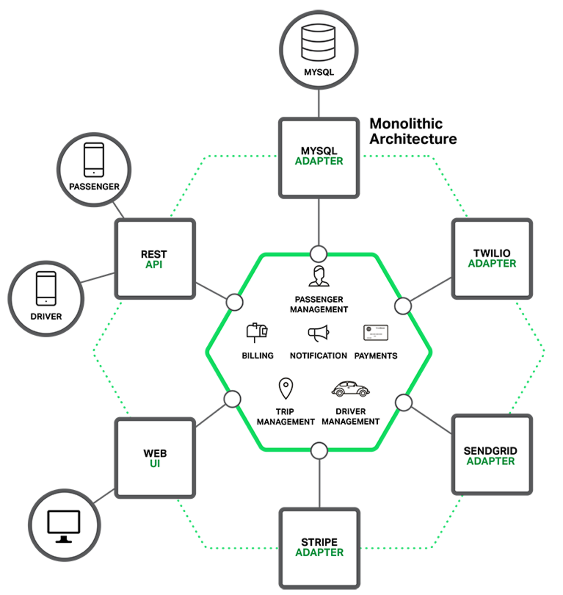
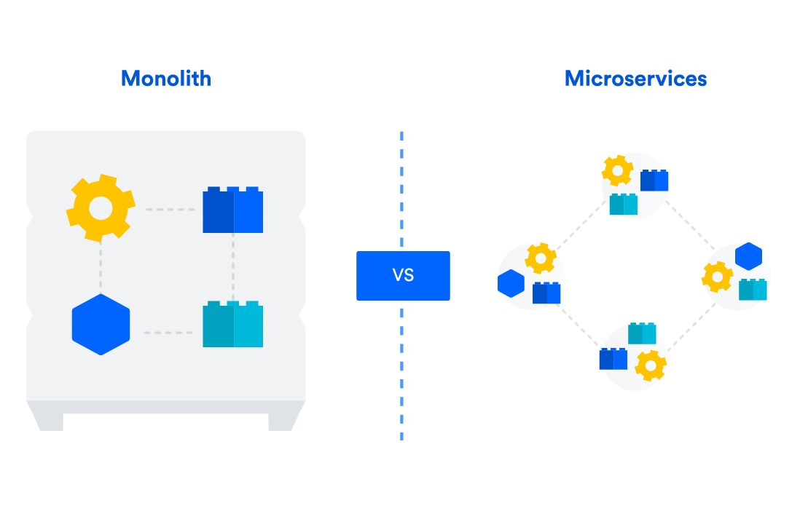

# Microservices, Monolith với Devops

**Microservices**, **Monolith** và **DevOps** là ba khái niệm khác nhau trong phát triển phần mềm.

- **Microservices** là một kiến trúc phần mềm trong đó hệ thống được chia thành các dịch vụ nhỏ, độc lập, có thể tự quản lý. Mỗi dịch vụ có một chức năng cụ thể và có thể được phát triển, triển khai và bảo trì độc lập.

- **Monolith** là một kiến trúc phần mềm trong đó hệ thống được phát triển và triển khai như một đơn vị duy nhất. Tất cả các thành phần của hệ thống đều được liên kết chặt chẽ và phụ thuộc lẫn nhau.

- **DevOps** là một cách tiếp cận tổng thể cho việc phát triển, triển khai và vận hành phần mềm. Nó tập trung vào việc hợp nhất các nhóm phát triển và vận hành để họ có thể cùng nhau làm việc để cung cấp phần mềm nhanh hơn, đáng tin cậy hơn và có thể bảo trì hơn.

**DevOps** có thể được sử dụng với cả **Microservices** và **Monolith**. Tuy nhiên, **Microservices** thường được coi là phù hợp hơn với **DevOps** vì chúng có thể được phát triển, triển khai và bảo trì độc lập, điều này làm cho chúng dễ dàng hơn để tự động hóa và quản lý.

## Lợi ích 

Lợi ích của việc sử dụng **DevOps** với **Microservices**

- **Tăng tốc độ phát triển và triển khai**: **DevOps** có thể giúp các nhóm phát triển và vận hành **Microservices** làm việc cùng nhau hiệu quả hơn, tự động hóa các quy trình và giảm thiểu các lỗi. Điều này có thể giúp tăng tốc độ phát triển và triển khai các hệ thống **Microservices**.

- **Cải thiện khả năng bảo trì**: **Microservices** có thể được bảo trì dễ dàng hơn các hệ thống **Monolithic** lớn. **DevOps** có thể giúp các nhóm phát triển và vận hành **Microseervices** tự động hóa các quy trình bảo trì và giảm thiểu các lỗi.

- **Tăng khả năng mở rộng**: **Microservices** có thể được mở rộng dễ dàng hơn các hệ thống **Monolithic** lớn. **DevOps** có thể giúp các nhóm phát triển và vận hành **Microservices** tự động hóa các quy trình mở rộng và giảm thiểu các lỗi.

- **Tăng khả năng đáp ứng**: **Microservices** có thể được đáp ứng nhanh hơn các hệ thống **Monolithic** lớn. **DevOps** có thể giúp các nhóm phát triển và vận hành **Microservices** tự động hóa các quy trình đáp ứng và giảm thiểu các lỗi.

## Thách thức

Tuy nhiên, cũng cần lưu ý rằng **Microservices** và **DevOps** cũng có một số thách thức:

- **Sự phức tạp**: **Microservices** có thể phức tạp hơn các hệ thống **Monolithic** lớn. **DevOps** có thể giúp giảm thiểu các thách thức này bằng cách cung cấp các công cụ và thực hành để quản lý các hệ thống **Microservices** phức tạp.

- **Khả năng tương tác**: Các **Microservices** cần phải có khả năng tương tác với nhau để hoạt động như một hệ thống thống nhất. **DevOps** có thể giúp các nhóm phát triển và vận hành **Microservices** xác định và giải quyết các vấn đề về khả năng tương tác.

- **Quản trị**: Các **Microservices** cần được quản trị một cách hiệu quả để đảm bảo rằng chúng hoạt động như một hệ thống thống nhất. **DevOps** có thể giúp các nhóm phát triển và vận hành **Microservices** xác định và giải quyết các vấn đề về quản trị.

## So sánh Monolith và Microservices

### Monolith là gì?

**Monolith** là một kiến trúc phần mềm truyền thống, trong đó toàn bộ ứng dụng được phát triển, triển khai và triển khai như một thực thể duy nhất. Tất cả các thành phần của ứng dụng, bao gồm giao diện người dùng, **logic** kinh doanh và cơ sở dữ liệu, đều được xây dựng và liên kết chặt chẽ với nhau. Một ứng dụng **Monolith** có thể được triển khai trong một máy chủ hoặc môi trường **cloud** duy nhất.

### Ưu điểm của kiến trúc Monolith

- **Dễ phát triển**: Kiến trúc **Monolith** dễ dàng để xây dựng và triển khai ban đầu vì không có sự phân tách rõ ràng giữa các thành phần. Điều này có nghĩa là việc phát triển và triển khai ứng dụng **Monolith** ban đầu được thực hiện một cách đơn giản hơn so với các kiến trúc phức tạp hơn như **Microservices**.

- **Dễ hiểu và duy trì**: Vì tất cả các phần của ứng dụng **Monolith** được kết hợp lại, nên việc hiểu và duy trì mã nguồn **Monolith** thường dễ dàng hơn so với các kiến trúc phức tạp hơn. Với **Monolith**, các nhà phát triển và quản trị viên có thể nắm bắt tổng thể của ứng dụng một cách dễ dàng hơn, vì không cần xử lý các tương tác phức tạp giữa các dịch vụ độc lập như trong kiến trúc **Microservices**.

### Monolith cũng có nhược điểm

- **Độ linh hoạt kém**: Trong kiến trúc **Monolith**, một thay đổi nhỏ trong một thành phần có thể yêu cầu triển khai lại toàn bộ ứng dụng. Điều này làm giảm độ linh hoạt của hệ thống, vì các phần của ứng dụng được kết hợp chặt chẽ với nhau và không thể triển khai độc lập.

- **Kích thước lớn**: Khi ứng dụng **Monolith** mở rộng, kích thước của nó cũng tăng lên. Điều này có thể gây ra vấn đề hiệu suất, vì toàn bộ ứng dụng phải được triển khai và chạy trên cùng một máy chủ hoặc môi trường **cloud** duy nhất.

## Microservices là gì?

**Microservices** là một kiến trúc phần mềm mà ứng dụng được chia thành các dịch vụ nhỏ, độc lập với nhau và chạy trên các quy trình riêng biệt. Mỗi dịch vụ trong kiến trúc **Microservices** chịu trách nhiệm cho một phần cụ thể của ứng dụng và có thể được triển khai, mở rộng và quản lý độc lập.

### Lợi ích của Microservices

- **Linh hoạt và mở rộng**: Với kiến trúc **Microservices**, mỗi dịch vụ có thể được phát triển, triển khai và mở rộng độc lập. Điều này giúp tăng cường khả năng mở rộng và đáp ứng nhu cầu của ứng dụng. Thay vì triển khai toàn bộ ứng dụng khi có sự thay đổi hoặc mở rộng, chỉ cần triển khai các dịch vụ cụ thể liên quan đến thay đổi đó.

- **Độc lập công nghệ**: Mỗi dịch vụ trong kiến trúc **Microservices** có thể sử dụng công nghệ khác nhau phù hợp với yêu cầu của nó, mà không ảnh hưởng đến các dịch vụ khác trong hệ thống. Điều này cho phép các nhà phát triển lựa chọn công nghệ tốt nhất cho từng dịch vụ cụ thể, tăng cường tính linh hoạt và khả năng đáp ứng đối với các yêu cầu kỹ thuật và chức năng.

### Microservices cũng có nhược điểm

- **Phức tạp hóa**: Kiến trúc **Microservices** đòi hỏi sự quản lý phức tạp hơn do sự phân tách của các dịch vụ và việc phải xử lý các vấn đề về giao tiếp và đồng bộ giữa chúng. Việc phải duy trì và điều phối các dịch vụ độc lập nhau có thể tạo ra thách thức quản lý và phát triển hệ thống.

- **Khó hiểu và duy trì**: Với nhiều dịch vụ riêng biệt, mã nguồn của kiến trúc **Microservices** có thể trở nên phức tạp và khó hiểu hơn so với **Monolith**. Sự phân tách của các dịch vụ và các tương tác giữa chúng đòi hỏi sự hiểu biết sâu về kiến trúc và mã nguồn, cũng như khả năng duy trì và khắc phục sự cố trong hệ thống phân tán.

## Phân biệt Monolith và Microservices

|	|Monolith	|Microservices|
|---|-----------|-------------|
|Định nghĩa|	Một ứng dụng lớn và đơn nolithic|	Một ứng dụng phân tách thành các dịch vụ nhỏ|
|Kích thước ứng dụng|	Lớn|	Nhỏ hơn so với Monolith|
|Độ phức tạp|	Cao|	Thấp|
|Độ phụ thuộc giữa các thành phần|	Cao|	Thấp|
|Độ linh hoạt và mở rộng|	Khó khăn, mở rộng toàn bộ ứng dụng|	Dễ dàng, mở rộng các dịch vụ độc lập|
|Tái sử dụng mã nguồn|	Khó khăn, khó tái sử dụng|	Dễ dàng, các dịch vụ có thể tái sử dụng|
|Quản lý dự án|	Đơn giản, quản lý một dự án duy nhất|	Phức tạp, quản lý nhiều dịch vụ và giao tiếp giữa chúng|
|Khả năng triển khai|	Đơn giản, triển khai toàn bộ ứng dụng|	Phức tạp, triển khai và quản lý các dịch vụ riêng lẻ|
|Độ phức tạp kiểm thử|	Cao, kiểm thử toàn bộ ứng dụng|	Thấp, kiểm thử từng dịch vụ độc lập|
|Độ phụ thuộc công nghệ|	Mạnh, khó thay đổi công nghệ mới|	Yếu, dễ dàng thay đổi và áp dụng công nghệ mới|
|Độ ổn định|	Cao, ít phụ thuộc vào các dịch vụ bên ngoài|	Thấp, dễ bị ảnh hưởng bởi sự cố của một số dịch vụ|

Với bảng tổng quan trên bạn hoàn toàn có thể khái quát và so sánh giữa **Monolith** và **Microservices**.

Chú ý rằng bảng trên chỉ là một bảng khái quát, nó không nói lên được rằng giữa **Monolith** và **Microservices** cái nào tốt hơn. Việc sử dụng một trong hai cấu trúc còn phụ thuộc vào hệ thống cũng như nhu cầu của người sử dụng

## Một số sản phẩm trong thực tế

### Hệ thống Monolith

- **WordPress**: Hệ thống quản lý nội dung (CMS) WordPress được xây dựng dựa trên kiến trúc Monolith, trong đó toàn bộ ứng dụng và tính năng được triển khai như một thực thể duy nhất.

- **Magento**: Nền tảng thương mại điện tử Magento sử dụng kiến trúc Monolith để xây dựng và triển khai các cửa hàng trực tuyến.

- **Joomla**: Một hệ thống CMS khác, Joomla, cũng sử dụng kiến trúc Monolith cho việc quản lý nội dung và xây dựng trang web.

- **Microsoft Office**: Microsoft Office, một bộ ứng dụng văn phòng phổ biến, như Word, Excel và PowerPoint, được phát triển và triển khai dưới dạng một ứng dụng Monolith. Các thành phần giao diện người dùng, xử lý dữ liệu và tính năng đều được kết hợp và triển khai như một thực thể duy nhất.

- **SAP ERP**: SAP ERP (Enterprise Resource Planning) là một hệ thống quản lý tài nguyên doanh nghiệp phổ biến, cung cấp các chức năng quản lý tài chính, quản lý kho, quản lý nhân sự và các quy trình kinh doanh khác. Hệ thống này thường được triển khai dưới dạng một ứng dụng Monolith để đảm bảo tính toàn vẹn và liên kết giữa các quy trình.

- **Adobe Photoshop**: Adobe Photoshop, một phần mềm chỉnh sửa và xử lý hình ảnh hàng đầu, được phát triển theo mô hình Monolith. Các tính năng, công cụ và giao diện người dùng được tích hợp và triển khai như một ứng dụng duy nhất.

- **Oracle E-Business Suite**: Oracle E-Business Suite là một hệ thống quản lý tài nguyên doanh nghiệp (ERP) mạnh mẽ, cung cấp các ứng dụng cho quản lý tài chính, quản lý chuỗi cung ứng, quản lý quan hệ khách hàng và nhiều lĩnh vực khác. Hệ thống này thường được triển khai dưới dạng một ứng dụng Monolith để đảm bảo tính nhất quán và liên kết giữa các quy trình kinh doanh.

- **IBM WebSphere Application Server**: IBM WebSphere Application Server là một máy chủ ứng dụng Java phổ biến, được sử dụng để triển khai và chạy các ứng dụng doanh nghiệp. Máy chủ này thường được triển khai dưới dạng một Monolith để đảm bảo tính đồng nhất và hiệu suất trong việc xử lý các yêu cầu ứng dụng.

### Hệ thống Microservices

- **PayPal**: PayPal, một hệ thống thanh toán trực tuyến hàng đầu, sử dụng kiến trúc Microservices để xử lý các tính năng thanh toán, xác thực người dùng và quản lý tài khoản.

- **Spotify**: Spotify, một dịch vụ phát nhạc trực tuyến, sử dụng kiến trúc Microservices để xây dựng và triển khai các dịch vụ như tìm kiếm, phát nhạc, gợi ý và quản lý người dùng.

- **Google**: Một số dịch vụ của Google, như Gmail, Google Drive và Google Maps, được xây dựng bằng kiến trúc Microservices. Mỗi dịch vụ độc lập chịu trách nhiệm cho một phần cụ thể của hệ thống và có khả năng mở rộng riêng.

- **eBay**: eBay, một trong những trang web đấu giá và mua bán trực tuyến lớn nhất thế giới, sử dụng kiến trúc Microservices để xử lý các tính năng như tìm kiếm sản phẩm, đấu giá, thanh toán và quản lý người dùng.

- **Zalando**: Zalando, một nền tảng thương mại điện tử chuyên về thời trang, sử dụng kiến trúc Microservices để xây dựng và triển khai các dịch vụ như đặt hàng, quản lý kho, thanh toán và quản lý người dùng.

### Hệ thống kết hợp Monolith và Microservices

- **Netflix**: Netflix, một trong những dịch vụ xem phim và TV trực tuyến lớn nhất thế giới, đã chuyển từ một ứng dụng Monolith ban đầu sang một kiến trúc Microservices. Họ chia nhỏ các dịch vụ thành các thành phần độc lập, cho phép họ dễ dàng mở rộng và triển khai các tính năng mới nhanh chóng.

- **Amazon**: Amazon là một trong những công ty thương mại điện tử lớn nhất thế giới và họ đã áp dụng cả kiến trúc Monolith và Microservices. Một số dịch vụ như trang chủ và quản lý khách hàng có thể sử dụng kiến trúc Monolith, trong khi các dịch vụ khác như xử lý thanh toán và quản lý kho sử dụng kiến trúc Microservices.

- **Uber**: Uber, một trong những ứng dụng đặt xe hàng đầu thế giới, sử dụng cả hai kiến trúc Monolith và Microservices. Các phần chính của ứng dụng có thể được triển khai dưới dạng Monolith, trong khi các tính năng như xác định vị trí và thanh toán sử dụng kiến trúc Microservices.

- **Twitter**: Twitter ban đầu sử dụng kiến trúc Monolith, sau đó họ đã chuyển sang một kiến trúc Microservices phân tán. Điều này giúp họ mở rộng hệ thống và đáp ứng tốt hơn với số lượng người dùng ngày càng lớn.

## Tổng kết

Tóm lại, **Monolith** và **Microservices** đều có ưu điểm và hạn chế riêng. Việc chọn kiến trúc phù hợp phụ thuộc vào yêu cầu cụ thể của dự án và mục tiêu kinh doanh của tổ chức. **Monolith** thích hợp cho các ứng dụng đơn giản và nhỏ, trong khi **Microservices** hữu ích cho các ứng dụng lớn, phức tạp và cần sự mở rộng và linh hoạt cao. Việc đánh giá cẩn thận các yếu tố này sẽ giúp đưa ra quyết định đúng đắn khi lựa chọn kiến trúc phần mềm cho dự án của bạn.

## Tham khảo

- https://stringee.com/vi/blog/post/khac-biet-giua-monolith-va-Microservices