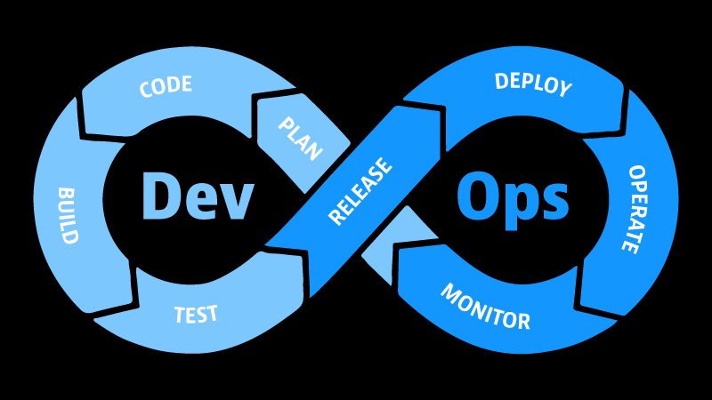

# Quy trình của DevOps

## Kế hoạch > Viết mã > Xây dựng > Kiểm thử > Phát hành > Triển khai > Vận hành > Giám sát >
## Plan > Code > Build > Testing > Release > Deploy > Operate > Monitor >

**DevOps** là một phương pháp phát triển và vận hành phần mềm tập trung vào việc tự động hóa và tích hợp các quy trình phát triển và vận hành. Mục tiêu của **DevOps** là tạo ra một môi trường nơi các nhóm phát triển và vận hành có thể cộng tác chặt chẽ để cung cấp phần mềm nhanh hơn, đáng tin cậy hơn và linh hoạt hơn.

Hôm nay chúng ta sẽ tập trung vào các bước riêng lẻ và chu trình liên tục của một ứng dụng từ đầu đến cuối trong thế giới **DevOps**.

### Kế hoạch (Plan)

Tất cả bắt đầu với việc lên kế hoạch, đây là lúc nhóm phát triển họp lại với nhau để thảo luận và tìm ra các tính năng và bản sửa lỗi mà họ muốn có trong sprint tiếp theo. Đây cũng là lúc mà kỹ sư **DevOps** tham gia và tìm hiểu những phần liên quan tới công việc của mình. Bạn cũng có thể đóng góp ý kiến vào các quyết định của nhóm phát triển, giúp họ có thể làm việc với cơ sở hạ tầng mà bạn đã xây dựng hoặc hướng họ đến lựa chọn tốt hơn nếu họ đang không lựa chọn phương án tốt nhất. Một điều quan trọng nên nhớ là nhóm phát triển đang là khách hàng của bạn, đây là cơ hội tốt để làm việc với họ trước khi mọi thứ không đi trên con đường tốt nhất.

### Viết mã (Code)

Sau khi việc lên kế hoạch kết thúc, họ sẽ bắt đầu viết mã, bạn có thể hoặc có thể không liên quan nhiều đến giai đoạn này. Tuy nhiên, bạn có thể tham gia, hướng dẫn nhóm phát triển để họ hiểu rõ hơn về cơ sở hạ tầng, những dịch vụ nào có sẵn và cách tốt nhất để sử dụng những dịch vụ đó.

### Xây dựng (Build)

Đây là điểm bắt đầu của quy trình tự động hoá. Chúng ta sẽ lấy mã nguồn từ nhóm phát triển, và xây dựng ứng dụng từ đó. Tuỳ thuộc vào ngôn ngữ họ sử dụng mà chúng ta có thể sẽ chuyển mã, biên dịch hoặc tậm chí là xây dựng một **Docker image** từ mã nguồn. Dù như thế nào, chúng ta vẫn sẽ sử dụng các **CI/CD pipeline** cho quá trình này.

### Kiểm thử (Testing)

Sau khi chúng ta xây dựng xong mã nguồn, chúng ta cần kiểm thử bằng các bài kiểm tra trên bản build mới. Các bài kiểm tra này thường sẽ được nhóm phát triển hoặc QA chuẩn bị trước, chúng ta cũng có thể đóng góp ý kiến vào việc cách mà các bài kiểm tra nên được viết. Quá trình kiểm thử nhằm giảm thiểu việc phát sinh các vấn đề trên môi trường sản xuất (**production**). Nó có thể không đảm bào hoàn toàn nhưng chúng ta muốn càng gần với một sự đảm bảo càng tốt, một là không đưa thêm lỗi mới, hai là không phá vỡ những thứ đang hoạt động.

### Phát hành (Release)

Sau khi vượt qua các bài kiểm tra, chúng ta sẽ thực hiện quá trình phát hành. Quá trình này có thể không tồn tại phụ thuộc vào loại ứng dụng bạn đang làm việc cùng. Mã nguồn có thể được lưu trữ ở bất kỳ đâu, chẳng hạn như **GitHub** hoặc kho lưu trữ git, hoặc mã đã được biên dịch hay **Docker image** đã được lưu giữ trong sổ đăng ký (**registry**) hoặc kho lưu trữ (**repository**) và có thể truy cập được từ máy chủ sản xuất trong quá trình triển khai.

### Triển khai (Deploy)

Cuối cùng, chúng ta triển khai mã lên môi trường sản xuất (**production**). Chỉ đến lúc này, doanh nghiệp mới có thể nhận ra giá trị từ thời gian, nỗ lực và sự tận tuỵ mà chúng ta và nhóm phát triển đã đưa vào sản phẩm.

### Vận hành (Operate)

Sau khi triển khai ứng dụng, chúng ta sẽ chuyển qua giai đoạn vận hành, đây là lúc mà bạn có thể nhận các cuộc gọi từ khách hành về việc website hoặc ứng dụng của họ rất chậm. Sau đó bạn cần tìm hiểu lý do và sau đó có thể xây dựng một hệ thống mở rộng quy mô tự động (**auto-scaling**) để tăng số lượng máy chủ trong giờ cao điểm và giảm số lượng máy chủ trong giờ thấp điểm. Một hoạt động khác là vòng lặp phản hồi từ môi trường sản xuất tới nhóm vận hành để cho biết về các sự kiện chính đã xảy ra trên môi trường sản xuất. Điều này có thể được tự động hoá hoặc không tuỳ thuộc và môi trường của bạn nhưng mục tiêu là luôn luôn tự động hoá khi có thể. Tuỳ thuộc vào môi trường, có thể một số bước cần được thực hiện trước khi sẵn sàng cho việc đó, nhưng lý tưởng nhất là bạn sẽ triển khai tự động như một phần của quy trình tự động hoá. Nếu bạn có thể, sẽ rất tốt nếu có thêm một số thông báo ở các bước để cho nhóm vận hành biết rằng việc triển khai đã xảy ra.

### Giám sát (Monitor)

Tất cả đều dẫn đến bước cuối cùng, giám sát. Điều này quan trọng với các các vấn đề vận hành như khắc phục sự cố, tự động mở rộng quy mô. Bạn có thể sẽ không biết có vấn đề xảy ra nếu bạn không giám sát hệ thống. Một số ví dụ cho các số liệu mà bạn có thể giám sát là: % sử dụng bộ nhớ, % sử dụng CPU, dung lượng ổ đĩa, thời gian phản hồi của **API**, và một phần rất qua trọng, logs. Nhờ logs, nhóm phát triển có thể xem những gì đã và đang diễn ra mà không cần truy cập vào hệ thống của môi trường sản xuất.

## Lặp lại

Sau khi hoàn thành, chúng ta quay lại từ đầu bắt đầu bằng việc lên kế hoạch và lặp lại toàn bộ chu trình.

## Liên tục (Continuous)

Nhiều công cụ giúp chúng ta thực hiện quy trình liên tục ở trên với mục tiêu cuối cùng là tự động toàn bộ quy trình. Việc này thường được gọi là **Tích hợp liên tục** / **Phân phối liên tụ**c / **Triển khai liên tục** hoặc viết tắt là "**CI/CD**". Chúng ta sẽ có các bài viết tiếp theo để tìm hiểu kiến ​​thức cơ bản với một số ví dụ và hướng dẫn.

### Phân phối liên tục (Continuous Delivery)

- Phân phối liên tục = Kế hoạch > Viết mã > Xây dựng > Kiểm thử - ( Continuous Delivery = Plan > Code > Build > Test ) 

### Tích hợp liên tục (Continuous Integration)

Đây là kết quả của **Phân phối liên tục (Continuous Delivery)** cộng với kết quả của giai đoạn **Phát hành (Release)**. Nếu thất bại thì sẽ quay trở lại **Phân phối liên tục (Continuous Delivery)**, nếu thành công thì chuyển sang giai đoạn **Triển khai liên tục (Continuous Deployment)**.

- Tích hợp liên tục = Kế hoạch > Viết mã > Xây dựng > Kiểm thử > Phát hành - ( Continuous Integration = Plan > Code > Build > Test > Release )

### Triển khai liên tục (Continuous Deployment)

Sau khi có bản phát hành thành công từ **Tích hợp liên tục (Continuous Integration)**, chúng ta sẽ chuyển sang **Triển khai liên tục (Continuous Deployment)** gồm các giai đoạn sau.

- Tích hợp liên tục phát hành thành công = Triển khai liên tục = Triển khai > Vận hành > Giám sát 

- ( CI Release is Success = Continuous Deployment = Deploy > Operate > Monitor )

Bạn có thể xem ba khái niệm **Liên tục (Continuous)** ở trên là tập hợp đơn giản của các giai đoạn của Vòng đời **DevOps**.

### Có thể tóm gọn quy trình DevOps bao gồm các bước sau:

- **Kế hoạch (Plan)**: Bước đầu tiên trong quy trình **DevOps** là lên kế hoạch cho dự án. Điều này bao gồm việc xác định các yêu cầu của dự án, xác định các thành viên của nhóm **DevOps** và thiết lập các quy trình và công cụ sẽ được sử dụng.
- **Viết mã (code)**: Bước tiếp theo là viết mã cho dự án. Điều này bao gồm việc viết mã mới, sửa lỗi và cải tiến mã hiện có.
- **Xây dựng (Build)**: Bước tiếp theo là xây dựng mã. Điều này bao gồm việc biên dịch mã, kiểm tra mã và tạo một bản dựng của phần mềm.
- **Kiểm thử (Testing)**: Bước tiếp theo là kiểm tra phần mềm. Điều này bao gồm việc chạy các bài kiểm tra tự động và kiểm tra thủ công để đảm bảo rằng phần mềm hoạt động bình thường.
- **Phát hành (Release)**: Bước tiếp theo là phát hành phần mềm. Điều này bao gồm việc đưa phần mềm vào môi trường sản xuất.
- **Triển khai (Deploy)**: Bước tiếp theo là triển khai phần mềm. Điều này bao gồm việc cài đặt phần mềm trên các máy chủ và cấu hình phần mềm để hoạt động.
- **Vận hành (Operate)**: Bước tiếp theo là vận hành phần mềm. Điều này bao gồm việc theo dõi hiệu suất của phần mềm, khắc phục sự cố và cập nhật phần mềm.
- **Giám sát (Monitor)**: Bước cuối cùng là giám sát phần mềm. Điều này bao gồm việc theo dõi hiệu suất của phần mềm, khắc phục sự cố và cập nhật phần mềm.

## Tài liệu tham khảo

- [DevOps for Developers – Software or DevOps Engineer?](https://www.youtube.com/watch?v=a0-uE3rOyeU)
- [Techworld with Nana -DevOps Roadmap 2022 - How to become a DevOps Engineer? What is DevOps?](https://www.youtube.com/watch?v=9pZ2xmsSDdo&t=125s)
- [How to become a DevOps Engineer in 2021 - DevOps Roadmap](https://www.youtube.com/watch?v=5pxbp6FyTfk)
- https://github.com/MichaelCade/90DaysOfDevOps/blob/main/2022/vi/Days/day05.md