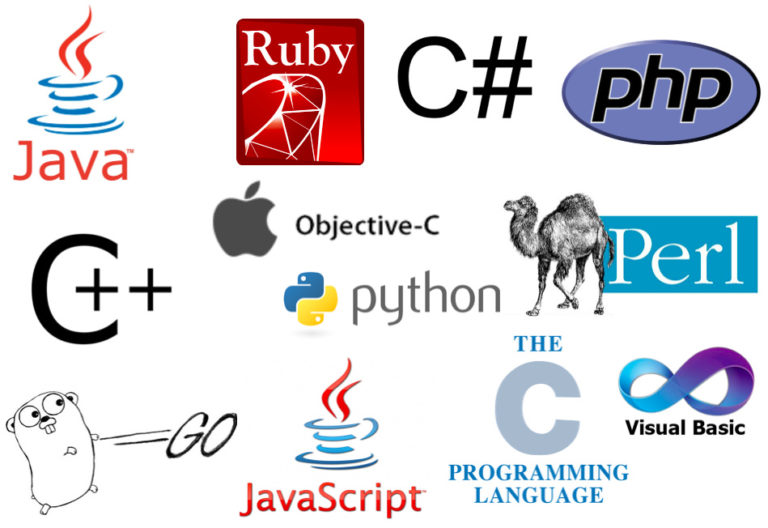

# Ngôn ngữ lập trình với DevOps

**DevOps** là một phương pháp phát triển và vận hành phần mềm tập trung vào việc tự động hóa và tích hợp các quy trình phát triển và vận hành. Mục tiêu của **DevOps** là tạo ra một môi trường nơi các nhóm phát triển và vận hành có thể cộng tác chặt chẽ để cung cấp phần mềm nhanh hơn, đáng tin cậy hơn và linh hoạt hơn.

## DevOps & Học một ngôn ngữ lập trình

Nói một cách công bằng, bạn phải biết ít nhất một ngôn ngữ lập trình ở mức độ cơ bản để trở thành một kỹ sư **DevOps** thành công. Tôi muốn dành phần đầu tiên để tìm hiểu lý do tại sao điều này lại quan trọng như vậy và hi vọng rằng sau bài viết này bạn sẽ hiểu rõ hơn về lý do, cách thức và những gì bạn có thể làm để thúc đẩy việc học của mình.

Nếu tôi hỏi trên các mạng xã hội rằng bạn có cần kỹ năng lập trình cho các vai trò liên quan tới **DevOps** hay không, câu trả lời khả năng cao là "*có*". Hãy cho tôi biết nếu bạn không nghĩ như vậy. Nhưng câu hỏi lớn hơn và không có một câu trả lời rõ ràng là ngôn ngữ lập trình nào? Câu trả lời phổ biến nhất có thể là **Python** hoặc gần đây, ngành càng có nhiều người nói rằng bạn nên học Golang hoặc bạn cần phải học **Go**.

Với những câu trả lời đó, tôi có thể hiểu được rằng để trở thành một kỹ sư **DevOps** thành công bạn cần có một kiến thức tốt về kỹ năng lập trình. Nhưng chúng ta phải hiểu lý do tại sao nó lại cần thiết để chọn một con đường phù hợp.

## Hiểu tại sao bạn cần học một ngôn ngữ lập trình

Lý do mà **Python** và **Go** thường được khuyến nghị cho các kỹ sư **DevOps** là có rất nhiều công cụ **DevOps** được viết bằng **Python** hoặc **Go**, điều này rất quan trọng nếu bạn đang chuẩn bị xây dựng các công cụ **DevOps** và nó quyết định những gì bạn nên học để có lợi nhất mình. Nếu bạn đang muốn xây dựng hoặc tham gia một nhóm xây dựng các công cụ **DevOps**, thì việc học cùng một ngôn ngữ là rất hợp lý. Nếu bạn muốn tiếp cận với **Kubernetes** hoặc **Containers** thì khả năng cao lựa chọn của bạn sẽ là **Go**.

Tuy nhiên, trong trường hợp nếu bạn không có một lý do rõ ràng như vậy ví dụ như bạn đang là sinh viên hoặc đang chuẩn bị cho một bước mới trong sự nghiệp của bạn thì tôi nghĩ bạn nên chọn thứ gì đó phù hợp với ứng dụng hoặc stack công nghệ mà bạn muốn làm việc cùng.

Hãy nhớ rằng chúng ta không muốn trở thành một nhà phát triển phần mềm ở đây mà chỉ muốn hiểu thêm về ngôn ngữ lập trình để có thể đọc và hiểu những công cụ đó đang làm gì từ đó có thể triển khai và cải thiện những thứ khác.

Một điều quan trọng cần biết nữa là cách bạn tương tác, làm việc với các công cụ **DevOps**, đó có thể là **Kasten K10** hoặc **Terraform** và **HCL**. Chúng ta gọi chúng là các tệp (**file**) cầu hình và đó là cách bạn tương tác với các công cụ **DevOps** và biến mọi thứ thành hiện thực, thông thược sẽ là các file **YAML** (Chúng ta sẽ tìm hiểu về YAML trong bài viết tiếp theo)

## Có phải tôi đã thuyết phục bản thân không học một ngôn ngữ lập trình?

Hầu hết nó sẽ tuỳ thuộc vào vai trò, bạn sẽ giúp các nhóm kỹ sư triển khai **DevOps** trong quy trình làm việc của họ, thực hiện nhiều thử nghiệm trên ứng dụng và đảm bảo quy trình được xây dựng phù hợp với các nguyên tắc **DevOps** mà chúng ta đã đề cập trong những ngày đầu tiên. Tuy nhiên, trong thực tế, dường như phần lớn thời gian thường sẽ là việc khắc phục sự cố về hiệu suất ứng dụng và tương tự như vậy. Điều này quay trở lại quan điểm dầu tiên, ngôn ngữ lập trình mình cần biết có phải là ngôn ngữ mà ứng dụng được viết? Nếu ứng dụng được viết bằng **NodeJS** thì bạn sẽ không giúp ích được nhiều nếu bạn biết biết về **Go** hoặc **Python**.

## Tại sao là Go?

Tại sao **Golang** là ngôn ngữ lập trình tiếp theo cho **DevOps** và trở thành ngôn ngữ lập trình rất phổ biến trong những năm gần đây. Theo khảo sát của [StackOverflow cho năm 2021](https://insights.stackoverflow.com/survey/2021#section-most-loved-dreaded-and-wanted-programming-scripting-and-markup-languages), **Go** là ngôn ngữ lập trình đứng thứ 4 trong các ngôn ngữ lập trình, **scripting** và **markup** trong khi **Python** đứng thứ 1 nhưng hãy nghe tôi trình bày. 

Tôi đã đề cập đến một số công cụ và nền tảng **DevOps** được biết đến nhiều nhất được viết bằng Go như **Kubernetes**, **Docker**, **Grafana** và **Prometheus**.

Những đặc điểm của **Go** khiến nó trở nên phù hợp với **DevOps** là gì?

## Xây dựng và Triển khai với Go

Một lợi thế của việc sử dụng ngôn ngữ như **Python** trong vai trò **DevOps** là mã được thông dịch và bạn không cần phải biên dịch trước khi chạy các chương trình sử dụng **Python**. Đặc biệt với các tác vụ tự động hoá nhỏ, bạn không muốn mất thời gian cho quá trình biên dịch, dù vậy **Go** là một ngôn ngữ lập trình biên dịch và **Go biên dịch trực tiếp ra mã máy**. **Go** cũng nổi tiếng với tốc độ biên dịch nhanh.

## Go với Python dành cho DevOps

Các chương trình **Go** được liên kết tĩnh, điều này có nghĩa khi bạn biên dịch một chương trình viết bằng **Go**, mọi thứ đều được bao gồm trong một tệp thực thi nhị phân duy nhất và không cần cài đặt thêm các phụ thuộc (**dependencies**) và thư viện bên ngoài trên các máy chủ. Điều này giúp cho việc triển khai các chương trình viết bằng Go dễ dàng hơn so với các chương trình **Python** sử dụng các thư viện bên ngoài nên bạn phải đảm bảo các thư việc được cài đặt trên máy chủ trước khi bạn có thể chạy chương trình.

**Go** là một ngôn ngữ độc lập với nền tảng, có nghĩa là bạn có thể tạo ra các tệp thực thi nhị phân cho tất cả các hệ điền hành như **Linux**, **Windows**, **macOS**,v.v và rất dễ để có thể làm như vậy với các hệ điều hành cụ thể. **Python** không dễ dàng tạo ra các tệp thực thi nhị phân cho các hệ điều hành như vậy.

**Go** là một ngôn ngữ có hiệu năng cao, nó có khả năng biên dịch, thời gian chạy nhanh và sử dụng ít tài nguyên hơn đặc biệt so với **Python**. Nhiều tối ưu hóa đã được viết bằng **Go** mang lại hiệu suất rất cao.

Không giống như **Python** thường yêu cầu sử dụng thư viện của bên thứ ba để triển khai một chương trình **Python** cụ thể, **Go** có một thư viện tiêu chuẩn có hầu hết các chức năng cần thiết cho **DevOps** được tích hợp sẵn. Nó bao gồm xử lý tệp, dịch vụ web **HTTP**, xử lý **JSON**, hỗ trợ cho xử lý đồng thời và song song (**concurency, parallelism**) cũng như kiểm thử tích hợp (**built-in testing**).

Điều này không có nghĩa là chúng ta vứt bỏ **Python**, tôi chỉ đưa ra những lý do để chọn **Go**. Nhưng thường thì lý do chính không phải như vậy, chủ yếu là do tôi đang làm việc sử dụng **Go** để phát triển phần mềm.

Người ta nói rằng một khi bạn học được ngôn ngữ lập trình đầu tiên, việc tiếp nhận các ngôn ngữ khác trở nên dễ dàng hơn. Có lẽ không có công việc nào trong bất kỳ công ty nào không liên quan đến việc quản lý, **architect**, quản lý và gỡ lỗi các ứng dụng **JavaScript** hoặc **Node JS**.

## Các ngôn ngữ và công nghệ phổ biến trong DevOps

Có một số ngôn ngữ lập trình và công nghệ phổ biến được sử dụng trong **DevOps**, bao gồm:

- **Python**: Python là một ngôn ngữ lập trình phổ biến được sử dụng cho nhiều mục đích khác nhau, bao gồm cả DevOps. Python có nhiều tính năng phù hợp với DevOps, chẳng hạn như khả năng tự động hóa, khả năng dễ đọc và khả năng dễ sử dụng.
- **Bash**: Bash là một ngôn ngữ lập trình dòng lệnh được sử dụng để điều khiển máy tính. Nó được sử dụng trong DevOps để tự động hóa các tác vụ và quản lý hệ thống.
- **JavaScript**: JavaScript là một ngôn ngữ lập trình được sử dụng để tạo giao diện người dùng cho các trang web và ứng dụng web. JavaScript cũng có thể được sử dụng cho DevOps, chẳng hạn như để tự động hóa các tác vụ và để tạo các công cụ DevOps.
- **Go**: Go là một ngôn ngữ lập trình mới được tạo ra bởi Google. Go là một ngôn ngữ nhanh, mạnh mẽ và dễ sử dụng. Go cũng là một ngôn ngữ được thiết kế đặc biệt cho DevOps.
- **Ruby**: Ruby là một ngôn ngữ lập trình khác được sử dụng cho DevOps. Ruby là một ngôn ngữ năng động và linh hoạt, và có một cộng đồng người dùng lớn và tích cực.
- **Docker**: Docker là một công nghệ container hóa giúp các nhà phát triển và vận hành đóng gói và phân phối phần mềm một cách hiệu quả. Docker là một công nghệ quan trọng trong DevOps.
- **Kubernetes**: Kubernetes là một hệ thống quản lý container giúp các nhà phát triển và vận hành quản lý các cụm container. Kubernetes là một công nghệ quan trọng trong DevOps.
- **Jenkins**: Jenkins là một công cụ tự động hóa được sử dụng để chạy các bài kiểm tra, xây dựng mã và triển khai phần mềm. Nó được sử dụng trong DevOps để tự động hóa các quy trình phát triển và vận hành.
- **Travis CI**, **CircleCI**: là một hệ thống CI mã nguồn mở chạy trên đám mây.
- **Ansible**, **Puppet**, **Chef**, **Terraform**: là một công cụ tự động hóa mã nguồn mở.

Cách tốt nhất để tìm hiểu về DevOps là bắt đầu với một dự án nhỏ. Bạn có thể sử dụng một trong các công cụ hoặc dịch vụ **DevOps** được đề cập ở trên để tự động hóa các quy trình phát triển và vận hành của mình.

## Với DevOps bạn có thể

Dưới đây là một số ví dụ về cách bạn có thể sử dụng **DevOps** để tự động hóa các quy trình phát triển và vận hành của mình:

- Bạn có thể sử dụng **Jenkins** để tự động hóa xây dựng và kiểm tra mã của mình.
- Bạn có thể sử dụng **Travis CI** hoặc **CircleCI** để tự động hóa triển khai mã của mình lên môi trường production.
- Bạn có thể sử dụng **Ansible**, **Puppet** hoặc **Chef** để tự động hóa việc quản lý cơ sở hạ tầng của mình.

Các ngôn ngữ lập trình và công nghệ **DevOps** khác nhau được sử dụng tùy thuộc vào nhu cầu cụ thể của từng tổ chức. Tuy nhiên, **Python**, **JavaScript**, **Go**, **Docker** và **Kubernetes** là một số ngôn ngữ lập trình và công nghệ **DevOps** phổ biến nhất.

Ngôn ngữ lập trình tốt nhất cho **DevOps** là ngôn ngữ mà bạn cảm thấy thoải mái nhất và có kiến thức tốt nhất. Nếu bạn không chắc chắn ngôn ngữ nào nên sử dụng, thì **Python** là một lựa chọn tốt.

## Tham khảo

- https://www.python.org/
- https://vi.wikipedia.org/wiki/Bash
- https://vi.wikipedia.org/wiki/JavaScript
- https://go.dev/
- https://www.ruby-lang.org/en/
- https://www.docker.com/
- https://kubernetes.io/vi/
- https://www.jenkins.io/
- [StackOverflow 2021 Developer Survey](https://insights.stackoverflow.com/survey/2021)
- [Why we are choosing Golang to learn](https://www.youtube.com/watch?v=7pLqIIAqZD4&t=9s)
- [Jake Wright - Learn Go in 12 minutes](https://www.youtube.com/watch?v=C8LgvuEBraI&t=312s)
- [Techworld with Nana - Golang full course - 3 hours 24 mins](https://www.youtube.com/watch?v=yyUHQIec83I)
- [**NOT FREE** Nigel Poulton Pluralsight - Go Fundamentals - 3 hours 26 mins](https://www.pluralsight.com/courses/go-fundamentals)
- [FreeCodeCamp - Learn Go Programming - Golang Tutorial for Beginners](https://www.youtube.com/watch?v=YS4e4q9oBaU&t=1025s)
- [Hitesh Choudhary - Complete playlist](https://www.youtube.com/playlist?list=PLRAV69dS1uWSR89FRQGZ6q9BR2b44Tr9N)