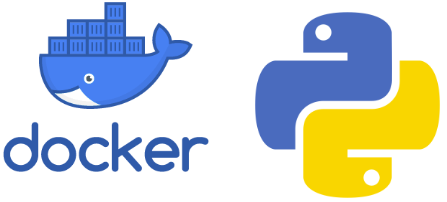

# Python là gì ?

**Python** là một ngôn ngữ lập trình đa năng được phát triển bởi **Guido van Rossum** vào năm **1991**. Python là một ngôn ngữ lập trình cấp cao, có nghĩa là nó dễ đọc và viết hơn các ngôn ngữ lập trình cấp thấp. **Python** cũng là một ngôn ngữ lập trình hướng đối tượng, có nghĩa là nó cho phép các nhà phát triển tạo các chương trình bằng cách sử dụng các đối tượng.

### Python được ứng dụng cho:

**Python** là một ngôn ngữ lập trình phổ biến, được sử dụng cho nhiều mục đích khác nhau, bao gồm:

- Phát triển web
- Khoa học dữ liệu
- Máy học
- Tự động hóa
- Cơ sở dữ liệu
- Đồ họa máy tính
- Kỹ thuật
- Tài chính
- Y tế

### Lợi ích khi sử dụng Python

**Python** là một ngôn ngữ lập trình mạnh mẽ và linh hoạt, có thể được sử dụng cho nhiều mục đích khác nhau. **Python** cũng là một ngôn ngữ lập trình dễ học, có nhiều tài nguyên có sẵn để giúp bạn học **Python**.

Đây là một số lợi ích của việc sử dụng **Python**:

- Python là một ngôn ngữ dễ học
- Python có một cộng đồng người dùng lớn và tích cực
- Python có nhiều thư viện và công cụ có sẵn
- Python là một ngôn ngữ đa năng, có thể được sử dụng cho nhiều mục đích khác nhau
- Python là một ngôn ngữ nhanh và hiệu quả

### Dưới đây là các bước để thiết lập môi trường DevOps cho Python và ứng dụng **Hello World**:

1. **Cài đặt Python**: bạn có thể tải xuống và cài đặt Python từ trang web chính thức của Python https://www.python.org/
2. **Tạo một dự án Python**: bạn có thể tạo một dự án Python mới bằng cách sử dụng trình tạo dự án của Python hoặc bằng cách tạo một thư mục mới và thêm tệp Python vào thư mục đó.
3. **Thêm mã Python vào dự án**: bạn có thể thêm mã Python vào dự án bằng cách tạo một tệp mới và thêm mã vào tệp đó.
4. **Chạy ứng dụng Python:** bạn có thể chạy ứng dụng Python bằng cách sử dụng trình thông dịch Python.
5. **Tích hợp liên tục (CI)**:  tích hợp liên tục (CI) là một quy trình tự động hóa việc xây dựng và kiểm tra mã khi có bất kỳ thay đổi nào được thực hiện. Bạn có thể sử dụng một công cụ CI như **Jenkins** hoặc **Travis CI** để tích hợp liên tục mã Python của mình.
6. **Triển khai liên tục (CD)**: triển khai liên tục (CD) là một quy trình tự động hóa việc triển khai mã đã được kiểm tra thành môi trường sản xuất. Bạn có thể sử dụng một công cụ CD như Jenkins hoặc Travis CI để triển khai liên tục mã Python của mình.

Mã **Hello World** Python là một chương trình đơn giản in ra văn bản "Hello, World!" trên màn hình. Đây là một chương trình mẫu thường được sử dụng để giới thiệu ngôn ngữ lập trình **Python**.

Mã Hello World Python rất đơn giản, vd ta có file *main.py*:

    print("Hello, world!")

Câu lệnh *print()* được sử dụng để in văn bản trên màn hình. Văn bản được in trong ngoặc kép là "Hello, World!"

Để chạy ứng dụng Python Hello World, bạn có thể sử dụng trình thông dịch *Python* như sau:

    python main.py

Đầu ra sẽ là:

    Hello, world!

Trong **DevOps**, mã Hello World Python thường được sử dụng để kiểm tra một hệ thống **Tích hợp liên tục (CI)**. Hệ thống CI là một tập hợp các công cụ được sử dụng để tự động hóa quá trình xây dựng, kiểm tra và triển khai mã. Bằng cách chạy mã Hello World Python thông qua hệ thống CI, bạn có thể đảm bảo rằng hệ thống CI đang hoạt động bình thường và có thể xây dựng, kiểm tra và triển khai mã mà không gặp bất kỳ lỗi nào.

Ngoài ra, mã Hello World Python còn có thể được sử dụng để kiểm tra một hệ thống **Triển khai liên tục (CD)**. Hệ thống CD là một tập hợp các công cụ được sử dụng để tự động hóa quá trình triển khai mã lên môi trường sản xuất. Bằng cách chạy mã Hello World Python thông qua hệ thống CD, bạn có thể đảm bảo rằng hệ thống CD đang hoạt động bình thường và có thể triển khai mã lên môi trường sản xuất mà không gặp bất kỳ lỗi nào.

### Để thiết lập môi trường DevOps cho Python, bạn cần làm theo các bước sau:

1. Tạo một dự án Python mới.

Bạn có thể tạo một dự án Python mới bằng cách sử dụng lệnh *python3 -m venv venv*. Lệnh này sẽ tạo một môi trường ảo có tên *venv*.

2. Thêm một tập tin *Dockerfile* vào dự án.

Tập tin *Dockerfile* là một tập tin văn bản mô tả cách xây dựng hình ảnh Docker của dự án. Bạn có thể tạo một tập tin *Dockerfile* mới bằng cách sử dụng trình soạn thảo văn bản yêu thích của mình. Nội dung của tập tin *Dockerfile* sẽ như sau:

    FROM python:3.8

    RUN pip install -r requirements.txt

    COPY . /app

    WORKDIR /app

    CMD python3 app.py

3. Thêm một tập tin *requirements.txt* vào dự án.

Tập tin *requirements.txt* là một tập tin văn bản liệt kê các gói Python cần được cài đặt cho dự án. Bạn có thể tạo một tập tin *requirements.txt* mới bằng cách sử dụng trình soạn thảo văn bản yêu thích của mình. Nội dung của tập tin *requirements.txt* sẽ như sau:

    numpy
    pandas
    matplotlib

4. Xây dựng hình ảnh Docker của dự án.

Bạn có thể xây dựng hình ảnh Docker của dự án bằng cách sử dụng lệnh *docker build -t <image_name> .*

Ví dụ:

    docker build -t my-python-app .

5. Chạy hình ảnh Docker của dự án.

Bạn có thể chạy hình ảnh Docker của dự án bằng cách sử dụng lệnh *docker run -it <image_name>*. Ví dụ:

    docker run -it my-python-app

Sau khi chạy lệnh này, bạn sẽ thấy một giao diện Python. Bạn có thể bắt đầu viết và chạy mã Python của mình.

Đây chỉ là một ví dụ về cách thiết lập môi trường **DevOps** cho **Python**. Có nhiều cách khác để thiết lập môi trường **DevOps**, và cách tốt nhất sẽ phụ thuộc vào nhu cầu cụ thể của bạn. Nếu bạn chưa từng làm với **Docker**, đừng quá lo lắng, bài viết **Docker là gì & Cài đặt** sẽ hướng dẫn bạn cụ thể hơn về **Docker**.

### Tham khảo:

- [Trang chủ Python](https://www.python.org/)
- [Trang chủ Docker](https://www.docker.com/)
- https://github.com/gto76/python-cheatsheet hoặc https://gto76.github.io/python-cheatsheet/
- https://github.com/trekhleb/learn-python
- https://github.com/FavioVazquez/ds-cheatsheets
- https://github.com/crazyguitar/pysheeet
- https://github.com/matplotlib/cheatsheets
- https://github.com/Tikam02/DevOps-Guide
- https://github.com/wilfredinni/python-cheatsheet
- https://github.com/Fechin/reference
- https://www.pythoncheatsheet.org/
- https://quickref.me/python.html