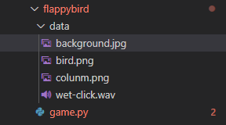
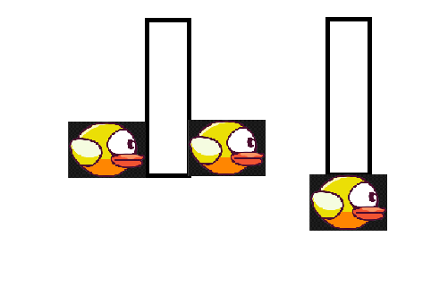

# Lập Trình Game Flappybird Với Python version 2

Vào những **năm 2014**, tựa game **flappybird** bỗng nhiên nổi tiếng không chỉ trong nước và quốc tế. **Game flappybird** có đồ họa đơn giản dễ chơi nhưng rất khó để đạt được điểm cao. Luật chơi vô cùng đơn giản, bạn chỉ cẩn điều khiển chú chim vượt qua các chướng ngại vật. Mỗi lần vượt qua bạn sẽ được cộng một điểm, nhưng nếu bạn để chú chim chạm vào các vật thể khác thì bạn sẽ bị thua.

## Cài đặt python và các thư viện kèm theo

### Cài đặt python

Nếu các bạn chưa cài **python** truy cập [tại đây](Introduction-to-Python.md) để được hướng dẫn .

### Cài đặt thư viện cần thiết

```
pip install pygame
```

## Bắt đầu lập trình thôi nào

Đầu tiên các bạn cần tạo **file** với cấu trúc thư mục như sau.



**Import** các thư viện cần thiết.

```python
import pygame
import random
from pygame import mixer
```

Tạo một **class** `Bird`.

```python
class Bird:
```

Hàm khởi tạo.

```python
    def __init__(self):
        pygame.init()  # Init pygame
        self.xScreen, self.yScreen = 500, 600  # Screen create
        linkBackGround = './data/background.jpg'  # Đường dẫn ảnh background
        self.linkImgBird = "./data/bird.png"  # Đường dẫn ảnh bird
        self.screen = pygame.display.set_mode(
            (self.xScreen, self.yScreen))  # Khởi tao kích thước màn hình
        pygame.display.set_caption("Code Learn - Flappybird")
        self.background = pygame.image.load(linkBackGround)
        self.gamerunning = True
        icon = pygame.image.load(self.linkImgBird)
        pygame.display.set_icon(icon)
        # --------------------------------------------------------
        self.xSizeBird = 80  # Chiều cao ảnh Bird
        self.ySizeBird = 60  # Chiều rộng ảnh Bird
        self.xBird = self.xScreen/3  # Vị trí bạn đầu của bird
        self.yBird = self.yScreen/2
        self.VBirdUp = 70  # Tốc độ nhảy bird
        self.VBirdDown = 7  # Tốc độ rớt bird
        # ------------------------------
        self.xColunm = self.yScreen+250  # khởi tạo cột đầu tiên
        self.yColunm = 0
        self.xSizeColunm = 100  # Chiều rộng cột
        self.ySizeColunm = self.yScreen
        self.Vcolunm = 6  # Tốc độ cột di chuyển
        self.colunmChange = 0

        self.scores = 0
        self.checkLost = False
```

Hàm bật âm thanh.

```python
    def music(self, url):  # Âm thanh
        bulletSound = mixer.Sound(url)
        bulletSound.play()
```

Lưu ý :

- Ở đây mình dùng một file có âm thanh click.
- Các bạn ấn [tại đây](https://freesound.org/browse/) để lựa chọn âm thanh bạn thích nhé.
- Chỉ sử dụng file âm thanh có đuôi là .wav với Bitdepth là 16.

Hàm để vẽ các hình ảnh .

```python
    def image_draw(self, url, xLocal, yLocal, xImg, yImg):  # In ra người hình ảnh
        PlanesImg = pygame.image.load(url)
        PlanesImg = pygame.transform.scale(
            PlanesImg, (xImg, yImg))  # change size image
        self.screen.blit(PlanesImg, (xLocal, yLocal))
```

Hàm hiển thị điểm.

```python
    def show_score(self, x, y, scores, size):  # Hiển thị điểm
        font = pygame.font.SysFont("comicsansms", size)
        score = font.render(str(scores), True, (255, 255, 255))
        self.screen.blit(score, (x, y))
```

Phương thức `colunm`.

```python
    def colunm(self):
        maginColunm = 80
        yColunmChangeTop = -self.ySizeColunm/2 - maginColunm + \
            self.colunmChange   # Khoảng cách giữa cột trên và đưới là 80*2
        yColunmChangeBotton = self.ySizeColunm/2 + maginColunm+self.colunmChange
        self.image_draw("./data/colunm.png", self.xColunm,
                        yColunmChangeTop, self.xSizeColunm, self.ySizeColunm)
        self.image_draw("./data/colunm.png", self.xColunm,
                        yColunmChangeBotton, self.xSizeColunm, self.ySizeColunm)
        self.xColunm = self.xColunm - self.Vcolunm
        if self.xColunm < -100:  # Nếu cột đi qua màn hình
            self.xColunm = self.xScreen  # Tạo cột mới
            # Random khoảng cách cột
            self.colunmChange = random.randint(-150, 150)
            self.scores += 1
        return yColunmChangeTop+self.ySizeColunm, yColunmChangeBotton  # Trả về vị trí hai cột
```

Hàm `run`.

```python
    def run(self):
        while self.gamerunning:
            self.screen.blit(self.background, (0, 0))
            for event in pygame.event.get():  # Bắt các sự kiện
                # print(event)
                if event.type == pygame .QUIT:  # sự kiện nhấn thoát
                    self.gamerunning = False
                if event.type == pygame.MOUSEBUTTONDOWN:
                    self.yBird -= self.VBirdUp  # Bird bay lên
                    self.music("./data/wet-click.wav")
                if event.type == pygame.KEYDOWN:  # sự kiện có phím nhấn xuống
                    if event.key == pygame.K_SPACE:
                        self.yBird -= self.VBirdUp  # Bird bay lên
                        self.music("./data/wet-click.wav")
            self.yBird += self.VBirdDown  # Bird rớt xuống
            yColunmChangeTop, yColunmChangeBotton = self.colunm()
            # print(self.yBird,yColunmChangeTop,self.yBird+self.ySizeBird, yColunmChangeBotton)
            # ---------Check xem bird chạm cột----------------------------------
            if self.yBird < yColunmChangeTop and (self.xColunm+self.xSizeColunm - 5 > self.xBird+self.xSizeBird > self.xColunm + 5 or self.xColunm+self.xSizeColunm > self.xBird > self.xColunm):
                self.checkLost = True
            if self.yBird+self.ySizeBird > yColunmChangeBotton and (self.xColunm+self.xSizeColunm - 5 > self.xBird+self.xSizeBird > self.xColunm + 5 or self.xColunm+self.xSizeColunm > self.xBird > self.xColunm):
                self.checkLost = True
            # ---------Check xem bird có chạm tường-----------------------------
            if (self.yBird + self.ySizeBird > self.yScreen) or self.yBird < 0:
                self.yBird = self.yScreen/2
                self.checkLost = True
            self.Vcolunm = 6 if self.scores < 1 else 6 + self.scores/5  # Tốc độ tăng dần
            self.VBirdDown = 7 if self.scores < 1 else 7 + \
                self.scores/10  # Bird rơi nhanh dần
            print(self.Vcolunm)
            while(self.checkLost):  # Nếu Bird chạm vật
                self.xColunm = self.xScreen+100
                for event in pygame.event.get():   # Nếu nhấn
                    if event.type == pygame.QUIT:  # Thoát
                        self.gamerunning = False
                        self.checkLost = False
                        break
                    if event.type == pygame.KEYDOWN:  # Thoát
                        self.checkLost = False
                        self.scores = 0
                    if event.type == pygame.MOUSEBUTTONDOWN:
                        self.checkLost = False
                        self.scores = 0
                self.show_score(100, 100, "Scores:{}".format(
                    self.scores), 40)  # In điểm
                self.show_score(self.xScreen/2-100, self.yScreen /
                                2-100, "GAME OVER", 50)  # In Thông báo thua
                self.Vcolunm = 6
                self.VBirdDown = 7
                pygame.display.update()
            self.image_draw(self.linkImgBird, self.xBird,
                            self.yBird, self.xSizeBird, self.ySizeBird)
            self.show_score(self.xScreen - 200, 20, "duyduysysy@gmail.com", 15)
            self.show_score(10, 10, "Scores:{}".format(self.scores), 35)
            pygame.display.update()  # Update
            clock = pygame.time.Clock()
            clock.tick(80)
```

Lưu ý:  Các bạn chú ý vào phần ghi chú **Check** xem `bird` chạm cột. Mình sẽ kiểm tra xem `bird` có chạm cột vào những trường hợp như sau. Và cũng tương tự như `bird` chạm vào tường.



Hàm `main`

```python
if __name__ == "__main__":
    bird = Bird()
    bird.run()
```

## Kết

Cảm ơn các bạn đã đọc bài viết của mình, nếu có gì thắc mắc thì hãy bình luận phía bên dưới. Nếu các bạn thấy hay thì hãy **share** bài để ủng hộ mình nhé.

- https://codelearn.io/sharing/lap-trinh-game-flappybird-voi-python