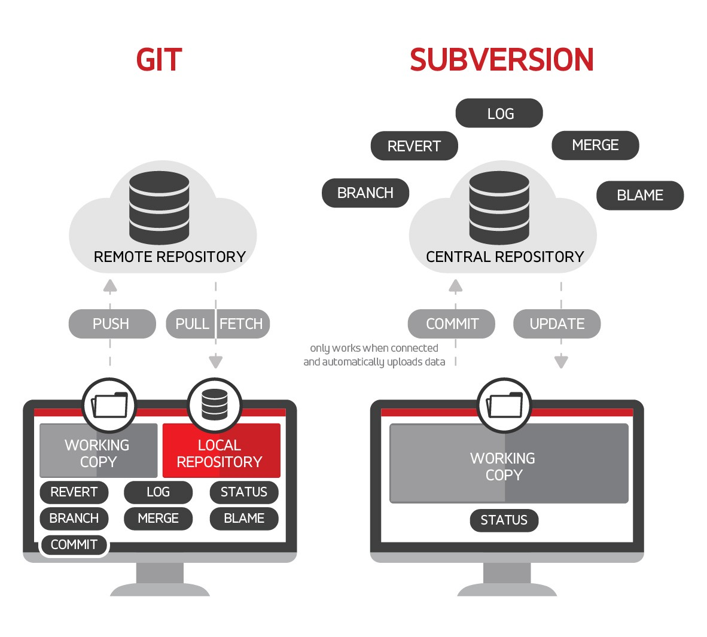

# Git là gì ?

**Git** là một hệ thống quản lý phiên bản phân tán được sử dụng để theo dõi các thay đổi đối với các tệp và thư mục trong một dự án. Nó được sử dụng rộng rãi bởi các nhà phát triển phần mềm để theo dõi các thay đổi đối với mã của họ, nhưng nó cũng có thể được sử dụng bởi bất kỳ ai cần theo dõi các thay đổi đối với một dự án.

**Git** hoạt động bằng cách lưu trữ các thay đổi đối với các tệp và thư mục trong các đơn vị được gọi là "**commit**". Mỗi commit có một ID duy nhất và nó chứa thông tin về các thay đổi đã được thực hiện đối với các tệp và thư mục. Git cũng lưu trữ một lịch sử của các commit, cho phép bạn xem các thay đổi đã được thực hiện đối với dự án theo thời gian.

Git là một công cụ mạnh mẽ có thể được sử dụng để theo dõi các thay đổi đối với các dự án lớn và phức tạp. Nó cũng rất dễ sử dụng và có thể được cài đặt trên hầu hết các hệ điều hành.

### Lợi ích khi sử dụng Git

Dưới đây là một số lợi ích của việc sử dụng Git:

- **Theo dõi các thay đổi đối với các dự án**: Git có thể được sử dụng để theo dõi các thay đổi đối với các dự án lớn và phức tạp. Điều này có thể giúp bạn quản lý các thay đổi, khôi phục các thay đổi cũ và cộng tác với các nhà phát triển khác.
- **Khôi phục các thay đổi cũ**: Git có thể được sử dụng để khôi phục các thay đổi cũ đối với các dự án. Điều này có thể hữu ích nếu bạn mắc lỗi hoặc nếu bạn cần quay lại một phiên bản cũ của dự án.
- **Cộng tác với các nhà phát triển khác**: Git có thể được sử dụng để cộng tác với các nhà phát triển khác đối với các dự án. Điều này có thể giúp bạn làm việc cùng nhau trên các dự án và chia sẻ các thay đổi của bạn với những người khác.
- **Dễ sử dụng**: Git là một công cụ rất dễ sử dụng. Nó có thể được cài đặt trên hầu hết các hệ điều hành và có tài liệu phong phú có sẵn trực tuyến.

### So sánh giữa Git và Subversion (SVN)

**Git** và **Subversion (SVN)** là hai hệ thống quản lý phiên bản (VCS) được sử dụng để theo dõi các thay đổi đối với mã. Tuy nhiên, có một số khác biệt chính giữa hai hệ thống này.

- **Git là một hệ thống phân tán, trong khi SVN là một hệ thống tập trung**. Điều này có nghĩa là với Git, mỗi nhà phát triển có một bản sao của toàn bộ kho lưu trữ trên máy tính của họ. Với SVN, chỉ có một kho lưu trữ trung tâm mà tất cả các nhà phát triển phải truy cập.

- **Git nhẹ hơn SVN**. Điều này có nghĩa là các kho lưu trữ Git nhỏ hơn và nhanh hơn để làm việc.

- **Git linh hoạt hơn SVN**. Điều này có nghĩa là Git phù hợp hơn cho các dự án yêu cầu nhiều nhánh và hợp nhất.

- **Git phổ biến hơn SVN**. Điều này có nghĩa là có nhiều tài nguyên hơn để học Git, và có nhiều người hơn có thể giúp bạn nếu bạn cần trợ giúp.

Nhìn chung, Git là lựa chọn tốt hơn cho hầu hết các dự án. Tuy nhiên, SVN có thể là lựa chọn tốt hơn cho các dự án yêu cầu nhiều cộng tác với những người không quen thuộc với Git.

Nếu bạn đang tìm kiếm một hệ thống quản lý phiên bản, thì Git là một lựa chọn tuyệt vời. Nó là một công cụ mạnh mẽ, dễ sử dụng và có thể được sử dụng để theo dõi các thay đổi đối với các dự án lớn và phức tạp.

### Tham khảo

- https://git-scm.com/
- https://github.com/
- https://about.gitlab.com/
- https://vi.wikipedia.org/wiki/Git_(ph%E1%BA%A7n_m%E1%BB%81m)
- https://vi.wikipedia.org/wiki/Subversion
- https://subversion.apache.org/